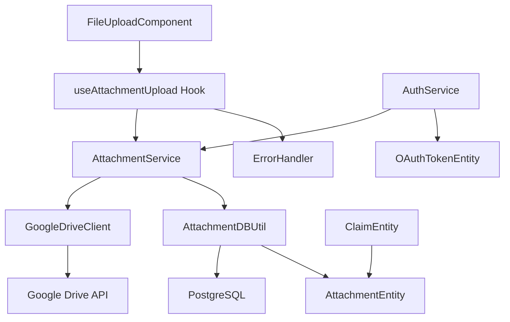

# Design Document

## Overview

The attachment upload feature implements client-side file uploads to Google Drive with metadata tracking in PostgreSQL, following established patterns for OAuth token management, database relationships, and error handling. The design leverages existing NestJS modules, React Query hooks, and TypeScript strict patterns to provide secure, efficient file upload capabilities that integrate seamlessly with the claims workflow.

## Steering Document Alignment

### Technical Standards (tech.md)

**TypeScript Strict Mode**: All components use strict typing with no `any` types, following existing patterns in `AttachmentEntity` and `AuthService`.

**Object.freeze() Pattern**: Status enums use the established pattern from `AttachmentStatus` enum rather than TypeScript enums.

**Module Architecture**: Follows NestJS module pattern with controllers, services, DTOs, and entities separated by responsibility.

**Database Design**: Extends existing entity relationships between `ClaimEntity` and `AttachmentEntity` using TypeORM patterns.

### Project Structure (structure.md)

**Backend Module Structure**: Creates `attachments/` module following the established pattern:
```
backend/src/modules/attachments/
├── controllers/attachment.controller.ts
├── services/attachment.service.ts
├── utils/attachment-db.util.ts
├── dtos/attachment-request.dto.ts
├── dtos/attachment-response.dto.ts
└── attachment.module.ts
```

**Frontend Integration**: Adds upload hooks to `frontend/src/hooks/` and components to `frontend/src/components/` following existing patterns.

**Shared Types**: Extends `@project/types` package with attachment-specific DTOs maintaining cross-workspace consistency.

## Code Reuse Analysis

### Existing Components to Leverage

- **AuthService**: Extends `getUserTokens()` method for Google Drive API token management with automatic refresh
- **BaseDBUtil**: Creates `AttachmentDBUtil` extending the established database utility pattern for CRUD operations
- **React Query Hooks**: Follows `useAuthStatus` patterns for performance monitoring and error handling
- **ErrorHandler**: Uses existing error extraction and status code handling for consistent user feedback
- **Form Components**: Leverages existing React Hook Form integration with UI components

### Integration Points

- **OAuth Token Management**: Integrates with existing `OAuthTokenEntity` and scope management (`drive.file`)
- **Database Schema**: Uses established `AttachmentEntity` with existing `ClaimEntity` relationship
- **API Client**: Extends existing axios instance with proper cookie authentication for file operations
- **Query Key Management**: Adds `ATTACHMENTS` group to existing query key enum patterns

## Architecture

The attachment upload system follows a three-layer architecture with clear separation between presentation (React components), business logic (NestJS services), and data persistence (PostgreSQL + Google Drive). Client-side uploads bypass server file handling while maintaining audit trails through metadata tracking.

### Modular Design Principles

- **Single File Responsibility**: Upload components handle UI only, services manage Google Drive API, utilities handle database operations
- **Component Isolation**: File upload hook isolated from claim forms, allowing reuse across different contexts
- **Service Layer Separation**: Clear boundaries between authentication, file operations, and database persistence
- **Utility Modularity**: Google Drive client abstracted behind interface for testing and potential future API changes



## Components and Interfaces

### Frontend: useAttachmentUpload Hook

- **Purpose:** Manages file upload lifecycle with progress tracking and error handling
- **Interfaces:** 
  ```typescript
  interface UseAttachmentUploadOptions {
    claimId: string;
    onSuccess?: (attachment: IAttachmentResponse) => void;
    onError?: (error: string) => void;
  }
  
  interface UseAttachmentUploadReturn {
    uploadFile: (file: File) => Promise<void>;
    isUploading: boolean;
    uploadProgress: number;
    error: string | null;
  }
  ```
- **Dependencies:** ErrorHandler, axios client, React Query
- **Reuses:** `useAuthStatus` performance monitoring patterns, existing query key management

### Frontend: FileUploadComponent

- **Purpose:** Provides drag-and-drop file selection with validation feedback
- **Interfaces:** Standard React component props with file selection callbacks
- **Dependencies:** useAttachmentUpload hook, existing Form components
- **Reuses:** Existing UI components (Button, Progress, Alert), form validation patterns

### Backend: AttachmentService

- **Purpose:** Orchestrates file upload to Google Drive and metadata persistence
- **Interfaces:**
  ```typescript
  interface IAttachmentService {
    uploadFile(userId: string, claimId: string, fileData: IFileUploadData): Promise<IAttachmentResponse>;
    getClaimAttachments(claimId: string): Promise<IAttachmentResponse[]>;
    deleteAttachment(attachmentId: string): Promise<void>;
  }
  ```
- **Dependencies:** AuthService, GoogleDriveClient, AttachmentDBUtil
- **Reuses:** Existing OAuth token management, database utility patterns

### Backend: GoogleDriveClient

- **Purpose:** Handles Google Drive API operations with proper error handling and retries
- **Interfaces:**
  ```typescript
  interface IGoogleDriveClient {
    uploadFile(token: string, file: Buffer, options: IUploadOptions): Promise<IDriveFileResponse>;
    createFolder(token: string, name: string, parentId?: string): Promise<string>;
    setFilePermissions(token: string, fileId: string): Promise<void>;
  }
  ```
- **Dependencies:** Google APIs library, OAuth tokens
- **Reuses:** Existing token refresh patterns, error handling approaches

### Backend: AttachmentDBUtil

- **Purpose:** Database operations for attachment metadata following established patterns
- **Interfaces:** Extends BaseDBUtil with attachment-specific methods
- **Dependencies:** TypeORM, AttachmentEntity
- **Reuses:** BaseDBUtil CRUD operations, existing entity relationship patterns

## Data Models

### AttachmentEntity (Existing - Extended)
```typescript
// Leverages existing entity structure:
export class AttachmentEntity extends BaseEntity {
  originalFilename: string;
  storedFilename: string;        // Generated filename with naming convention
  googleDriveFileId: string;     // Drive file identifier
  googleDriveUrl: string;        // Shareable URL for administrative access
  fileSize: number;              // File size in bytes
  mimeType: string;              // MIME type for validation
  status: AttachmentStatus;      // PENDING | UPLOADED | FAILED
  claim: ClaimEntity;            // Existing relationship
}
```

### File Upload DTOs
```typescript
// Request DTO for file upload
export interface IAttachmentUploadRequest {
  originalFilename: string;
  fileSize: number;
  mimeType: string;
  claimId: string;
}

// Response DTO with Google Drive metadata
export interface IAttachmentResponse {
  id: string;
  originalFilename: string;
  googleDriveUrl: string;
  fileSize: number;
  status: AttachmentStatus;
  uploadedAt: string;
}
```

## Error Handling

### Error Scenarios

1. **File Validation Failure**
   - **Handling:** Client-side validation before upload attempt, server-side MIME type verification
   - **User Impact:** Clear error message specifying supported formats (PDF, PNG, JPEG, JPG, IMG) and 5MB limit

2. **Google Drive API Failure**
   - **Handling:** Exponential backoff retry with maximum 3 attempts, differentiate between quota and permission errors
   - **User Impact:** Specific error messages for quota exceeded, insufficient permissions, or network issues

3. **OAuth Token Expiry**
   - **Handling:** Automatic token refresh through existing AuthService patterns, graceful fallback to reauthorization
   - **User Impact:** Seamless token refresh or redirect to OAuth consent if refresh token invalid

4. **Database Operation Failure**
   - **Handling:** Transaction rollback for metadata operations, mark attachment as FAILED status for retry
   - **User Impact:** Error notification with retry option, preserves form data for resubmission

5. **File Size/Network Timeout**
   - **Handling:** Progress monitoring with 30-second timeout for 5MB files, resumable upload support
   - **User Impact:** Progress indicator with clear timeout messaging and retry capability

## Testing Strategy

### Unit Testing

**Backend Services**: Test AttachmentService upload orchestration with mocked GoogleDriveClient and AttachmentDBUtil dependencies.

**Frontend Hooks**: Test useAttachmentUpload hook state management and error handling with mocked API responses.

**Validation Logic**: Test file type and size validation with various invalid inputs following existing validation patterns.

**Database Utilities**: Test AttachmentDBUtil CRUD operations extending existing BaseDBUtil test patterns.

### Integration Testing

**Google Drive Upload Flow**: Test complete upload pipeline from frontend component through backend service to Google Drive API.

**OAuth Token Management**: Test token refresh scenarios and scope validation following existing auth integration patterns.

**Database Transactions**: Test attachment metadata persistence with claim entity relationships and status transitions.

**Error Handling Flows**: Test retry mechanisms, timeout handling, and user feedback for various failure scenarios.

### End-to-End Testing

**Complete Upload Workflow**: User selects file, validates, uploads to Drive, stores metadata, associates with claim.

**Permission Management**: Test file permission setting for "anyone with the link" access required for administrative review.

**Claim Integration**: Test attachment addition/removal during different claim statuses (draft, sent, failed).

**Mobile Responsive Upload**: Test drag-and-drop and file selection on mobile devices with touch interactions.