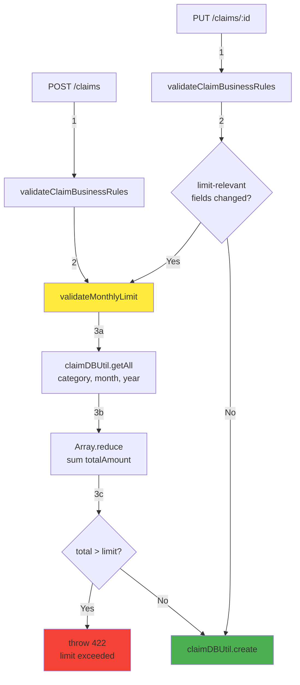

# Design Document

## Overview

Backend claim limit validation adds a single private method to ClaimsController that validates monthly limits for Telco ($150) and Fitness ($50) categories. The validation executes during claim creation and updates, rejecting requests that exceed limits with HTTP 422 and clear error messages.

**Implementation Philosophy**: Keep it simple. One method, two call sites, zero special cases. Use existing ClaimDBUtil for data fetching, array reduce for summation, no new dependencies, no new database queries beyond standard find().

**Integration Points**:
- `createClaim()`: Call validation before creating claim entity
- `updateClaim()`: Call validation when limit-relevant fields change
- `ClaimDBUtil.getAll()`: Fetch existing claims for total calculation

## Steering Document Alignment

### Technical Standards (tech.md)

**NestJS Module Pattern**: Validation logic stays in ClaimsController (no new services/modules)
- Controller: HTTP layer + business validation
- DBUtil: Data access only, no business logic
- Follows existing pattern: `validateClaimBusinessRules()`, `validateStatusTransition()`

**TypeScript Standards**:
- No `any` types (use ClaimEntity, ClaimCategory explicitly)
- Use Object.freeze() constants for limits: `{ [ClaimCategory.TELCO]: 150, [ClaimCategory.FITNESS]: 50 }`
- Reuse existing types from `@project/types`

**Error Handling Pattern**:
- Use `UnprocessableEntityException` for business rule violations (existing pattern)
- Clear error messages (match existing error message style)
- Logging with `this.logger.warn()` for limit violations

**Testing Strategy**:
- Unit tests in `claims.controller.spec.ts` (existing test file)
- Integration tests in `api-test/src/tests/claims.test.ts`
- Follow Vitest patterns already established

### Project Structure (structure.md)

**No New Files Required**: All changes in existing files
- `backend/src/modules/claims/claims.controller.ts`: Add validation method + constants
- `backend/src/modules/claims/claims.controller.spec.ts`: Add unit tests
- `api-test/src/tests/claims.test.ts`: Add integration tests

**Module Organization Preserved**:
```
claims/
├── controllers/claims.controller.ts    # ← Add validateMonthlyLimit() here
├── utils/claim-db.util.ts              # ← No changes (use existing getAll())
└── entities/claim.entity.ts            # ← No changes
```

**Follows "Single Responsibility"**: Controller handles HTTP + business validation, DBUtil handles data access.

## Code Reuse Analysis

### Existing Components to Leverage

**ClaimDBUtil.getAll()**:
- Already exists, takes `{ criteria: { userId, category, month, year } }`
- Returns `ClaimEntity[]` (automatically excludes soft-deleted via TypeORM)
- No modifications needed

**ClaimsController Private Methods Pattern**:
- Existing: `validateClaimBusinessRules()`, `validateStatusTransition()`
- Add: `validateMonthlyLimit()` (same pattern, same location)
- All private methods called from public endpoint methods

**Error Handling Pattern**:
```typescript
// Existing pattern in validateClaimBusinessRules():
throw new UnprocessableEntityException('Claim amount must be greater than zero');

// New pattern (same style):
throw new UnprocessableEntityException(
  `TELCO monthly limit of $150.00 exceeded. Current: $120.00, Proposed: $50.00, Total: $170.00`
);
```

**Logger Pattern**:
```typescript
// Existing pattern:
this.logger.log(`Creating claim for user: ${user.id}`);
this.logger.warn(`Claim not found: ${id}`);

// New pattern (same style):
this.logger.warn(`Monthly limit exceeded for user ${userId}: ${category} ${month}/${year}`);
```

### Integration Points

**createClaim() Integration**:
```typescript
// Existing location: Line 349 (after validateClaimBusinessRules)
this.validateClaimBusinessRules(createClaimDto);

// Add immediately after:
await this.validateMonthlyLimit(
  user.id,
  createClaimDto.category,
  createClaimDto.month,
  createClaimDto.year,
  createClaimDto.totalAmount,
);
```

**updateClaim() Integration**:
```typescript
// Existing location: Line 545 (after validateClaimBusinessRules)
this.validateClaimBusinessRules(updateClaimDto);

// Add immediately after - ALWAYS validate, no conditionals:
await this.validateMonthlyLimit(
  user.id,
  updateClaimDto.category ?? existingClaim.category,
  updateClaimDto.month ?? existingClaim.month,
  updateClaimDto.year ?? existingClaim.year,
  updateClaimDto.totalAmount ?? existingClaim.totalAmount,
  existingClaim.id, // ← Exclude claim being updated
);
```

**ClaimDBUtil Usage** (no changes to util, just use existing method):
```typescript
const existingClaims = await this.claimDBUtil.getAll({
  criteria: { userId, category, month, year },
});
```

## Architecture

**Single Method Design**: No services, no helpers, no utilities. One private method in ClaimsController.

**Data Flow**:
```
POST /claims
  → validateClaimBusinessRules()  [existing]
  → validateMonthlyLimit()        [NEW]
  → claimDBUtil.create()          [existing]

PUT /claims/:id
  → validateClaimBusinessRules()  [existing]
  → validateMonthlyLimit()        [NEW, conditional]
  → claimDBUtil.updateWithSave()  [existing]
```

**No Special Cases**:
- Unlimited categories? Skip validation (simple `if (!limit) return`)
- Update without limit changes? Skip validation (simple `if` check)
- No complex branching, no nested conditions



## Components and Interfaces

### validateMonthlyLimit() - Private Method

**Purpose**: Calculate existing claim total for a user/category/month/year and reject if new amount exceeds limit

**Signature**:
```typescript
private async validateMonthlyLimit(
  userId: string,
  category: ClaimCategory,
  month: number,
  year: number,
  newAmount: number,
  excludeClaimId?: string, // For update operations
): Promise<void>
```

**Logic Flow**:
```typescript
1. Check if category has limit (if not, return early)
2. Fetch existing claims via ClaimDBUtil
3. Filter out excludeClaimId (if provided, for updates)
4. Sum totalAmount using array.reduce()
5. Calculate total = existing + newAmount
6. If total > limit, throw UnprocessableEntityException
7. Log warning on rejection
```

**Error Message Format**:
```typescript
const categoryName = category.toUpperCase();
const message = `${categoryName} monthly limit of $${limit.toFixed(2)} exceeded. ` +
  `Current: $${existingTotal.toFixed(2)}, Proposed: $${newAmount.toFixed(2)}, ` +
  `Total: $${total.toFixed(2)}`;
throw new UnprocessableEntityException(message);
```

**Dependencies**:
- `ClaimDBUtil.getAll()`: Fetch claims
- `MONTHLY_LIMITS`: Static constant map
- `this.logger`: Logging

**Reuses**:
- Existing ClaimDBUtil instance (injected via constructor)
- Existing logger instance
- Existing exception handling pattern

### MONTHLY_LIMITS - Module Constant

**Purpose**: Define monthly limits for limited categories

**Implementation**:
```typescript
// File: backend/src/modules/claims/constants/claim-limits.constants.ts
import { ClaimCategory } from '../enums/claim-category.enum';

export const CLAIM_MONTHLY_LIMITS: Record<string, number> = {
  [ClaimCategory.TELCO]: 150,
  [ClaimCategory.FITNESS]: 50,
};
```

**Location**: New file in `claims/constants/` directory

**Usage in Controller**:
```typescript
import { CLAIM_MONTHLY_LIMITS } from './constants/claim-limits.constants';

// In validateMonthlyLimit() method:
const limit = CLAIM_MONTHLY_LIMITS[category];
if (!limit) return; // No limit for this category
```

## Data Models

**No New Models**: Uses existing ClaimEntity

**ClaimEntity Fields Used**:
- `id`: string (UUID) - For excluding claim during updates
- `userId`: string - Filter criteria
- `category`: ClaimCategory - Filter criteria + limit lookup
- `month`: number (1-12) - Filter criteria
- `year`: number - Filter criteria
- `totalAmount`: number - Summed for limit calculation
- `deletedAt`: Date | null - Automatically filtered by TypeORM

**TypeORM Behavior**: Soft-deleted claims (deletedAt IS NOT NULL) automatically excluded by default `find()` query

## Error Handling

### Error Scenarios

**1. Monthly Limit Exceeded (Create or Update)**
- **Trigger**: `existingTotal + newAmount > limit`
- **Handling**: `throw new UnprocessableEntityException(message)`
- **HTTP Status**: 422 Unprocessable Entity
- **Message Example**: `"TELCO monthly limit of $150.00 exceeded. Current: $120.00, Proposed: $50.00, Total: $170.00"`
- **User Impact**: Frontend displays error via toast, user knows exact amounts
- **Note**: Same message format for both create and update operations

**2. Database Error During Validation**
- **Trigger**: ClaimDBUtil.getAll() throws exception
- **Handling**: Caught by existing error handler in controller, re-thrown as 500
- **HTTP Status**: 500 Internal Server Error
- **Message**: Generic error (don't expose DB internals)
- **User Impact**: "Failed to create/update claim. Please try again."
- **Logging**: Full error stack logged for debugging

**3. Invalid Category/Month/Year (Existing Validation)**
- **Trigger**: DTO validation fails before reaching validateMonthlyLimit()
- **Handling**: Existing NestJS ValidationPipe catches this
- **HTTP Status**: 400 Bad Request
- **No Changes**: Existing validation continues to work

### Error Response Structure

**Successful Validation**: Returns void, proceeds to claim creation/update

**Failed Validation**:
```json
{
  "statusCode": 422,
  "message": "TELCO monthly limit of $150.00 exceeded. Current: $120.00, Proposed: $50.00, Total: $170.00",
  "error": "Unprocessable Entity"
}
```

**Frontend Compatibility**: Matches existing error handling in `MultiClaimForm.tsx` (line 150-152):
```typescript
onError: () => {
  toast.error('Failed to create claim. Please try again.');
}
```

## Testing Strategy

### Unit Testing (claims.controller.spec.ts)

**Test File Location**: `backend/src/modules/claims/claims.controller.spec.ts`

**Test Scenarios**:

1. **Telco Limit Exceeded**:
   - Mock ClaimDBUtil to return claims totaling $120
   - Call createClaim with $50 Telco claim
   - Expect UnprocessableEntityException with specific message

2. **Fitness Limit Exceeded**:
   - Mock ClaimDBUtil to return claims totaling $40
   - Call createClaim with $15 Fitness claim
   - Expect UnprocessableEntityException

3. **Telco Under Limit**:
   - Mock ClaimDBUtil to return claims totaling $100
   - Call createClaim with $40 Telco claim
   - Expect success (no exception)

4. **Unlimited Category (Dental)**:
   - Mock ClaimDBUtil to return ANY amount of dental claims
   - Call createClaim with ANY dental amount
   - Expect success (validation skipped)

5. **Update Excludes Current Claim**:
   - Mock ClaimDBUtil to return 2 claims: $80 + $60 (claim being updated)
   - Call updateClaim to change $60 → $80
   - Expect FAILURE ($80 existing + $80 new = $160 > $150)

6. **Update With No Category Change**:
   - Mock updateClaim with only claimName change
   - Expect validateMonthlyLimit CALLED (always validate, no conditional skip)
   - Expect success (amounts unchanged)

7. **Empty Existing Claims**:
   - Mock ClaimDBUtil to return empty array
   - Call createClaim with $50 Telco
   - Expect success

8. **Exact Limit Boundary**:
   - Mock ClaimDBUtil to return claims totaling $100
   - Call createClaim with $50 Telco (total = $150 exactly)
   - Expect success (not exceeding, just meeting limit)

**Mocking Strategy**:
```typescript
const mockClaimDBUtil = {
  getAll: vi.fn().mockResolvedValue([
    { id: '1', totalAmount: 80, category: ClaimCategory.TELCO, /* ... */ },
    { id: '2', totalAmount: 40, category: ClaimCategory.TELCO, /* ... */ },
  ]),
  create: vi.fn(),
  // ...
};
```

### Integration Testing (api-test/src/tests/claims.test.ts)

**Test File Location**: `api-test/src/tests/claims.test.ts`

**Test Scenarios**:

1. **Sequential Claim Creation Enforces Limits**:
   - Create Telco claim for $100 (expect 201)
   - Create another Telco claim for $60 (expect 422 limit exceeded)
   - Verify error message contains amounts

2. **Different Categories Independent**:
   - Create Telco claim for $150 (expect 201)
   - Create Fitness claim for $50 (expect 201)
   - Both at limit but independent

3. **Different Months Independent**:
   - Create Telco claim for September $150 (expect 201)
   - Create Telco claim for October $150 (expect 201)
   - Same category but different months

4. **Update Revalidates Correctly**:
   - Create Telco claim for $80 (expect 201)
   - Create another Telco claim for $60 (expect 201)
   - Update second claim to $80 (expect 422, would total $160)

5. **Deleted Claims Don't Count**:
   - Create Telco claim for $100 (expect 201)
   - Delete that claim (expect 204)
   - Create new Telco claim for $150 (expect 201, previous deleted doesn't count)

6. **Category Change Revalidates**:
   - Create Dental claim for $200 (expect 201, unlimited)
   - Update to Fitness category with $200 (expect 422, exceeds $50 limit)

**Test Setup Requirements**:
- Clean database before each test
- Authenticated user context (JWT token)
- Database seeding for test data

### End-to-End Testing

**Not Required**: Integration tests cover API behavior sufficiently. Frontend already has validation, no E2E changes needed.

**Manual Testing Checklist** (dev environment):
1. [ ] Create Telco claim for $100, then $60 → Expect 422 error with clear message
2. [ ] Verify frontend toast shows error message correctly
3. [ ] Check backend logs contain WARN entry with user/category/amounts
4. [ ] Create claim at exact limit ($150) → Expect success
5. [ ] Delete claim, create new one → Verify deleted claim doesn't count

## Implementation Checklist

**Phase 1: Core Implementation**
- [ ] Add `MONTHLY_LIMITS` constant to ClaimsController
- [ ] Implement `validateMonthlyLimit()` private method
- [ ] Integrate validation into `createClaim()` (line 349)
- [ ] Integrate conditional validation into `updateClaim()` (line 545)
- [ ] Add logging for limit violations
- [ ] Test manually in dev environment

**Phase 2: Testing**
- [ ] Write 8 unit test scenarios in `claims.controller.spec.ts`
- [ ] Write 6 integration test scenarios in `api-test/src/tests/claims.test.ts`
- [ ] Run `make test/unit` and verify all pass
- [ ] Run `make test/api` and verify all pass
- [ ] Verify test coverage includes new validation method

**Phase 3: Documentation**
- [ ] Update OpenAPI/Swagger annotations on `createClaim()` with 422 response example
- [ ] Update OpenAPI/Swagger annotations on `updateClaim()` with 422 response example
- [ ] Add JSDoc comments to `validateMonthlyLimit()` method
- [ ] Verify Swagger UI shows 422 examples correctly

**Phase 4: Performance & Polish**
- [ ] Add database index: `CREATE INDEX idx_claims_user_category_month_year ON claims(user_id, category, month, year) WHERE deleted_at IS NULL;`
- [ ] Run integration tests with timing measurements (<100ms target)
- [ ] Review logs for any unexpected errors
- [ ] Format code: `make format`
- [ ] Lint code: `make lint`

## Performance Considerations

**Query Performance**:
- Single `getAll()` call per validation
- Filtered by userId + category + month + year (4-field index)
- Typical result: 2-20 claim entities
- Database query: ~10-20ms

**In-Memory Processing**:
- Array reduce for summation: O(n) where n = 2-20 claims
- Processing time: <1ms

**Total Overhead**:
- Typical: 20-50ms per validation
- Target: <100ms
- Monitoring: Log slow validations >100ms for review

**Scalability**:
- Handles typical volumes (2-20 claims/month) efficiently
- Database query with 20 rows: ~5ms
- Array reduce on 20 numbers: <0.01ms

## Security Considerations

**Authorization**: Validation uses authenticated user.id from JWT guard (existing pattern)

**Input Sanitization**: Category/month/year validated by DTO validators before reaching validation

**Information Disclosure**: Error messages only expose current user's own claim totals (no cross-user data)

**Audit Trail**: All limit violations logged with userId, category, amounts, timestamp

**Transaction Safety**: Validation runs in same request context as claim creation/update (atomic operation)

## Rollback Strategy

**If validation causes issues in production**:

1. **Immediate Fix**: Comment out validation calls in `createClaim()` and `updateClaim()`, redeploy (5-minute hotfix)
2. **Root Cause Analysis**: Review logs for unexpected errors, performance issues, or false positives
3. **Gradual Re-Enable**: Fix issues, re-enable for limited users via feature flag (if available)

**Minimal Risk**: Validation is additive (doesn't change existing behavior for claims under limits)