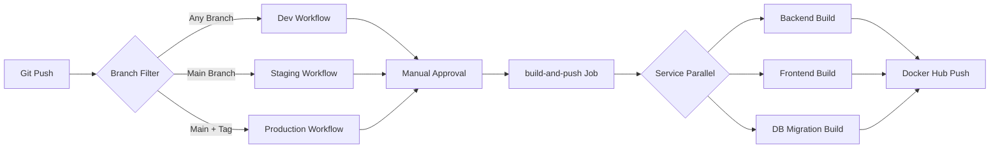

# Design Document

## Overview

CircleCI pipeline for building and pushing multi-architecture Docker images to Docker Hub. Uses **parameterized reusable jobs** to eliminate duplication across 3 environments (dev, staging, production) and 3 services (backend, frontend, db-migration).

**Linus's Take:** "Bad programmers worry about the code. Good programmers worry about data structures."

The data structure here is simple:
```
Workflow → Environment Parameters → Reusable Job → Docker Build
```

No special cases. One job definition. Parameters drive behavior.

## Steering Document Alignment

### Technical Standards (tech.md)

N/A - No steering documents exist yet. This design follows CircleCI best practices and Docker multi-stage build patterns already implemented in `docker/deployment/`.

### Project Structure (structure.md)

N/A - No steering documents exist yet. Pipeline will respect existing TurboRepo monorepo structure with workspaces for `backend/`, `frontend/`, and `packages/types/`.

## Code Reuse Analysis

### Existing Components to Leverage

- **docker/deployment/Dockerfile.backend**: Multi-stage build with deps → build → runtime stages
- **docker/deployment/Dockerfile.frontend**: Next.js standalone output with multi-stage build
- **docker/deployment/Dockerfile.db-migration**: TypeORM migration runner with minimal runtime image
- **pnpm-workspace.yaml**: TurboRepo workspace configuration for monorepo
- **turbo.json**: Build pipeline configuration for TurboRepo

### Integration Points

- **Docker Hub**: Image registry at `jianhong1998/mav-claim-submission-{service}`
- **Git Tags**: Semantic versioning for production releases (v1.0.0 format)
- **Git SHA**: Commit hashes for dev/staging environments
- **CircleCI Secrets**: DOCKERHUB_USERNAME and DOCKERHUB_PASSWORD environment variables

## Architecture

**Linus's Principle:** "If you need more than 3 levels of indentation, you're screwed anyway."

### Design Decision: Parameterized Jobs Over Duplication

**❌ Bad Approach (3× duplication):**
```yaml
jobs:
  build-backend-dev: ...
  build-backend-staging: ...
  build-backend-production: ...
  build-frontend-dev: ...
  # 9 total job definitions 🤮
```

**✅ Good Taste (1 parameterized job):**
```yaml
jobs:
  build-and-push:
    parameters:
      service: { type: string }
      environment: { type: string }
      tag_strategy: { type: enum }
    # ONE definition for all 9 combinations ✨
```

### Architecture Flow



### CircleCI Configuration Structure

```
.circleci/
└── config.yml    # Single configuration file
    ├── commands:        # Reusable command snippets
    │   ├── docker-login
    │   ├── setup-buildx
    │   └── build-and-push-image
    ├── jobs:            # Job definitions
    │   └── build-and-push  # Parameterized job
    └── workflows:       # Workflow orchestration
        ├── dev-build
        ├── staging-build
        └── production-build
```

## Components and Interfaces

### Component 1: docker-login Command

- **Purpose:** Authenticate to Docker Hub using CircleCI secrets
- **Interfaces:**
  - Inputs: None (reads from environment: DOCKERHUB_USERNAME, DOCKERHUB_PASSWORD)
  - Outputs: Docker authentication state
- **Dependencies:** docker/cli
- **Reuses:** CircleCI's built-in environment variable system

**Implementation:**
```yaml
commands:
  docker-login:
    steps:
      - run:
          name: Login to Docker Hub
          command: echo "$DOCKERHUB_PASSWORD" | docker login -u "$DOCKERHUB_USERNAME" --password-stdin
```

### Component 2: setup-buildx Command

- **Purpose:** Configure Docker buildx for multi-platform builds
- **Interfaces:**
  - Inputs: None
  - Outputs: buildx builder instance with cache configuration
- **Dependencies:** docker/buildx plugin
- **Reuses:** CircleCI's remote Docker environment

**Implementation:**
```yaml
commands:
  setup-buildx:
    steps:
      - run:
          name: Set up Docker Buildx
          command: |
            docker buildx create --use --name multiarch-builder
            docker buildx inspect --bootstrap
```

### Component 3: build-and-push-image Command

- **Purpose:** Build multi-arch image and push to Docker Hub
- **Interfaces:**
  - Inputs:
    - `service` (string): backend | frontend | db-migration
    - `tag` (string): Image tag (SHA or version)
    - `dockerfile` (string): Path to Dockerfile
    - `repository` (string): Docker Hub repository name
  - Outputs: Pushed Docker image with manifest
- **Dependencies:** docker buildx, Dockerfile
- **Reuses:** Existing Dockerfiles in docker/deployment/

**Implementation:**
```yaml
commands:
  build-and-push-image:
    parameters:
      service: { type: string }
      tag: { type: string }
      dockerfile: { type: string }
      repository: { type: string }
    steps:
      - run:
          name: Build and push << parameters.service >>
          command: |
            docker buildx build \
              --platform linux/amd64,linux/arm64 \
              --file << parameters.dockerfile >> \
              --tag << parameters.repository >>:<< parameters.tag >> \
              --tag << parameters.repository >>:latest-<< parameters.environment >> \
              --cache-from type=registry,ref=<< parameters.repository >>:buildcache \
              --cache-to type=registry,ref=<< parameters.repository >>:buildcache,mode=max \
              --push \
              .
```

### Component 4: build-and-push Job

- **Purpose:** Orchestrate build for one service in one environment
- **Interfaces:**
  - Parameters:
    - `service` (string): backend | frontend | db-migration
    - `environment` (string): dev | staging | production
    - `tag_strategy` (enum): sha | tag
  - Outputs: Docker image pushed to Docker Hub
- **Dependencies:** docker-login, setup-buildx, build-and-push-image
- **Reuses:** CircleCI remote Docker executor

**Logic:**
1. Checkout code
2. Determine tag based on `tag_strategy`:
   - `sha`: Use `CIRCLE_SHA1` (first 7 chars)
   - `tag`: Use `CIRCLE_TAG` (git tag)
3. Login to Docker Hub
4. Setup buildx
5. Build and push image
6. Report success with image URL

### Component 5: Workflows (dev-build, staging-build, production-build)

- **Purpose:** Trigger builds for all 3 services with environment-specific rules
- **Interfaces:**
  - Triggers: Git push events (filtered by branch/tag)
  - Outputs: Parallel builds for backend, frontend, db-migration
- **Dependencies:** build-and-push job
- **Reuses:** CircleCI workflow filters and manual approval

**Workflow Comparison:**

| Workflow | Branch Filter | Tag Filter | Manual Approval | Tag Strategy |
|----------|--------------|------------|----------------|--------------|
| dev-build | All branches | - | Required | sha |
| staging-build | main only | - | Required | sha |
| production-build | main only | `/^v\d+\.\d+\.\d+$/` | Required | tag |

## Data Models

### Environment Configuration

```yaml
Environment:
  name: string           # dev | staging | production
  tag_strategy: enum     # sha | tag
  branch_filter:         # Git branch filter
    only: string[]
  tag_filter:            # Git tag filter (optional)
    only: string
  requires_approval: boolean
```

**Example:**
```yaml
# Production environment
name: production
tag_strategy: tag
branch_filter:
  only: [main]
tag_filter:
  only: /^v\d+\.\d+\.\d+$/
requires_approval: true
```

### Service Configuration

```yaml
Service:
  name: string           # backend | frontend | db-migration
  dockerfile: string     # Path to Dockerfile
  repository: string     # Docker Hub repo
  context: string        # Build context (monorepo root)
```

**Example:**
```yaml
# Backend service
name: backend
dockerfile: docker/deployment/Dockerfile.backend
repository: jianhong1998/mav-claim-submission-backend
context: .
```

### Build Matrix

```yaml
BuildMatrix:
  - service: backend
    environment: dev
    tag: abc1234
  - service: backend
    environment: staging
    tag: abc1234
  - service: backend
    environment: production
    tag: v1.0.0
  # ... 9 total combinations
```

## Error Handling

### Error Scenarios

1. **Scenario: Missing Docker Hub Credentials**
   - **Handling:** Fail build at docker-login step with clear error message
   - **User Impact:** CircleCI build fails with: "Error: DOCKERHUB_USERNAME or DOCKERHUB_PASSWORD not set"
   - **Resolution:** Add environment variables in CircleCI project settings

2. **Scenario: Invalid Git Tag Format for Production**
   - **Handling:** Workflow filter prevents build from running
   - **User Impact:** Production workflow does not trigger
   - **Resolution:** Create tag matching `/^v\d+\.\d+\.\d+$/` format (e.g., v1.0.0)

3. **Scenario: Multi-Platform Build Failure (Architecture-Specific)**
   - **Handling:** Docker buildx fails with platform-specific error
   - **User Impact:** Build fails at buildx step, no image pushed
   - **Resolution:** Check Dockerfile compatibility with both linux/amd64 and linux/arm64

4. **Scenario: Docker Hub Rate Limit**
   - **Handling:** Build fails at push step with 429 error
   - **User Impact:** CircleCI build fails with rate limit message
   - **Resolution:** Authenticate with Docker Hub (already handled by docker-login)

5. **Scenario: TurboRepo Dependency Build Failure**
   - **Handling:** Docker build fails during packages/types build stage
   - **User Impact:** Build fails with TypeScript compilation errors
   - **Resolution:** Fix packages/types source code and retry

6. **Scenario: Manual Approval Timeout/Cancellation**
   - **Handling:** Workflow pauses at approval step, cancels if rejected
   - **User Impact:** Build does not proceed, no images pushed
   - **Resolution:** Approve workflow in CircleCI UI or re-trigger

## Testing Strategy

### Unit Testing

Not applicable - CircleCI configuration is declarative YAML. Testing is done through:
- **YAML validation:** CircleCI CLI `circleci config validate`
- **Local execution:** CircleCI CLI `circleci local execute` (limited support for workflows)

### Integration Testing

**Approach:** Test in real CircleCI environment with controlled inputs

**Test Cases:**
1. **Dev Workflow Test:**
   - Push to feature branch
   - Manually trigger dev-build workflow
   - Verify all 3 service images build and push successfully
   - Verify images tagged with git SHA (7 chars)
   - Verify images tagged with `latest-dev`

2. **Staging Workflow Test:**
   - Push to main branch
   - Manually trigger staging-build workflow
   - Verify all 3 service images build and push successfully
   - Verify images tagged with git SHA (7 chars)
   - Verify images tagged with `latest-staging`

3. **Production Workflow Test:**
   - Create tag `v1.0.0` on main branch
   - Manually trigger production-build workflow
   - Verify all 3 service images build and push successfully
   - Verify images tagged with `v1.0.0`
   - Verify images tagged with `latest`

### End-to-End Testing

**Approach:** Full deployment cycle from git push to running containers

**User Scenarios:**
1. **Developer pushes feature:**
   - Push to feature branch → Trigger dev-build → Pull image → Run container → Verify app works
2. **Merge to staging:**
   - Merge PR to main → Trigger staging-build → Pull image → Deploy to staging env → Verify app works
3. **Production release:**
   - Create v1.0.0 tag → Trigger production-build → Pull image → Deploy to production → Verify app works

### Validation Checklist

- [ ] All 3 services build successfully for all 3 environments (9 total builds)
- [ ] Multi-arch images work on both amd64 and arm64 platforms
- [ ] Docker Hub authentication works with CircleCI secrets
- [ ] Git SHA tagging works for dev/staging
- [ ] Semantic version tagging works for production
- [ ] Layer caching reduces build time (<10 min per service)
- [ ] Manual approval gates prevent accidental deployments
- [ ] Workflow filters correctly restrict production to main + tag
- [ ] Build failures do not push partial images
- [ ] CircleCI UI shows clear status and error messages
