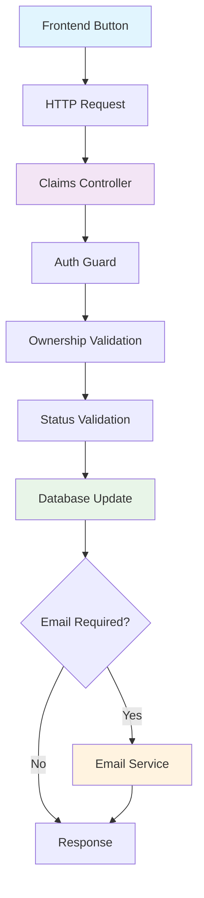

# Design Document

## Overview

The Claim Status Management feature implements three atomic operations for claim lifecycle control: mark as paid, resend email, and revert to sent status. The design follows existing architectural patterns, reuses established services, and adds minimal complexity through three focused endpoint implementations.

**【Linus-Style Design Principle】**
> "Good taste is about seeing a problem from a different angle and eliminating special cases."

This design eliminates state management complexity by using simple validation functions instead of state machines, reuses existing infrastructure completely, and provides three atomic operations with zero conditional branches.

## Steering Document Alignment

### Technical Standards (tech.md)

**Object.freeze() Enum Pattern**: Leverages existing `ClaimStatus` enum implementation using Object.freeze() with `as const` pattern for predictable JavaScript output and better tree-shaking.

**NestJS Module Architecture**: Follows established controller → service → database util pattern with proper dependency injection, validation pipes, and error handling.

**TypeScript Strict Mode**: All new components use strict typing with no `any` types, proper DTO validation, and shared type imports from `@project/types`.

**Database Transaction Pattern**: Follows existing atomic transaction approach using TypeORM with proper rollback handling for failed operations.

### Project Structure (structure.md)

**Claims Module Extension**: New endpoints integrate into existing `backend/src/modules/claims/claims.controller.ts` following established controller patterns.

**DTO Organization**: Status management DTOs follow existing pattern in `backend/src/modules/claims/dto/` with proper barrel exports and validation decorators.

**Service Layer Reuse**: Leverages existing `EmailService` and `ClaimDBUtil` without modification, maintaining clean separation of concerns.

**Frontend Integration**: Components follow existing `frontend/src/components/` structure with button-based UI elements integrated into claim detail views.

## Code Reuse Analysis

### Existing Components to Leverage

- **ClaimDBUtil**: Complete database operations layer with getOne, updateWithSave, and proper error handling
- **EmailService**: Full email sending workflow with Gmail integration, template generation, and transaction management
- **JwtAuthGuard + @User() Decorator**: Authentication and user identification without modification
- **ClaimStatusUpdateDto**: Existing validation DTO for status updates with enum validation
- **Error Handling Patterns**: Established HTTP status code mapping and validation error processing

### Integration Points

- **Claims Controller**: One new endpoint (`POST /claims/:id/resend`) plus enhanced existing endpoint (`PATCH /claims/:id/status`) following established patterns
- **Existing Status Validation**: Reuses `validateStatusTransition()` method with enhanced validation for `paid ↔ sent` transitions
- **Database Schema**: Zero changes required - uses existing status enum values and audit trail through updatedAt timestamps
- **Gmail API Integration**: Direct reuse of EmailService.sendClaimEmail() method for resend functionality

## Architecture

The design follows the **Single Responsibility Principle** with status changes handled by existing infrastructure and email resend as a focused new operation. Both are atomic and stateless, avoiding complex state management.

### Modular Design Principles
- **Single File Responsibility**: Status changes reuse existing endpoint, email resend isolated to new endpoint
- **Component Isolation**: Enhanced status validation is pure and testable in isolation
- **Service Layer Separation**: Business logic remains in service layer, controllers handle HTTP concerns only
- **Utility Modularity**: Reuses existing database and email utilities without modification



## Components and Interfaces

### Claims Controller Extensions

- **Purpose:** Add one email resend endpoint and leverage existing status endpoint for state changes
- **Interfaces:**
  - `PATCH /claims/:id/status` → 200 ClaimResponseDto (existing endpoint, enhanced validation)
  - `POST /claims/:id/resend` → 200 ClaimResponseDto (new endpoint for email operations)
- **Dependencies:** ClaimDBUtil, EmailService, existing auth/validation infrastructure
- **Reuses:** Existing `updateClaimStatus` method and all controller patterns, error handling, response formatting

### Status Validation Functions

- **Purpose:** Validate status transitions for new operations
- **Interfaces:**
  - `canMarkAsPaid(status: ClaimStatus): boolean`
  - `canResendEmail(status: ClaimStatus): boolean`
  - `canMarkAsSent(status: ClaimStatus): boolean`
- **Dependencies:** ClaimStatus enum
- **Reuses:** Existing validateStatusTransition pattern with simplified boolean functions

### Frontend Button Components

- **Purpose:** Provide click-to-action interface for status management
- **Interfaces:** React components with onClick handlers and loading states
- **Dependencies:** API client functions, existing claim context
- **Reuses:** Existing button styling, loading patterns, and error handling components

## Data Models

### Status Transition Rules

```typescript
// Simple validation functions (Good Taste - no state machine)
const canMarkAsPaid = (status: ClaimStatus): boolean => status === ClaimStatus.SENT
const canResendEmail = (status: ClaimStatus): boolean =>
  [ClaimStatus.SENT, ClaimStatus.FAILED].includes(status)
const canMarkAsSent = (status: ClaimStatus): boolean => status === ClaimStatus.PAID
```

### Request/Response DTOs

```typescript
// Reuses existing ClaimStatusUpdateDto pattern
class MarkPaidRequestDto {
  // No additional fields - operation is implicit
}

class ResendEmailRequestDto {
  // No additional fields - claim ID from URL parameter
}

class MarkSentRequestDto {
  // No additional fields - operation is implicit
}

// All responses use existing ClaimResponseDto
```

## Error Handling

### Error Scenarios

1. **Ownership Violation:** User attempts to modify claim they don't own
   - **Handling:** 404 Not Found (existing pattern - don't reveal claim existence)
   - **User Impact:** "Claim not found" message

2. **Invalid Status Transition:** Action not allowed for current claim status
   - **Handling:** 422 Unprocessable Entity with descriptive message
   - **User Impact:** Clear explanation of why action is unavailable

3. **Email Send Failure:** Gmail API fails during resend operation
   - **Handling:** Maintain existing status, log error, return 500 with retry suggestion
   - **User Impact:** "Email failed to send, please try again" with option to retry

4. **Database Transaction Failure:** Status update fails mid-operation
   - **Handling:** Automatic rollback, log error details, return 500
   - **User Impact:** "Operation failed, please try again" with no partial state changes

## Testing Strategy

### Unit Testing

**Controller Methods**: Test each endpoint with mocked dependencies, focusing on:
- Proper auth guard integration
- Ownership validation logic
- Status transition validation
- Error handling pathways
- Response DTO formatting

**Validation Functions**: Test status transition logic with all possible status combinations:
- Valid transitions return true
- Invalid transitions return false
- Edge cases with undefined/null status values

### Integration Testing

**Database Operations**: Test actual database updates with:
- Successful status changes with proper timestamps
- Transaction rollback on failures
- Concurrent update handling
- Ownership validation with real user data

**Email Integration**: Test Gmail API integration:
- Successful email sending with existing templates
- Error handling for API failures
- Rate limiting behavior
- Authentication token refresh scenarios

### End-to-End Testing

**Complete User Workflows**: Test realistic user scenarios:
- Employee marks sent claim as paid → Status updates correctly
- Employee resends failed email → Email sent and status updated
- Employee reverts paid claim to sent → Status transition succeeds
- Unauthorized access attempts → Proper rejection
- Invalid status transition attempts → Clear error messages

**Frontend Integration**: Test UI interactions:
- Button visibility based on claim status
- Loading states during API calls
- Error message display and retry functionality
- Responsive behavior on mobile devices