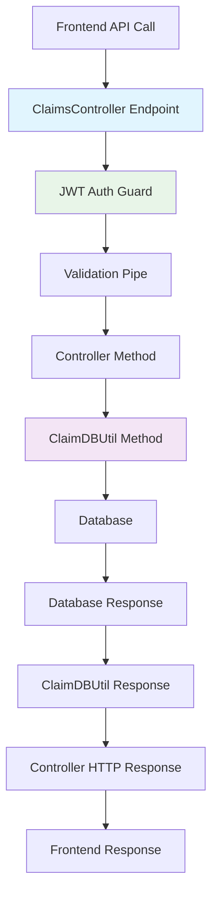

# Design Document

## Overview

The Claims API Implementation provides a straightforward NestJS REST controller that exposes the five missing endpoints the frontend expects: GET /claims, POST /claims, PUT /claims/:id, DELETE /claims/:id, and PUT /claims/:id/status. This implementation leverages existing ClaimEntity, ClaimDBUtil, authentication infrastructure, and validation patterns without requiring any architectural changes. The design follows the established "dumb controller, smart utilities" pattern used throughout the application.

## Steering Document Alignment

### Technical Standards (tech.md)
- **Object.freeze() Pattern**: Reuses existing ClaimStatus and ClaimCategory enums without modification
- **TypeScript Standards**: Maintains strict typing with proper DTOs following existing patterns
- **NestJS Architecture**: Standard controller/service pattern following AuthController and other existing controllers
- **Database Patterns**: Uses existing ClaimDBUtil methods without introducing new database access patterns
- **Authentication**: Leverages existing JWT guard and user context extraction

### Project Structure (structure.md)
- **Backend Modules**: Extends existing claims module with controller layer only
- **DTOs Structure**: Creates request/response DTOs following existing validation patterns
- **Error Handling**: Uses existing exception filters and error response formats
- **Testing**: Follows existing unit and integration test patterns with controller-specific test coverage

## Code Reuse Analysis

### Existing Components to Leverage (100% Reuse)
- **ClaimEntity**: Complete reuse of existing entity definition and relationships
- **ClaimDBUtil**: All CRUD operations already implemented - controller calls these directly
- **JWT Authentication**: Existing JwtAuthGuard and user context extraction
- **Validation Infrastructure**: Existing class-validator decorators and ValidationPipe
- **Error Handling**: Existing HttpException patterns and error response formats
- **Business Logic**: All claim validation rules already implemented in database utilities

### Zero New Infrastructure Needed
- **Database Schema**: No changes required to existing claim or user tables
- **Authentication**: No changes to existing Google OAuth or JWT token handling
- **Validation Rules**: All business rules already implemented in ClaimDBUtil
- **Error Patterns**: All error scenarios already handled by existing exception infrastructure

## Architecture

The Claims API controller implements a pure pass-through pattern where HTTP endpoints map directly to existing database utility methods. This eliminates complexity and maintains consistency with existing patterns.

### Request Flow Pattern
```
HTTP Request → Controller → ClaimDBUtil → Database
HTTP Response ← Controller ← ClaimDBUtil ← Database
```

### Zero Additional Layers
- No new service classes (controller calls ClaimDBUtil directly)
- No new validation logic (reuses existing validation)
- No new error handling (uses existing HttpException patterns)
- No new authentication (uses existing JWT guards)



## Components and Interfaces

### ClaimsController (New - Simple Pass-Through)
- **Purpose:** HTTP endpoint layer that maps requests to existing ClaimDBUtil methods
- **Pattern:** Standard NestJS controller with decorators and guards
- **Methods:**
  - `GET /claims` → `ClaimDBUtil.findClaimsByUser(userId, { status })`
  - `POST /claims` → `ClaimDBUtil.createClaim(userId, claimData)`
  - `PUT /claims/:id` → `ClaimDBUtil.updateClaim(userId, claimId, updates)`
  - `DELETE /claims/:id` → `ClaimDBUtil.deleteClaim(userId, claimId)`
  - `PUT /claims/:id/status` → `ClaimDBUtil.updateClaimStatus(userId, claimId, status)`
- **Authentication:** Uses existing `@UseGuards(JwtAuthGuard)` decorator
- **Validation:** Uses existing `@Body()` with DTOs and ValidationPipe

### Request/Response DTOs (New - Simple Mappings)

#### ClaimCreateRequestDto
```typescript
// Maps directly to existing ClaimDBUtil.createClaim parameters
export class ClaimCreateRequestDto {
  @IsEnum(ClaimCategory)
  category: ClaimCategory;

  @IsString()
  @IsNotEmpty()
  claimName: string;

  @IsInt()
  @Min(1)
  @Max(12)
  month: number;

  @IsInt()
  @Min(2020)
  year: number;

  @IsNumber()
  @Min(0.01)
  totalAmount: number;
}
```

#### ClaimUpdateRequestDto
```typescript
// Partial version of create DTO for updates
export class ClaimUpdateRequestDto extends PartialType(ClaimCreateRequestDto) {}
```

#### ClaimStatusUpdateDto
```typescript
export class ClaimStatusUpdateDto {
  @IsEnum(ClaimStatus)
  status: ClaimStatus;
}
```

#### ClaimResponseDto
```typescript
// Maps directly to ClaimEntity structure
export class ClaimResponseDto {
  id: string;
  category: ClaimCategory;
  claimName: string;
  month: number;
  year: number;
  totalAmount: number;
  status: ClaimStatus;
  userEmail: string;
  createdAt: Date;
  updatedAt: Date;
}
```

### Database Operations (Existing - Zero Changes)
All database operations already exist in ClaimDBUtil:
- `createClaim(userEmail: string, claimData: CreateClaimData): Promise<ClaimEntity>`
- `findClaimsByUser(userEmail: string, filters?: { status?: ClaimStatus }): Promise<ClaimEntity[]>`
- `updateClaim(userEmail: string, claimId: string, updates: Partial<ClaimEntity>): Promise<ClaimEntity>`
- `deleteClaim(userEmail: string, claimId: string): Promise<void>`
- `updateClaimStatus(userEmail: string, claimId: string, status: ClaimStatus): Promise<ClaimEntity>`

## Implementation Mapping

### Endpoint Implementation Pattern (Identical for All 5 Endpoints)

```typescript
@Controller('claims')
@UseGuards(JwtAuthGuard)
export class ClaimsController {
  constructor(private readonly claimDBUtil: ClaimDBUtil) {}

  @Get()
  async getClaims(
    @User() user: UserContext,
    @Query('status') status?: ClaimStatus
  ): Promise<ClaimResponseDto[]> {
    const claims = await this.claimDBUtil.findClaimsByUser(user.email, { status });
    return claims.map(claim => this.mapToResponseDto(claim));
  }

  @Post()
  async createClaim(
    @User() user: UserContext,
    @Body() createClaimDto: ClaimCreateRequestDto
  ): Promise<ClaimResponseDto> {
    const claim = await this.claimDBUtil.createClaim(user.email, createClaimDto);
    return this.mapToResponseDto(claim);
  }

  // Similar pattern for PUT, DELETE, PUT /:id/status
}
```

### Error Handling (Existing Pattern Reuse)
All error scenarios are already handled by ClaimDBUtil methods:
- **Not Found**: ClaimDBUtil throws NotFoundException → Controller returns 404
- **Validation**: ValidationPipe throws BadRequestException → Controller returns 400
- **Business Rules**: ClaimDBUtil throws UnprocessableEntityException → Controller returns 422
- **Database**: ClaimDBUtil throws InternalServerErrorException → Controller returns 500

### Authentication (Existing Pattern Reuse)
```typescript
// Uses existing JWT guard pattern
@UseGuards(JwtAuthGuard) // Existing guard
export class ClaimsController {
  // User context automatically extracted by existing decorator
  async getClaims(@User() user: UserContext) {
    // user.email already available from JWT token
  }
}
```

## Testing Strategy

### Unit Testing Pattern (Following Existing Patterns)

**Controller Tests:**
- Mock ClaimDBUtil methods and verify correct parameters passed
- Test HTTP status codes and response formats
- Test authentication guard integration
- Test validation pipe integration with DTOs

**Example Test Pattern:**
```typescript
describe('ClaimsController', () => {
  let controller: ClaimsController;
  let mockClaimDBUtil: jest.Mocked<ClaimDBUtil>;

  beforeEach(() => {
    // Setup mocks following existing test patterns
  });

  it('should return draft claims when status filter provided', async () => {
    // Test GET /claims?status=draft
    mockClaimDBUtil.findClaimsByUser.mockResolvedValue(mockDraftClaims);
    const result = await controller.getClaims(mockUser, ClaimStatus.DRAFT);
    expect(mockClaimDBUtil.findClaimsByUser).toHaveBeenCalledWith(
      mockUser.email,
      { status: ClaimStatus.DRAFT }
    );
    expect(result).toEqual(expectedResponseDtos);
  });
});
```

### Integration Testing (API Endpoint Testing)
- Test complete request/response cycle using existing API test patterns
- Verify JWT authentication enforcement
- Test error scenarios with actual database operations
- Validate request/response DTOs with real data

### Zero New Test Infrastructure
- Uses existing test database setup
- Uses existing JWT token mocking for authentication tests
- Uses existing API client patterns for integration tests
- Uses existing mock patterns for unit tests

## Error Scenarios and Handling

### HTTP Status Code Mapping (Standard REST Pattern)
- **200 OK**: Successful GET, PUT operations
- **201 Created**: Successful POST operations
- **204 No Content**: Successful DELETE operations
- **400 Bad Request**: Validation failures, malformed requests
- **401 Unauthorized**: Missing or invalid JWT token
- **404 Not Found**: Claim not found or not owned by user
- **422 Unprocessable Entity**: Business rule violations
- **500 Internal Server Error**: Database or system errors

### Error Response Format (Existing Pattern)
```typescript
// Uses existing HttpException format
{
  "statusCode": 400,
  "message": ["month must be between 1 and 12", "totalAmount must be positive"],
  "error": "Bad Request"
}
```

All error handling leverages existing patterns - no new error handling code required.

## Module Integration

### Claims Module Update (Minimal Changes)
```typescript
@Module({
  controllers: [ClaimsController], // Add controller
  providers: [ClaimDBUtil],        // Existing
  exports: [ClaimDBUtil],          // Existing
})
export class ClaimsModule {}
```

### App Module Registration (Standard Pattern)
```typescript
@Module({
  imports: [
    ClaimsModule, // Already imported
    // Other existing modules
  ],
})
export class AppModule {}
```

No changes to existing module structure or dependencies required.

## API Documentation

### Swagger Integration (Following Existing Pattern)
```typescript
@ApiTags('claims')
@Controller('claims')
export class ClaimsController {
  @ApiOperation({ summary: 'Get user claims with optional status filter' })
  @ApiQuery({ name: 'status', enum: ClaimStatus, required: false })
  @ApiResponse({ status: 200, type: [ClaimResponseDto] })
  @Get()
  async getClaims(/* ... */) {/* ... */}
}
```

Documentation follows the exact same pattern as existing AuthController and other controllers.