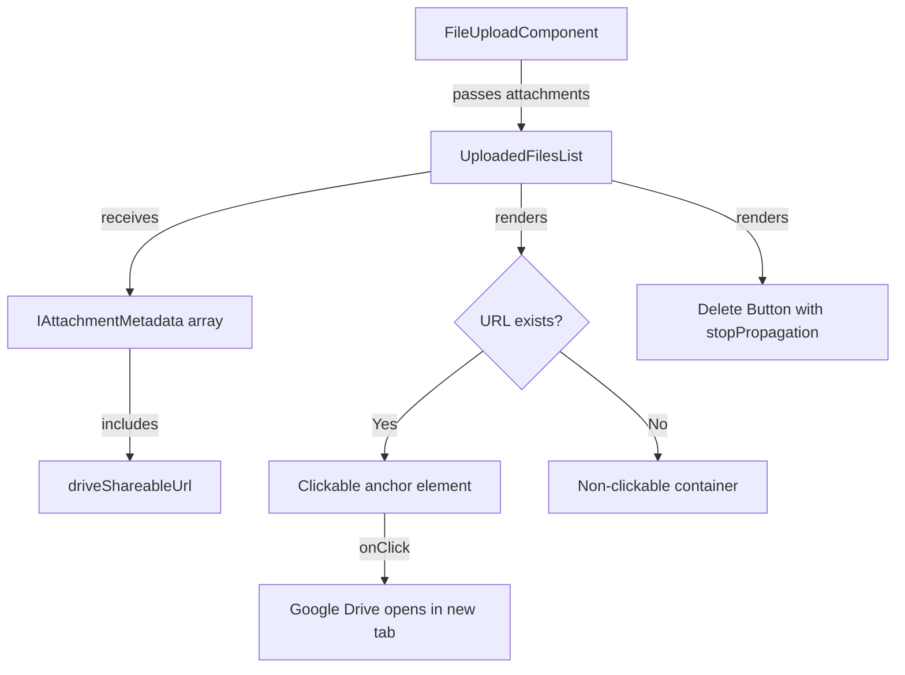

# Design Document

## Overview

The **Clickable File List** feature adds one-click access to Google Drive files from the `UploadedFilesList` component. The design follows the **Linus principle: eliminate special cases through proper data structure**. Instead of complex click handlers and keyboard events, we use semantic HTML (`<a>` tags) to get accessibility, keyboard navigation, and security for free.

**Core Philosophy:**
- **Data First:** Expose `driveShareableUrl` from existing `IAttachmentMetadata` type
- **Semantic HTML:** Use `<a>` tags instead of `div` + `onClick` for built-in accessibility
- **Zero Special Cases:** URL is always present for uploaded files; optional chaining handles edge case
- **No Over-Engineering:** Inline the solution, don't create unnecessary abstractions

## Steering Document Alignment

### Technical Standards (tech.md)

**TypeScript Strict Mode:**
- Interface extends/aligns with `IAttachmentMetadata` from `@project/types`
- No `any` types
- Optional chaining for defensive null handling

**Shared Types Pattern:**
- Leverage existing `IAttachmentMetadata` type instead of duplicating fields
- Ensures type consistency between backend DTOs and frontend components

**Component Modularity:**
- Changes isolated to single component file (`uploaded-files-list.tsx`)
- No new dependencies or utilities needed
- Existing `cn()` utility for className composition

### Project Structure (structure.md)

**Component Organization:**
- Location: `frontend/src/components/attachments/uploaded-files-list.tsx`
- Follows established component patterns in the attachments module
- Maintains React.memo optimization for performance

**Naming Conventions:**
- PascalCase for component: `UploadedFilesList`
- camelCase for props: `driveShareableUrl`
- kebab-case for CSS classes: `cursor-pointer`

## Code Reuse Analysis

### Existing Components to Leverage

**AttachmentList Component** (`frontend/src/components/attachments/AttachmentList.tsx`):
- **Pattern Discovered (lines 113-116, 209, 273):** Already uses `window.open(attachment.driveShareableUrl, '_blank')`
- **Security Gap Identified:** Missing `rel="noopener noreferrer"` security attribute
- **Our Improvement:** Use semantic `<a>` tag with proper security attributes instead of `window.open()`

**useAttachmentList Hook** (`frontend/src/hooks/attachments/useAttachmentList.ts`):
- **Data Source:** Returns `IAttachmentMetadata[]` from backend (line 120)
- **Field Already Present:** `driveShareableUrl` exists in `IAttachmentMetadata` type
- **No Changes Needed:** Hook already provides the data we need

**Button Component** (`frontend/src/components/ui/button.tsx`):
- **Accessibility Pattern:** Uses focus-visible rings and ARIA attributes
- **We Apply:** Similar hover/focus patterns for our clickable file items

### Integration Points

**Type System** (`packages/types/src/dtos/attachment.dto.ts`):
- `IAttachmentMetadata` interface (line 37-50) includes `driveShareableUrl: string` (line 45)
- Our component interface will align with this existing type

**Google Drive URLs:**
- Backend generates shareable URLs when files are uploaded
- URLs flow through: Backend → DTO → Hook → Component
- No API changes needed; data pipeline already complete

## Architecture

### Modular Design Principles

**Single File Responsibility:**
- All changes confined to `uploaded-files-list.tsx`
- No new files, utilities, or hooks created
- Existing component behavior fully preserved

**Semantic HTML Over JavaScript:**
- Use native `<a>` tag instead of `div` + `onClick` handler
- Browser provides keyboard accessibility, context menus, screen reader support
- Eliminates need for custom keyboard event handlers

**Defensive Programming:**
- Optional chaining (`driveShareableUrl?.`) handles missing URLs gracefully
- Conditional rendering wraps content in `<a>` only when URL exists
- Fallback to non-clickable div maintains visual consistency

### Component Structure



## Components and Interfaces

### UploadedFilesList Component (Modified)

**File:** `frontend/src/components/attachments/uploaded-files-list.tsx`

**Purpose:** Display uploaded files with click-to-open functionality for Google Drive access

**Interface Changes:**
```typescript
// BEFORE
export interface UploadedFile {
  id: string;
  originalFilename: string;
  fileSize: number;
  mimeType: string;
}

// AFTER (align with IAttachmentMetadata)
export interface UploadedFile {
  id: string;
  originalFilename: string;
  fileSize: number;
  mimeType: string;
  driveShareableUrl?: string; // Optional for safety, though always present for uploaded files
}
```

**Dependencies:**
- Existing: `React`, `cn`, `Button`, `lucide-react` icons, `formatFileSize`
- No new dependencies added

**Reuses:**
- `cn()` utility for className composition
- Existing hover/focus patterns from Button component
- `stopPropagation()` pattern already present on delete button

**Component Logic:**
```typescript
// Conditional wrapper for clickability
{file.driveShareableUrl ? (
  <a
    href={file.driveShareableUrl}
    target="_blank"
    rel="noopener noreferrer"
    className="flex-1 min-w-0 cursor-pointer hover:opacity-80 transition-opacity"
  >
    {/* File info content */}
  </a>
) : (
  <div className="flex-1 min-w-0">
    {/* Same file info content */}
  </div>
)}
```

**Why This Design:**
1. **Semantic HTML:** `<a>` tag provides keyboard nav (Tab, Enter), context menu, screen reader support
2. **Security:** `rel="noopener noreferrer"` prevents reverse tabnabbing attacks
3. **Simplicity:** No custom event handlers needed for clicks or keyboard
4. **Accessibility:** Built-in focus states and ARIA support from native anchor element
5. **User Experience:** Right-click "Open in new tab", middle-click for background tab

## Data Models

### UploadedFile Interface (Updated)

```typescript
export interface UploadedFile {
  id: string;                    // Unique attachment identifier
  originalFilename: string;      // Original filename from user's device
  fileSize: number;              // File size in bytes
  mimeType: string;              // MIME type (e.g., 'application/pdf')
  driveShareableUrl?: string;    // Google Drive shareable URL (optional for type safety)
}
```

**Alignment with Backend:**
- Maps directly to `IAttachmentMetadata` from `@project/types`
- Field names match exactly (except `driveShareableUrl` vs. backend's `googleDriveUrl`)
- Backend: `driveShareableUrl: string` (line 45 in attachment.dto.ts)
- Frontend: Made optional (`?`) for defensive typing, though always present in practice

**Data Flow:**
1. Backend uploads file to Google Drive → generates shareable URL
2. Backend returns `IAttachmentMetadata` with `driveShareableUrl`
3. `useAttachmentList` hook fetches and provides data
4. `UploadedFilesList` receives array and renders clickable items

## Error Handling

### Error Scenarios

1. **Missing driveShareableUrl (null/undefined)**
   - **Handling:** Optional chaining and conditional rendering
   - **User Impact:** File displays normally but is not clickable (no cursor change, no link)
   - **Code:** `{file.driveShareableUrl ? <a>...</a> : <div>...</div>}`

2. **Invalid URL format**
   - **Handling:** Browser's native URL validation in `<a href>`
   - **User Impact:** Browser may show error or refuse to navigate
   - **Mitigation:** Backend guarantees valid Google Drive URLs; no frontend validation needed

3. **Delete button click propagation**
   - **Handling:** Existing `e.stopPropagation()` on delete button (line 85 in original)
   - **User Impact:** Delete action works independently of file item click
   - **Code:** Preserved as-is, no changes needed

4. **TypeScript compilation errors**
   - **Handling:** Make `driveShareableUrl` optional in interface
   - **User Impact:** None (development-time safety)
   - **Code:** `driveShareableUrl?: string;`

### Security Considerations

**Reverse Tabnabbing Prevention:**
- **Issue:** `target="_blank"` without `rel` allows opened page to access `window.opener`
- **Solution:** Always use `rel="noopener noreferrer"`
- **Code:** `<a target="_blank" rel="noopener noreferrer">`

**XSS Prevention:**
- **Issue:** Malicious URLs could execute scripts
- **Solution:** Google Drive URLs are generated by Google's servers (trusted source)
- **Additional Safety:** React's JSX escapes href attribute values automatically

## Testing Strategy

### Unit Testing

**Component Tests** (`uploaded-files-list.test.tsx`):
1. **Renders clickable link when URL present:**
   - Given: File with valid `driveShareableUrl`
   - When: Component renders
   - Then: Anchor tag exists with correct href and security attributes

2. **Renders non-clickable div when URL missing:**
   - Given: File without `driveShareableUrl`
   - When: Component renders
   - Then: Content wrapped in div, no anchor tag, no cursor-pointer

3. **Delete button works independently:**
   - Given: Clickable file item
   - When: Delete button clicked
   - Then: Only delete handler fires, no navigation occurs

4. **Preserves existing behavior:**
   - Given: Zero files
   - When: Component renders
   - Then: Returns null (existing behavior)

**Accessibility Tests:**
1. **Keyboard navigation:**
   - Given: Clickable file item
   - When: Tab key pressed
   - Then: Focus moves to file item link

2. **Screen reader support:**
   - Given: File item rendered
   - When: Screen reader reads content
   - Then: Announces as link with filename

### Integration Testing

**FileUploadComponent Integration:**
1. **Data flow from hook to component:**
   - Given: `useAttachmentList` returns attachments with `driveShareableUrl`
   - When: `UploadedFilesList` receives data
   - Then: Clickable links render correctly

2. **Type safety:**
   - Given: TypeScript strict mode enabled
   - When: Component receives `IAttachmentMetadata[]`
   - Then: No type errors, optional field handled gracefully

### End-to-End Testing

**User Scenarios:**
1. **Click file to view in Drive:**
   - User uploads file
   - User clicks on file item
   - Google Drive opens in new tab with file
   - Original tab remains unchanged

2. **Delete file without opening:**
   - User clicks delete button on file item
   - Confirmation dialog appears
   - File deleted, no Drive navigation occurs

3. **Keyboard accessibility:**
   - User tabs to file item
   - User presses Enter
   - Google Drive opens in new tab

### Visual Regression Testing

**Hover States:**
- Before hover: Normal appearance
- During hover: Cursor changes to pointer, slight opacity change
- Focus state: Browser's native focus ring visible

**Mobile Touch:**
- Touch targets meet 44x44px minimum
- Tap on file opens Drive (no hover state on mobile)
- Delete button tap works independently

## Implementation Plan

### Phase 1: Interface Update
1. Add `driveShareableUrl?: string` to `UploadedFile` interface
2. Verify TypeScript compilation succeeds

### Phase 2: Component Markup Changes
1. Extract file info content into reusable JSX
2. Add conditional wrapper logic (URL present → `<a>`, else → `<div>`)
3. Apply security attributes and styling classes

### Phase 3: Styling
1. Add `cursor-pointer` class when URL present
2. Add hover opacity transition: `hover:opacity-80 transition-opacity`
3. Verify dark mode compatibility (existing styles preserved)

### Phase 4: Testing
1. Write unit tests for new behavior
2. Manual testing across browsers (Chrome, Safari, Firefox)
3. Mobile testing (iOS Safari, Chrome Android)
4. Accessibility audit (keyboard nav, screen reader)

### Phase 5: Documentation
1. Update component JSDoc comments
2. Add inline code comments explaining conditional rendering
3. Update any integration documentation if needed

## Performance Considerations

**Zero Performance Impact:**
- No new API calls (data already fetched by `useAttachmentList`)
- No new React hooks or state management
- Existing `React.memo` optimization preserved
- Conditional rendering is O(1) operation per file

**Bundle Size:**
- No new dependencies
- Minimal additional code (<20 lines)
- Negligible impact on bundle size

## Accessibility Compliance

**WCAG 2.1 AA Standards:**
- ✅ **Keyboard Navigation:** Native `<a>` tag provides full keyboard support
- ✅ **Focus Indicators:** Browser default focus ring visible
- ✅ **Touch Targets:** Existing 44px+ height maintained
- ✅ **Screen Readers:** Semantic HTML announces links properly
- ✅ **Color Contrast:** Existing dark mode styles meet contrast requirements

**Additional Benefits:**
- Right-click context menu (Open in new tab, Copy link, etc.)
- Middle-click for background tab opening
- Mobile long-press for options menu
