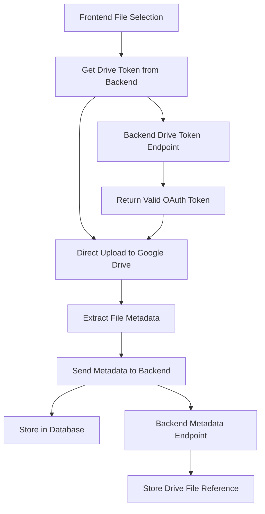

# Design Document

## Overview

This design implements direct client-side uploads to Google Drive, completely eliminating server-side file handling. The architecture separates concerns between authentication (backend), file storage (Google Drive), and metadata management (backend), creating a clean, scalable, and secure file upload system that respects employee file ownership.

**Core Principle**: Files flow Browser → Google Drive. Backend handles ONLY metadata and OAuth token management.

## Steering Document Alignment

### Technical Standards (tech.md)
- **Enum Pattern**: Maintains Object.freeze() pattern for attachment status and types
- **TypeScript Standards**: Strict typing throughout with proper error handling
- **Module Architecture**: Clear separation of concerns between auth, drive, and metadata services
- **Testing**: Comprehensive unit and integration test coverage for new components
- **Database**: Uses existing attachment entity structure, removes file buffer handling

### Project Structure (structure.md)
- **Backend Modules**: Extends existing auth module with drive token endpoint, refactors attachment module
- **Frontend Components**: Leverages existing hook patterns, adds Google Drive API integration
- **Shared Types**: Utilizes @project/types for consistent interfaces across workspaces
- **API Design**: Follows existing REST patterns with proper DTOs and validation

## Code Reuse Analysis

### Existing Components to Leverage
- **AuthService & TokenDBUtil**: Reuse OAuth token encryption/decryption and refresh logic
- **AttachmentEntity & DB Utilities**: Reuse database model, remove file buffer fields
- **JWT Auth Guards & Rate Limiting**: Apply existing authentication patterns to new endpoints
- **React Query Patterns**: Extend useAttachmentUpload hook pattern for Drive operations
- **Error Handling**: Leverage existing ErrorHandler utility for consistent error processing

### Integration Points
- **Google OAuth Strategy**: Extend existing Google OAuth scope to include Drive access
- **Attachment Database Schema**: Modify to store Drive file metadata instead of binary references
- **Frontend API Client**: Extend existing apiClient for new Drive token endpoint
- **Toast Notifications**: Reuse existing toast system for upload progress and error feedback

## Architecture

The new architecture eliminates the server as a file proxy and implements proper separation of concerns:



### Modular Design Principles
- **Single File Responsibility**: DriveTokenService handles only token provisioning, AttachmentMetadataService handles only database operations
- **Component Isolation**: Frontend DriveUploadClient isolated from backend file operations
- **Service Layer Separation**: Clear boundaries between authentication, Drive API, and metadata persistence
- **Utility Modularity**: Focused utilities for Drive API calls, file validation, and progress tracking

## Components and Interfaces

### Backend: DriveTokenController
- **Purpose:** Provides temporary Drive access tokens to authenticated frontend clients
- **Interfaces:**
  - `GET /auth/drive-token` → `{ accessToken: string, expiresIn: number }`
- **Dependencies:** AuthService, TokenDBUtil
- **Reuses:** Existing JWT auth guards, OAuth token refresh logic, rate limiting decorators

### Backend: AttachmentMetadataController (refactored)
- **Purpose:** Stores and retrieves Google Drive file metadata only
- **Interfaces:**
  - `POST /attachments/metadata` → Store Drive file reference
  - `GET /attachments/:claimId` → List claim attachments
  - `DELETE /attachments/:id` → Remove metadata (not Drive file)
- **Dependencies:** AttachmentService (refactored), AttachmentEntity
- **Reuses:** Existing validation patterns, error handling, authentication guards

### Backend: GoogleDriveTokenService (new)
- **Purpose:** Manages Drive-specific token operations and scope validation
- **Interfaces:**
  - `getValidDriveToken(userId: string)` → Valid access token for Drive API
  - `validateDriveScopes(tokens: OauthTokenEntity)` → Ensure proper Drive permissions
- **Dependencies:** AuthService, TokenDBUtil
- **Reuses:** Existing token encryption/decryption, refresh mechanisms

### Frontend: DriveUploadClient (new)
- **Purpose:** Direct Google Drive API integration for file uploads
- **Interfaces:**
  - `uploadFile(file: File, accessToken: string, folderId?: string)` → DriveFileMetadata
  - `createFolder(folderName: string, accessToken: string, parentId?: string)` → string
- **Dependencies:** Google Drive REST API, fetch API
- **Reuses:** Existing error handling patterns, progress tracking concepts

### Frontend: useAttachmentUpload (refactored)
- **Purpose:** Orchestrates the complete upload flow: token → upload → metadata storage
- **Interfaces:**
  - `uploadFile(file: File)` → Upload status and metadata
  - `validateFiles(files: File[])` → Validation results
- **Dependencies:** DriveUploadClient, apiClient for metadata calls
- **Reuses:** Existing React Query patterns, toast notifications, validation logic

## Data Models

### DriveTokenResponse (new)
```typescript
interface DriveTokenResponse {
  accessToken: string;
  expiresIn: number; // seconds until expiry
  scope: string; // 'https://www.googleapis.com/auth/drive.file'
  tokenType: 'Bearer';
}
```

### DriveFileMetadata (new)
```typescript
interface DriveFileMetadata {
  driveFileId: string;
  fileName: string;
  fileSize: number;
  mimeType: AttachmentMimeType;
  webViewLink: string; // shareable URL
  createdAt: Date;
}
```

### AttachmentMetadataRequest (refactored)
```typescript
interface AttachmentMetadataRequest {
  claimId: string;
  driveFileId: string;
  fileName: string;
  fileSize: number;
  mimeType: AttachmentMimeType;
  webViewLink: string;
}
```

### AttachmentEntity (updated)
```typescript
// Remove these fields:
// - fileBuffer: Buffer (DELETE)
// - filePath: string (DELETE)
// - uploadProgress: number (DELETE)

// Keep/Add these fields:
// - driveFileId: string (EXISTING)
// - webViewLink: string (EXISTING)
// - fileName: string (EXISTING)
// - fileSize: number (EXISTING)
// - mimeType: AttachmentMimeType (EXISTING)
```

## Error Handling

### Error Scenarios

1. **Token Expired During Upload**
   - **Handling:** Frontend catches 401, requests new token, retries upload
   - **User Impact:** Brief "Refreshing connection..." message, seamless retry

2. **Google Drive Quota Exceeded**
   - **Handling:** Drive API returns 403 with quotaExceeded, surface to user
   - **User Impact:** Clear message: "Google Drive storage full. Please free space and try again."

3. **Network Failure During Upload**
   - **Handling:** Implement exponential backoff retry with progress preservation
   - **User Impact:** "Retrying upload..." with progress bar continuing from last position

4. **Invalid File Permissions**
   - **Handling:** Backend validates Drive scopes before issuing tokens
   - **User Impact:** "Please re-authorize Google Drive access" with OAuth re-flow

5. **Backend Metadata Storage Failure**
   - **Handling:** File uploaded to Drive successfully but metadata save fails
   - **User Impact:** "Upload complete but not linked to claim. Contact support with file: [filename]"

6. **Drive API Rate Limiting**
   - **Handling:** Exponential backoff with user feedback
   - **User Impact:** "Google Drive is busy. Waiting to retry..." with countdown timer

## Testing Strategy

### Unit Testing

**Backend Tests:**
- DriveTokenController: Mock AuthService, validate token format and expiry
- AttachmentMetadataController: Mock database calls, test validation logic
- GoogleDriveTokenService: Mock token encryption/decryption, test scope validation

**Frontend Tests:**
- DriveUploadClient: Mock fetch calls to Drive API, test error handling
- useAttachmentUpload hook: Mock API calls, test state transitions and progress tracking
- File validation: Test all validation rules with edge cases

### Integration Testing

**API Integration:**
- Drive token endpoint: Full OAuth flow with real Google API calls
- Metadata endpoint: Database integration with attachment entity operations
- Error scenarios: Network failures, invalid tokens, permission denials

**Frontend Integration:**
- Complete upload flow: File selection → token fetch → Drive upload → metadata save
- Error recovery: Token refresh, upload retry, fallback handling
- Progress tracking: Real-time updates during multi-file uploads

### End-to-End Testing

**User Scenarios:**
1. **Happy Path**: Select file → upload progress → success notification → file appears in claim
2. **Token Refresh**: Long session → token expires during upload → seamless refresh → successful upload
3. **Large File Upload**: 10MB file → progress tracking → completion with accurate time estimates
4. **Network Interruption**: Upload starts → network fails → automatic retry → successful completion
5. **Drive Permissions**: New user → missing Drive scope → OAuth re-authorization → successful upload

**Performance Testing:**
- Concurrent uploads: Multiple files uploading simultaneously
- Large file handling: Progress accuracy and memory usage
- Token caching: Minimize backend calls for valid tokens