# Design Document: Frontend Component Refactoring

## Overview

This design addresses endemic code duplication and Single Responsibility Principle violations across the frontend codebase. The refactoring eliminates ~40% code duplication by extracting shared utilities, breaking monolithic 600+ line components into focused sub-components, and applying the principle that **good code has no special cases**.

**Core Philosophy**: Simplify the data structure so that duplicated logic becomes shared utilities, and complex components become compositions of simple, focused components. The result is code where adding new claim categories or file types requires changing one place, not seven.

**Backward Compatibility Guarantee**: Zero breaking changes. All external APIs remain unchanged. All tests pass without modification.

## Steering Document Alignment

### Technical Standards (tech.md)

**TypeScript Strict Mode**: All new utilities and components maintain strict type safety with zero `any` types.

**Enum Pattern**: Use `Object.freeze()` with `as const` for constants (already established pattern).

**No Breaking Changes**: The sacred law - external component props and behavior remain identical.

**Testing**: Maintain existing Vitest unit test coverage. New utilities enable easier isolated testing.

### Project Structure (structure.md)

**Design Rationale for Folder Organization**:
- **`components/ui/`**: Reserved for third-party ShadCN UI library components - NOT for project-specific code
- **`components/common/`**: Project-specific reusable components, organized by type (badges, icons, skeletons, etc.)
- **Why organize by type?** The folder structure itself documents the architecture. When you need an icon, you know exactly where to look: `common/icons/`. When you need a badge, it's in `common/badges/`. No guessing, no searching 7 files.

**Frontend Organization**:
```
frontend/src/
├── components/
│   ├── common/                    # Shared/reusable components (NEW: extracted patterns)
│   │   ├── badges/
│   │   │   └── claim-status-badge.tsx
│   │   ├── icons/
│   │   │   └── file-type-icon.tsx
│   │   ├── skeletons/
│   │   │   └── loading-skeleton.tsx
│   │   ├── empty-states/
│   │   │   └── empty-state.tsx
│   │   └── errors/
│   │       └── error-display.tsx
│   ├── ui/                        # ShadCN components (existing, no changes)
│   │   ├── button.tsx
│   │   ├── card.tsx
│   │   ├── alert.tsx
│   │   └── ... (existing ShadCN UI components)
│   ├── attachments/               # Attachment feature (refactored)
│   ├── claims/                    # Claims feature (refactored)
│   ├── auth/                      # Auth components (minimal changes)
│   └── email/                     # Email components (minimal changes)
├── lib/                           # Shared utilities (EXPANDED)
│   ├── claim-utils.ts             # NEW: Claim formatting/display logic
│   ├── file-utils.ts              # NEW: File operations
│   ├── format-utils.ts            # NEW: Date/currency formatting
│   └── utils.ts                   # Existing: cn() and general utilities
└── hooks/
    ├── attachments/               # Existing hooks
    ├── claims/                    # NEW: Business logic hooks
    └── queries/                   # Existing query hooks
```

## Code Reuse Analysis

### Existing Patterns to Leverage

**UI Component Library**: shadcn/ui components (Card, Button, Alert, etc.) - already established, reuse pattern

**React Query**: Data fetching and caching - existing hooks in `@frontend/src/hooks/queries/`

**Form Handling**: react-hook-form pattern from `MultiClaimForm.tsx` - proven pattern to reuse

**Loading States**: Skeleton pattern from `ClaimsListComponent.tsx` - extract and reuse

**Error Handling**: Toast notifications via sonner - consistent pattern across all components

### Integration Points

**Existing Hooks to Extend**:
- `useAttachmentList` - no changes, used by refactored components
- `useAttachmentUpload` - no changes, state management remains internal
- `useEmailSending` - no changes, API contract unchanged

**Existing Utilities**:
- `cn()` from `@/lib/utils` - continue using for className merging
- `apiClient` from `@/lib/api-client` - no changes to API layer

**Type System**:
- Import types from `@project/types` - existing pattern, no changes
- All components maintain existing prop interfaces for backward compatibility

## Architecture

### Design Principles

**1. Good Taste - Eliminate Special Cases**

*Problem*: Every component has its own `getCategoryDisplayName()` function. Adding a new category requires changing 7 files.

*Solution*: One function in `@/lib/claim-utils.ts`. The special case of "where do I put this?" disappears.

**2. Simplify Data Structures**

*Problem*: `getStatusInfo()` and `getStatusDisplay()` exist in 3 different files with slightly different return structures.

*Solution*: Single canonical `getClaimStatusConfig()` that returns a consistent structure. Status badge component consumes it directly.

**3. Single Responsibility Per File**

*Problem*: `FileUploadComponent.tsx` (645 lines) handles drag-drop, file validation, preview generation, upload progress, error display, and already-uploaded file management.

*Solution*: Six focused components, each under 100 lines:
- `UploadZone` - handles drag-drop events only
- `FilePreviewList` - renders pending uploads only
- `UploadProgressTracker` - shows current upload status only
- `UploadedFilesList` - displays completed uploads only
- `FileUploadComponent` - orchestrates the above (composition)

**4. Never Break Userspace**

*Guarantee*: All refactored components maintain exact same props interface. If a component currently accepts `onUploadSuccess?: (fileName: string) => void`, it continues to accept it. Internal implementation changes, external API doesn't.

### Component Architecture

```mermaid
graph TB
    subgraph "Shared Utilities Layer"
        CU[claim-utils.ts]
        FU[file-utils.ts]
        FormatU[format-utils.ts]
    end

    subgraph "Reusable UI Layer"
        CSB[ClaimStatusBadge]
        FTI[FileTypeIcon]
        LS[LoadingSkeleton]
        ES[EmptyState]
        ED[ErrorDisplay]
    end

    subgraph "Feature Components - Attachments"
        FUC[FileUploadComponent]
        UZ[UploadZone]
        FPL[FilePreviewList]
        UPT[UploadProgressTracker]
        UFL[UploadedFilesList]

        FUC --> UZ
        FUC --> FPL
        FUC --> UPT
        FUC --> UFL
    end

    subgraph "Feature Components - Claims"
        CLC[ClaimsListComponent]
        CC[ClaimCard]

        CRC[ClaimReviewComponent]
        CRI[ClaimReviewItem]
        RSS[ReviewSummaryStats]
        RA[ReviewActions]

        MCF[MultiClaimForm]
        CS[CategorySelect]
        MYP[MonthYearPicker]
        FA[FormActions]

        CLC --> CC
        CRC --> CRI
        CRC --> RSS
        CRC --> RA
        MCF --> CS
        MCF --> MYP
        MCF --> FA
    end

    %% Dependencies
    CC --> CSB
    CC --> CU
    CC --> FormatU

    CRI --> CSB
    CRI --> CU
    CRI --> FormatU

    FPL --> FTI
    FPL --> FU

    UFL --> FTI
    UFL --> FU

    CS --> CU
    MYP --> FormatU

    style CU fill:#e1f5e1
    style FU fill:#e1f5e1
    style FormatU fill:#e1f5e1
    style CSB fill:#fff4e6
    style FTI fill:#fff4e6
```



## Components and Interfaces

### Phase 1: Shared Utilities (The Foundation)

#### claim-utils.ts

**Purpose**: Centralize all claim-related display logic and formatting

**Exports**:
```typescript
export const getCategoryDisplayName = (category: ClaimCategory): string
export const getClaimStatusConfig = (status: ClaimStatus): StatusConfig
export const MONTHLY_LIMITS: Record<ClaimCategory, number | undefined>
export const validateMonthlyLimit = (
  category: ClaimCategory,
  amount: number,
  month: number,
  year: number,
  existingClaims: IClaimMetadata[]
): ValidationResult
```

**Interface**:
```typescript
interface StatusConfig {
  label: string;
  color: string;        // Tailwind text color class
  bgColor: string;      // Tailwind bg color class
  borderColor: string;  // Tailwind border color class
  icon: LucideIcon;     // Icon component from lucide-react
}

interface ValidationResult {
  valid: boolean;
  error?: string;
  currentTotal?: number;
  limit?: number;
}
```

**Reuses**: Nothing - this is the foundation layer

**Migration Strategy**: Create file → Update one component at a time → Delete old functions

#### file-utils.ts

**Purpose**: Centralize all file-related operations and validation

**Exports**:
```typescript
export const formatFileSize = (bytes: number): string
export const getFileTypeInfo = (mimeType: string): FileTypeInfo
export const validateFileType = (file: File, allowedTypes: string[]): boolean
export const validateFileSize = (file: File, maxSize: number): boolean
export const createFilePreview = (file: File): Promise<string | undefined>
```

**Interface**:
```typescript
interface FileTypeInfo {
  icon: LucideIcon;
  color: string;      // Tailwind text color
  bgColor: string;    // Tailwind bg color
  category: 'image' | 'document' | 'other';
}
```

**Reuses**: Nothing - foundation layer

#### format-utils.ts

**Purpose**: Centralize all date and currency formatting

**Exports**:
```typescript
export const formatAmount = (amount: number, currency?: string): string
export const formatMonthYear = (month: number, year: number): string
export const formatDate = (
  dateString: string,
  options?: Intl.DateTimeFormatOptions
): string
export const formatRelativeTime = (dateString: string): string  // "2 days ago"
```

**Reuses**: Intl.NumberFormat, Intl.DateTimeFormat (browser APIs)

---

### Phase 2: Reusable Common Components

**Location**: `@frontend/src/components/common/` organized by component type

#### ClaimStatusBadge

**File**: `@frontend/src/components/common/badges/claim-status-badge.tsx`

**Purpose**: Consistent status badge display across all claim views

**Props Interface** (NEW component, no backward compatibility needed):
```typescript
interface ClaimStatusBadgeProps {
  status: ClaimStatus;
  size?: 'sm' | 'md' | 'lg';
  showIcon?: boolean;
  className?: string;
}
```

**Dependencies**: `getClaimStatusConfig()` from claim-utils.ts, lucide-react icons

**Reuses**: Badge styling patterns from existing components

**Implementation Notes**:
- Single source of truth for status appearance
- Supports accessibility (aria-label with status description)
- Optimized with React.memo for performance

#### FileTypeIcon

**File**: `@frontend/src/components/common/icons/file-type-icon.tsx`

**Purpose**: Consistent file type icon display

**Props Interface**:
```typescript
interface FileTypeIconProps {
  mimeType: string;
  size?: number;  // Icon size in pixels, default 20
  className?: string;
  showBackground?: boolean;  // Show colored background circle
}
```

**Dependencies**: `getFileTypeInfo()` from file-utils.ts, lucide-react icons

**Reuses**: Icon styling patterns from AttachmentList.tsx

#### LoadingSkeleton

**File**: `@frontend/src/components/common/skeletons/loading-skeleton.tsx`

**Purpose**: Reusable loading state component

**Props Interface**:
```typescript
interface LoadingSkeletonProps {
  variant: 'claim-card' | 'claim-list' | 'attachment-list' | 'form';
  count?: number;  // Number of skeleton items
  className?: string;
}
```

**Reuses**: Skeleton pattern from ClaimsListComponent.tsx (lines 183-201)

#### EmptyState

**File**: `@frontend/src/components/common/empty-states/empty-state.tsx`

**Purpose**: Consistent empty state display

**Props Interface**:
```typescript
interface EmptyStateProps {
  icon: LucideIcon;
  title: string;
  description: string;
  action?: {
    label: string;
    onClick: () => void;
  };
  className?: string;
}
```

**Reuses**: Empty state patterns from DraftClaimsList.tsx and ClaimsListComponent.tsx

#### ErrorDisplay

**File**: `@frontend/src/components/common/errors/error-display.tsx`

**Purpose**: Consistent error display component

**Props Interface**:
```typescript
interface ErrorDisplayProps {
  error: Error | string;
  variant?: 'inline' | 'toast' | 'alert';
  onRetry?: () => void;
  className?: string;
}
```

**Reuses**: Alert component from shadcn/ui, existing error styling patterns

---

### Phase 3: Refactored Feature Components

#### FileUploadComponent (REFACTORED)

**Current State**: 645 lines, handles everything

**Refactored Design**: Orchestrator component (~120 lines) composing:

**Sub-components to Extract**:

1. **UploadZone** (~80 lines)
   - **Purpose**: Drag-and-drop upload area
   - **Props**:
     ```typescript
     interface UploadZoneProps {
       onFilesSelected: (files: File[]) => void;
       disabled?: boolean;
       multiple?: boolean;
       allowedTypes: string[];
       maxFileSize: number;
       isDragOver: boolean;
       onDragOver: (isDragOver: boolean) => void;
     }
     ```
   - **Responsibilities**: Handle drag events, render dropzone UI, trigger file picker
   - **Reuses**: `formatFileSize()` from format-utils.ts

2. **FilePreviewList** (~70 lines)
   - **Purpose**: Display files pending upload
   - **Props**:
     ```typescript
     interface FilePreviewListProps {
       files: FilePreview[];
       onRemove: (fileId: string) => void;
       uploadProgress: Map<string, UploadProgress>;
     }
     ```
   - **Responsibilities**: Render preview thumbnails, show file info, remove button
   - **Reuses**: `FileTypeIcon`, `formatFileSize()`

3. **UploadProgressTracker** (~60 lines)
   - **Purpose**: Show active upload progress
   - **Props**:
     ```typescript
     interface UploadProgressTrackerProps {
       uploads: CurrentUpload[];
     }
     ```
   - **Responsibilities**: Progress bars, time remaining, status indicators
   - **Reuses**: `FileTypeIcon`, `formatFileSize()`

4. **UploadedFilesList** (~80 lines)
   - **Purpose**: Display successfully uploaded files
   - **Props**:
     ```typescript
     interface UploadedFilesListProps {
       attachments: IAttachmentMetadata[];
       onDelete: (attachmentId: string) => Promise<void>;
       isDeleting: boolean;
     }
     ```
   - **Responsibilities**: Show uploaded files, delete actions
   - **Reuses**: `FileTypeIcon`, `formatFileSize()`, `formatDate()`

**Main Component** (~120 lines):
```typescript
export const FileUploadComponent: React.FC<FileUploadComponentProps> = ({
  claimId,
  onUploadSuccess,
  onUploadError,
  className,
  multiple = true,
  disabled = false,
}) => {
  // State management (hooks)
  const { uploadFile, uploadFiles, ... } = useAttachmentUpload(claimId);
  const { attachments, deleteAttachment, ... } = useAttachmentList(claimId);

  // Local state for file previews
  const [filePreviews, setFilePreviews] = useState<FilePreview[]>([]);
  const [isDragOver, setIsDragOver] = useState(false);

  // Event handlers
  const handleFiles = useCallback(async (files: File[]) => { ... }, []);

  // Composition
  return (
    <div className={cn('w-full space-y-4', className)}>
      <UploadZone
        onFilesSelected={handleFiles}
        disabled={disabled}
        multiple={multiple}
        allowedTypes={allowedTypes}
        maxFileSize={maxFileSize}
        isDragOver={isDragOver}
        onDragOver={setIsDragOver}
      />

      {filePreviews.length > 0 && (
        <FilePreviewList
          files={filePreviews}
          onRemove={removeFilePreview}
          uploadProgress={currentUploads}
        />
      )}

      {currentUploads.length > 0 && (
        <UploadProgressTracker uploads={currentUploads} />
      )}

      {attachments.length > 0 && (
        <UploadedFilesList
          attachments={attachments}
          onDelete={handleDeleteUploadedFile}
          isDeleting={isDeletingAttachment}
        />
      )}

      {error && <ErrorDisplay error={error} />}
    </div>
  );
};
```

**Backward Compatibility**:
- Props interface UNCHANGED
- External behavior UNCHANGED
- Internal implementation completely refactored

---

#### ClaimReviewComponent (REFACTORED)

**Current State**: 542 lines, mixes data fetching, UI rendering, and business logic

**Refactored Design**: (~150 lines) composing:

1. **ReviewSummaryStats** (~60 lines)
   - **Purpose**: Display summary statistics card
   - **Props**:
     ```typescript
     interface ReviewSummaryStatsProps {
       totalClaims: number;
       totalAmount: number;
       totalAttachments: number;
       claimsWithoutAttachments: number;
     }
     ```
   - **Reuses**: `formatAmount()` from format-utils.ts

2. **ClaimReviewItem** (~120 lines)
   - **Purpose**: Individual claim in review list
   - **Props**:
     ```typescript
     interface ClaimReviewItemProps {
       claim: IClaimMetadata;
       onEdit: (claim: IClaimMetadata) => void;
       isUpdating: boolean;
     }
     ```
   - **Reuses**: `ClaimStatusBadge`, `getCategoryDisplayName()`, `formatAmount()`, `formatMonthYear()`

3. **ReviewActions** (~50 lines)
   - **Purpose**: Bottom action buttons
   - **Props**:
     ```typescript
     interface ReviewActionsProps {
       claimCount: number;
       onMarkAllReady: () => void;
       onBack?: () => void;
       isLoading: boolean;
       disabled: boolean;
     }
     ```

**Main Component** (~150 lines):
- Focus on orchestration and data fetching
- Compose sub-components
- Maintain exact same external props interface

---

#### ClaimsListComponent (REFACTORED)

**Current State**: 371 lines, renders claim list with inline card markup

**Refactored Design**: (~120 lines) composing:

1. **ClaimCard** (~100 lines)
   - **Purpose**: Individual claim display card
   - **Props**:
     ```typescript
     interface ClaimCardProps {
       claim: IClaimMetadata;
       onStatusChange: () => void;
     }
     ```
   - **Reuses**: `ClaimStatusBadge`, `getCategoryDisplayName()`, `formatAmount()`, `formatMonthYear()`
   - **Responsibilities**: Render single claim, handle status button actions

**Main Component** (~120 lines):
- Data fetching logic
- Error/loading states (using `LoadingSkeleton`, `EmptyState`)
- Map claims to `ClaimCard` components

---

#### MultiClaimForm (REFACTORED)

**Current State**: 430 lines, form fields inline

**Refactored Design**: (~180 lines) composing:

1. **CategorySelect** (~60 lines)
   - **Purpose**: Category dropdown with monthly limits display
   - **Props**:
     ```typescript
     interface CategorySelectProps {
       value: ClaimCategory;
       onChange: (category: ClaimCategory) => void;
       disabled?: boolean;
     }
     ```
   - **Reuses**: `getCategoryDisplayName()`, `MONTHLY_LIMITS` from claim-utils.ts

2. **MonthYearPicker** (~70 lines)
   - **Purpose**: Month and year selection inputs
   - **Props**:
     ```typescript
     interface MonthYearPickerProps {
       month: number;
       year: number;
       onMonthChange: (month: number) => void;
       onYearChange: (year: number) => void;
       disabled?: boolean;
     }
     ```
   - **Reuses**: `formatMonthYear()` (for display validation)

3. **FormActions** (~40 lines)
   - **Purpose**: Form submission buttons
   - **Props**:
     ```typescript
     interface FormActionsProps {
       onSubmit: () => void;
       isSubmitting: boolean;
       disabled?: boolean;
     }
     ```

**Main Component** (~180 lines):
- Form validation logic
- Business rules (monthly limits)
- Composition of form field components

---

#### BulkFileUploadComponent (REFACTORED)

**Current State**: 429 lines, stats and claim cards inline

**Refactored Design**: (~150 lines) composing:

1. **BulkUploadStatsCard** (~80 lines)
   - **Purpose**: Upload statistics dashboard
   - **Props**:
     ```typescript
     interface BulkUploadStatsCardProps {
       totalClaims: number;
       claimsWithFiles: number;
       claimsWithoutFiles: number;
       totalFiles: number;
       completionRate: number;
       onExpandAll: () => void;
       onCollapseAll: () => void;
     }
     ```

2. **BulkUploadClaimCard** (~120 lines)
   - **Purpose**: Individual claim card with upload section
   - **Props**:
     ```typescript
     interface BulkUploadClaimCardProps {
       claim: IClaimMetadata;
       isExpanded: boolean;
       onToggleExpand: () => void;
       onUploadSuccess: (fileName: string) => void;
       onUploadError: (fileName: string, error: string) => void;
     }
     ```
   - **Reuses**: `getCategoryDisplayName()`, `formatAmount()`, `formatMonthYear()`, `FileUploadComponent`

**Main Component** (~150 lines):
- State management for expansion
- Orchestrate file upload tracking
- Compose stats and claim cards

---

#### DraftClaimsList (REFACTORED)

**Current State**: 278 lines (already relatively clean, minimal refactor)

**Refactored Design**: (~120 lines) composing:

1. **DraftClaimCard** (~90 lines)
   - **Purpose**: Individual draft claim card with edit/delete
   - **Props**:
     ```typescript
     interface DraftClaimCardProps {
       claim: IClaimMetadata;
       onEdit: (claim: IClaimMetadata) => void;
       onDelete: (claim: IClaimMetadata) => void;
       isDeleting: boolean;
     }
     ```
   - **Reuses**: `getCategoryDisplayName()`, `formatAmount()`, `formatMonthYear()`

**Main Component** (~120 lines):
- Data fetching
- Delete mutation handling
- Map claims to `DraftClaimCard`

---

### Phase 4: Custom Hooks (Optional Enhancement)

These hooks are NOT required for the refactoring but would improve code organization:

#### useClaimValidation

**Purpose**: Centralize form validation logic

**Interface**:
```typescript
export const useClaimValidation = (existingClaims: IClaimMetadata[]) => {
  const validateClaim = useCallback((claimData: FormData) => {
    // Validation logic
    return { valid: boolean; errors: string[] };
  }, [existingClaims]);

  return { validateClaim };
};
```

**Usage**: MultiClaimForm can use this instead of inline validation

---

## Data Models

**No Changes** - All existing TypeScript interfaces from `@project/types` remain unchanged:
- `IClaimMetadata`
- `IClaimCreateRequest`
- `IAttachmentMetadata`
- `ClaimCategory`
- `ClaimStatus`
- `AttachmentStatus`

The refactoring is purely about code organization, not data model changes.

---

## Error Handling

### No New Error Scenarios

Refactoring maintains existing error handling patterns:
- File upload errors: Continue using `onUploadError` callback
- Network errors: Continue using React Query error handling
- Validation errors: Continue using toast notifications
- Form errors: Continue using react-hook-form validation

### Error Handling Improvements

**Centralized Error Messages**: Create `error-messages.ts` for consistent user-facing error text:
```typescript
export const ERROR_MESSAGES = {
  FILE_TOO_LARGE: (maxSize: string) => `File exceeds maximum size of ${maxSize}`,
  INVALID_FILE_TYPE: (allowedTypes: string) => `Only ${allowedTypes} files are allowed`,
  MONTHLY_LIMIT_EXCEEDED: (category: string, limit: number) =>
    `Monthly ${category} limit of SGD ${limit} exceeded`,
  // ... more consistent messages
} as const;
```

---

## Testing Strategy

### Unit Testing

**New Utility Functions** (100% coverage target):
```typescript
// claim-utils.test.ts
describe('getCategoryDisplayName', () => {
  it('returns correct display name for each category', () => {
    expect(getCategoryDisplayName(ClaimCategory.TELCO)).toBe('Telecommunications');
    // ... test all categories
  });
});

describe('validateMonthlyLimit', () => {
  it('validates telco claims within limit', () => { ... });
  it('rejects telco claims exceeding limit', () => { ... });
  it('allows unlimited categories', () => { ... });
});

// file-utils.test.ts
describe('formatFileSize', () => {
  it('formats bytes correctly', () => {
    expect(formatFileSize(0)).toBe('0 Bytes');
    expect(formatFileSize(1024)).toBe('1 KB');
    expect(formatFileSize(1048576)).toBe('1 MB');
  });
});

// format-utils.test.ts
describe('formatAmount', () => {
  it('formats SGD currency', () => {
    expect(formatAmount(100)).toBe('SGD 100.00');
  });
});
```

**New UI Components**:
```typescript
// ClaimStatusBadge.test.tsx
describe('ClaimStatusBadge', () => {
  it('renders draft status with correct styling', () => { ... });
  it('renders sent status with correct icon', () => { ... });
  it('applies custom className', () => { ... });
});

// FileTypeIcon.test.tsx
describe('FileTypeIcon', () => {
  it('shows image icon for image MIME types', () => { ... });
  it('shows document icon for PDF', () => { ... });
  it('applies correct color classes', () => { ... });
});
```

**Refactored Components**:
```typescript
// Existing tests should pass WITHOUT modification
// Internal implementation changes should not affect test suites

// If tests break, it indicates backward compatibility violation
```

### Integration Testing

**File Upload Flow**:
- Test `FileUploadComponent` with all sub-components integrated
- Verify file selection → preview → upload → completion flow
- Ensure drag-and-drop continues working

**Claim Creation Flow**:
- Test `MultiClaimForm` with sub-components
- Verify form submission with validation
- Ensure monthly limit validation works

**Claim Review Flow**:
- Test `ClaimReviewComponent` with sub-components
- Verify claim expansion, editing, batch actions

### Regression Testing

**Critical Test**: Run full existing test suite before and after refactoring
- **Before**: Establish baseline (all tests passing)
- **After**: All tests must pass without modification
- **Failure**: Indicates backward compatibility breakage - fix required

### Visual Regression Testing

**Manual Testing Checklist**:
1. Claims list displays identically
2. File upload UI unchanged
3. Status badges look the same
4. Loading states render correctly
5. Error states display properly
6. Mobile responsiveness maintained

---

## Migration Strategy

### Phase 1: Foundation (No Risk)
1. Create `claim-utils.ts`, `file-utils.ts`, `format-utils.ts`
2. Write comprehensive unit tests for utilities
3. No component changes yet - zero risk

### Phase 2: Gradual Component Migration (Low Risk)
1. Create new common components in `@frontend/src/components/common/` organized by type:
   - `badges/claim-status-badge.tsx`
   - `icons/file-type-icon.tsx`
   - `skeletons/loading-skeleton.tsx`
   - `empty-states/empty-state.tsx`
   - `errors/error-display.tsx`
2. Test each component in isolation with unit tests
3. Integrate into ONE feature component at a time
4. Test after each integration
5. If anything breaks, rollback is trivial (one file)

### Phase 3: Component Refactoring (Controlled Risk)
1. Refactor smallest component first (`DraftClaimCard` - ~90 lines)
2. Run tests, verify UI unchanged
3. Move to next smallest component
4. Repeat until all components refactored
5. Keep old component in git history for easy rollback

### Phase 4: Cleanup (Zero Risk)
1. Remove duplicate utility functions from old component files
2. Update imports to use shared utilities
3. Run final test suite
4. Verify bundle size impact

### Rollback Plan
At any point, if tests fail or regressions occur:
1. Revert last git commit
2. Analyze what broke
3. Fix in isolation
4. Re-apply change

---

## Performance Considerations

### Bundle Size Impact
- **Expected**: +2-5% due to component extraction creating more files
- **Acceptable**: Trade-off for maintainability is worth it
- **Mitigation**: Tree-shaking eliminates unused code, lazy loading for large features

### Runtime Performance
- **No Degradation**: Same React rendering behavior, just different file structure
- **Potential Improvement**: Better memoization boundaries with smaller components
- **Monitoring**: Use React DevTools Profiler to verify no re-render regressions

### Code Splitting
- Current: Single bundle for all frontend code
- After: Same behavior (no changes to lazy loading)
- Future: Smaller components enable better code splitting later

---

## Success Criteria

### Quantitative Metrics
- [ ] Code duplication reduced from ~40% to <10%
- [ ] No components exceed 250 lines (target: <200)
- [ ] Zero new TypeScript errors
- [ ] Zero test failures
- [ ] Bundle size increase <5%
- [ ] All utility functions have >90% test coverage

### Qualitative Metrics
- [ ] Developer can find utility function location immediately (no searching 7 files)
- [ ] Adding new claim category requires changing exactly 1 place
- [ ] Component responsibilities are clear from file name
- [ ] New developer can understand component hierarchy in <30 minutes

### Backward Compatibility Checklist
- [ ] All component props interfaces unchanged
- [ ] All existing tests pass without modification
- [ ] Visual appearance identical (pixel-perfect)
- [ ] User interactions work identically
- [ ] No console errors introduced
- [ ] Accessibility attributes preserved

---

## Risk Analysis

### High Risk
**NONE** - Migration strategy ensures incremental, reversible changes

### Medium Risk
1. **Developer Confusion During Transition**
   - **Mitigation**: Update README with new file locations, code review each change
   - **Impact**: Temporary slowdown during learning period

2. **Import Path Updates**
   - **Mitigation**: Use IDE refactoring tools, verify with TypeScript compiler
   - **Impact**: Mechanical changes, easily fixed

### Low Risk
1. **Subtle Behavior Changes**
   - **Mitigation**: Comprehensive testing, visual regression checks
   - **Impact**: Caught early in development

2. **Merge Conflicts**
   - **Mitigation**: Refactor in dedicated branch, communicate with team
   - **Impact**: Standard git workflow handles this

---

## Linus's Verdict

**【Taste Rating】** 🟢 **Good Taste**

**Why**: This refactoring eliminates special cases. Instead of 7 places to change when adding a category, there's 1. Instead of 600-line "do everything" components, there are focused 80-line components that compose together. The data structure is simplified so that the code becomes obvious.

**【Fatal Flaw】** NONE - Backward compatibility is sacred and enforced

**【Direction for Improvement】**
- "These 645 lines became six 80-line files - each with one job"
- "The special case of 'where is this function?' disappeared - it's in claim-utils.ts"
- "Adding a new category now changes one place, not seven - that's good taste"

**The Real Problem Solved**: Code duplication and SRP violations make the codebase fragile and slow to modify. This refactoring solves the REAL problem, not an imaginary one.
