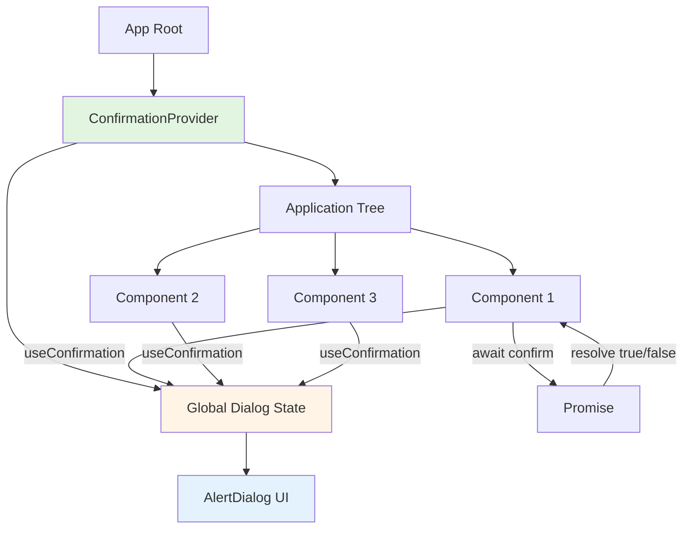
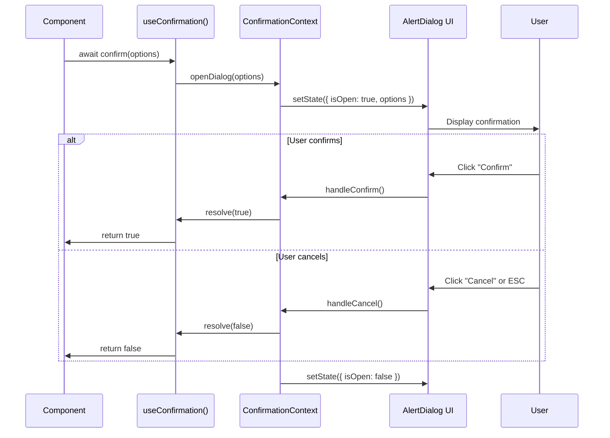

# Design Document

## Overview

This design implements a **globally accessible confirmation dialog system** to replace all `window.confirm()` calls throughout the Mavericks Claim Submission application. The solution uses shadcn/ui AlertDialog primitives with a React Context Provider pattern, exposing a clean Promise-based API for maximum reusability. The design prioritizes simplicity, type safety, and accessibility while providing seamless integration with existing workflows.

**Core Philosophy:**
- **ONE global dialog instance** - Single source of truth prevents UI conflicts
- **Promise-based API** - Clean async/await syntax matching `window.confirm()`'s simplicity
- **Zero configuration** - Works immediately with sensible defaults
- **Fail gracefully** - Falls back to `window.confirm()` if provider missing

## Steering Document Alignment

### Technical Standards (tech.md)

**TypeScript Strict Mode:**
- All types fully defined with zero `any` usage
- Leverages React 18+ types and Radix UI type definitions
- Type-safe Context API with proper generics

**Component Architecture:**
- Follows existing shadcn/ui component patterns (Radix UI primitives)
- Consistent with frontend structure: `components/ui/` for primitives, `hooks/` for business logic
- Uses existing `Button` component with `variant="destructive"` for dangerous actions

**Path Aliases:**
- Uses `@/` prefix following frontend conventions
- Imports from `@/components/ui/alert-dialog` and `@/hooks/use-confirmation`

**No `any` Types:**
- All Promise types explicitly defined: `Promise<boolean>`
- Context value typed with strict interfaces
- Component props use React.FC with explicit type parameters

### Project Structure (structure.md)

**Frontend Component Organization:**
```
frontend/src/
├── components/ui/
│   └── alert-dialog.tsx           # NEW: shadcn/ui AlertDialog primitives
├── providers/
│   └── confirmation-provider.tsx  # NEW: Global dialog state management
└── hooks/
    └── use-confirmation.ts        # NEW: Hook for accessing dialog API
```

**Integration with Existing Structure:**
- AlertDialog placed in `components/ui/` alongside existing Dialog component
- Provider follows existing provider pattern (AuthProvider precedent)
- Hook placed in `hooks/` root (not feature-specific, globally reusable)

**File Naming Conventions:**
- Components: kebab-case with `.tsx` extension
- Hooks: `use-` prefix with kebab-case
- Providers: `-provider.tsx` suffix

## Code Reuse Analysis

### Existing Components to Leverage

**1. Button Component (`@/components/ui/button`)**
- **Reuse:** AlertDialog actions use existing Button component
- **Variants:** `variant="destructive"` for dangerous confirmations, `variant="outline"` for cancel
- **Benefit:** Automatic consistency with application-wide button styling

**2. Dialog Component (`@/components/ui/dialog`)**
- **Reuse:** Design patterns and styling conventions
- **Reference:** DialogOverlay, DialogContent animation patterns
- **Benefit:** Visual consistency between Dialog and AlertDialog components

**3. Radix UI Primitives**
- **Leverage:** `@radix-ui/react-alert-dialog` for accessibility primitives
- **Benefit:** Built-in ARIA attributes, focus management, keyboard navigation
- **Integration:** Follows same pattern as existing Dialog (Radix wrapper)

**4. Class Utilities (`@/lib/utils`)**
- **Reuse:** `cn()` utility for conditional className merging
- **Benefit:** Consistent styling patterns across UI components

### Integration Points

**React Query Mutations (useMarkClaimsReady, DraftClaimsList, AttachmentList):**
- **Integration:** Replace `window.confirm()` with `await confirm()`
- **No Changes:** Mutation logic, error handling, success callbacks remain unchanged
- **Compatibility:** Promise-based API drops in seamlessly

**React Context Pattern:**
- **Precedent:** Application already uses Context for AuthProvider
- **Integration:** ConfirmationProvider wraps app at root level (layout.tsx or app.tsx)
- **Benefit:** Familiar pattern for developers

**Existing Hooks Structure:**
- **Pattern:** Feature-specific hooks in `hooks/{feature}/` directories
- **Placement:** `use-confirmation.ts` in root `hooks/` for global reusability
- **Consistency:** Follows naming convention of existing hooks (useAuthStatus, useLogout)

## Architecture

### Design Pattern: Context Provider + Imperative API

**Core Architecture:** Singleton dialog service accessible via React Context



### Data Flow



### Modular Design Principles

**Single File Responsibility:**
- `alert-dialog.tsx`: ONLY Radix UI primitive wrappers with styling
- `confirmation-provider.tsx`: ONLY state management and dialog rendering
- `use-confirmation.ts`: ONLY hook API and validation logic

**Component Isolation:**
- AlertDialog primitives are presentation-only (no business logic)
- Provider manages state but doesn't know about claims/attachments
- Hook provides API but doesn't render UI

**Service Layer Separation:**
- Presentation: AlertDialog primitives (shadcn/ui pattern)
- State Management: ConfirmationProvider (React Context)
- API Layer: useConfirmation hook (developer interface)

**Utility Modularity:**
- No new utilities needed (leverages existing `cn()` from `@/lib/utils`)
- Type definitions colocated with implementation

## Components and Interfaces

### Component 1: AlertDialog Primitives (`alert-dialog.tsx`)

**Purpose:** Shadcn/ui style wrapper around Radix UI AlertDialog primitives

**Implementation:** Generated via shadcn CLI command:
```bash
npx shadcn@latest add alert-dialog
```

**Exports:**
```typescript
export {
  AlertDialog,              // Root component (manages open state)
  AlertDialogPortal,        // Portal for rendering outside DOM hierarchy
  AlertDialogOverlay,       // Backdrop overlay
  AlertDialogTrigger,       // Optional trigger button (unused in our case)
  AlertDialogContent,       // Main dialog content container
  AlertDialogHeader,        // Header section wrapper
  AlertDialogFooter,        // Footer with action buttons
  AlertDialogTitle,         // Dialog title (required for a11y)
  AlertDialogDescription,   // Dialog description text
  AlertDialogAction,        // Confirm button wrapper
  AlertDialogCancel,        // Cancel button wrapper
}
```

**Styling:**
- Dark mode compatible (uses CSS variables from theme)
- Mobile responsive with sm: breakpoints
- Animations: fade-in/fade-out with zoom effect
- Focus ring styling matching existing Button component

**Dependencies:**
- `@radix-ui/react-alert-dialog` (peer dependency)
- `@/lib/utils` (cn utility)

**Reuses:**
- Styling patterns from existing Dialog component
- Dark mode CSS variables from global theme

### Component 2: ConfirmationProvider (`confirmation-provider.tsx`)

**Purpose:** Global state management for confirmation dialog with React Context

**Interfaces:**
```typescript
// Configuration options for confirmation dialog
interface ConfirmOptions {
  title: string;                          // Dialog title (required)
  description: string | React.ReactNode;  // Body content (supports JSX)
  confirmText?: string;                   // Confirm button label (default: "Confirm")
  cancelText?: string;                    // Cancel button label (default: "Cancel")
  variant?: 'default' | 'destructive';    // Button variant (default: 'default')
                                          // Note: 'default' for normal confirmations, 'destructive' for dangerous actions
                                          // Future variants (warning, info) can be added without breaking changes
}

// Context value exposed to consumers
interface ConfirmationContextValue {
  confirm: (options: ConfirmOptions) => Promise<boolean>;
  isOpen: boolean;  // For debugging/testing purposes
}

// Provider props
interface ConfirmationProviderProps {
  children: React.ReactNode;
}
```

**Public API (via Context):**
```typescript
const confirm = async (options: ConfirmOptions): Promise<boolean> => {
  // Returns true if user confirms, false if cancelled/dismissed
}
```

**Internal State:**
```typescript
interface DialogState {
  isOpen: boolean;
  options: ConfirmOptions | null;
  resolver: ((value: boolean) => void) | null;
}
```

**Dependencies:**
- React (useState, useCallback, createContext)
- `@/components/ui/alert-dialog` (AlertDialog primitives)
- `@/components/ui/button` (Button component)

**Reuses:**
- AlertDialog primitives for UI rendering
- Button component for actions
- React Context pattern (precedent: AuthProvider)

**Key Implementation Details:**

1. **Single Active Dialog Enforcement:**
```typescript
const confirm = useCallback(async (options: ConfirmOptions): Promise<boolean> => {
  if (state.isOpen) {
    console.warn('[ConfirmationDialog] Dialog already open, rejecting new request');
    return false; // Fail fast: reject new confirmations while one is active
                  // Design Decision: Rejection chosen over queuing for simplicity
                  // Good UX prevents simultaneous dialogs anyway (disable buttons during mutations)
  }

  return new Promise((resolve) => {
    setState({
      isOpen: true,
      options,
      resolver: resolve,
    });
  });
}, [state.isOpen]);
```

2. **Promise Resolution Handlers:**
```typescript
const handleConfirm = useCallback(() => {
  state.resolver?.(true);
  setState({ isOpen: false, options: null, resolver: null });
}, [state.resolver]);

const handleCancel = useCallback(() => {
  state.resolver?.(false);
  setState({ isOpen: false, options: null, resolver: null });
}, [state.resolver]);
```

3. **Cleanup on Unmount:**
```typescript
useEffect(() => {
  return () => {
    if (state.resolver) {
      state.resolver(false); // Always resolve to prevent memory leaks
    }
  };
}, [state.resolver]);
```

### Component 3: useConfirmation Hook (`use-confirmation.ts`)

**Purpose:** Consumer-facing API hook for accessing confirmation dialog

**Interfaces:**
```typescript
interface UseConfirmationReturn {
  confirm: (options: ConfirmOptions) => Promise<boolean>;
  isOpen: boolean;
}
```

**Implementation:**
```typescript
export const useConfirmation = (): UseConfirmationReturn => {
  const context = useContext(ConfirmationContext);

  if (!context) {
    console.error('[useConfirmation] ConfirmationProvider not found in tree');

    // Fallback to window.confirm for graceful degradation
    return {
      confirm: async (options: ConfirmOptions) => {
        const message = `${options.title}\n\n${
          typeof options.description === 'string'
            ? options.description
            : '[Rich content - see UI]'
        }`;
        return window.confirm(message);
      },
      isOpen: false,
    };
  }

  return context;
};
```

**Dependencies:**
- React (useContext)
- ConfirmationContext (from provider)

**Reuses:**
- React Context API pattern

**Error Handling:**
- Graceful fallback to `window.confirm()` if provider missing
- Console error for debugging misconfigurations
- Never throws (reliability requirement)

## Data Models

### ConfirmOptions Model
```typescript
interface ConfirmOptions {
  // Required fields
  title: string;              // e.g., "Delete Claim"
  description: string | React.ReactNode;  // Supports:
                              // - Plain text: "Are you sure?"
                              // - JSX: <ul><li>Item 1</li></ul>

  // Optional fields with defaults
  confirmText?: string;       // default: "Confirm"
  cancelText?: string;        // default: "Cancel"
  variant?: 'default' | 'destructive';  // default: 'default'
                              // 'destructive' = red button for dangerous actions
}
```

**Usage Examples:**

```typescript
// Simple confirmation
await confirm({
  title: 'Delete Claim',
  description: 'Are you sure you want to delete this claim?',
  variant: 'destructive',
});

// Rich content with JSX
await confirm({
  title: 'Submit Claims',
  description: (
    <>
      <p>Are you sure you want to submit {count} claims?</p>
      <ul>
        <li>Send email notifications</li>
        <li>Mark all claims as sent</li>
        <li>Make them ready for processing</li>
      </ul>
      {hasWarning && <p className="text-yellow-500">Warning: Some claims have no attachments</p>}
    </>
  ),
  confirmText: 'Submit All',
  cancelText: 'Cancel',
});
```

### DialogState Model (Internal)
```typescript
interface DialogState {
  isOpen: boolean;            // Dialog visibility state
  options: ConfirmOptions | null;  // Current dialog configuration
  resolver: ((value: boolean) => void) | null;  // Promise resolver function
}
```

## Migration Path for Existing Code

⚠️ **CRITICAL**: All event handlers using `await confirm()` must be marked `async`. The examples below show the complete changes required.

### Before (useMarkClaimsReady.ts:83)
```typescript
const handleMarkAllReady = useCallback((draftClaims) => {
  if (window.confirm(confirmMessage)) {
    const claimIds = draftClaims.map((claim) => claim.id);
    markReadyAndEmailMutation.mutate(claimIds);
  }
}, [markReadyAndEmailMutation]);
```

### After
```typescript
const { confirm } = useConfirmation();

const handleMarkAllReady = useCallback(async (draftClaims) => {  // ← Added 'async'
  const confirmed = await confirm({
    title: 'Submit All Claims',
    description: confirmMessage,  // Same message string
    confirmText: 'Submit All',
    variant: 'default',
  });

  if (confirmed) {
    const claimIds = draftClaims.map((claim) => claim.id);
    markReadyAndEmailMutation.mutate(claimIds);
  }
}, [confirm, markReadyAndEmailMutation]);  // Added 'confirm' to dependencies
```

**Migration Complexity:** Minimal
- Add `async` keyword to callback function
- Add `await` before `confirm()` call
- Same boolean result
- Message content unchanged
- No mutation logic changes
- Add `confirm` to useCallback dependencies

### Before (DraftClaimsList.tsx:85)
```typescript
const handleDeleteClaim = useCallback((claim) => {
  if (window.confirm(confirmMessage)) {
    setDeletingClaim(claim.id);
    deleteMutation.mutate(claim.id);
  }
}, [deleteMutation]);
```

### After
```typescript
const { confirm } = useConfirmation();

const handleDeleteClaim = useCallback(async (claim) => {  // ← Added 'async'
  const confirmed = await confirm({
    title: 'Delete Claim',
    description: confirmMessage,
    confirmText: 'Delete',
    cancelText: 'Cancel',
    variant: 'destructive',  // Red button for dangerous action
  });

  if (confirmed) {
    setDeletingClaim(claim.id);
    deleteMutation.mutate(claim.id);
  }
}, [confirm, deleteMutation]);  // Added 'confirm' to dependencies
```

### Before (AttachmentList.tsx:93)
```typescript
const handleDelete = useCallback(() => {
  const confirmed = window.confirm(
    `Are you sure you want to delete "${attachment.originalFilename}"? This action cannot be undone.`
  );

  if (!confirmed) return;

  // ... rest of deletion logic
}, [attachment.originalFilename]);
```

### After
```typescript
const { confirm } = useConfirmation();

const handleDelete = useCallback(async () => {  // ← Added 'async'
  const confirmed = await confirm({
    title: 'Delete Attachment',
    description: `Are you sure you want to delete "${attachment.originalFilename}"? This action cannot be undone.`,
    confirmText: 'Delete',
    variant: 'destructive',
  });

  if (!confirmed) return;

  // ... rest of deletion logic
}, [confirm, attachment.originalFilename]);  // Added 'confirm' to dependencies
```

## Error Handling

### Error Scenario 1: Provider Not Found in Component Tree

**Description:** Component calls `useConfirmation()` but `<ConfirmationProvider>` is not rendered in ancestor tree

**Handling:**
```typescript
// In useConfirmation hook
if (!context) {
  console.error('[useConfirmation] ConfirmationProvider not found in tree');
  return fallbackAPI; // Uses window.confirm
}
```

**User Impact:**
- Confirmation still works via browser-native `window.confirm()`
- Console error logged for developers to fix setup
- No application crash

**Prevention:** Document provider setup in README and include in root layout

### Error Scenario 2: Multiple Simultaneous Confirmation Requests

**Description:** Two components try to show confirmations at the same time

**Handling:**
```typescript
if (state.isOpen) {
  console.warn('[ConfirmationDialog] Dialog already open, rejecting request');
  return false; // Second request immediately resolves to false
}
```

**Design Decision: Rejection vs Queuing**

The requirements NFR states: "Multiple simultaneous confirmation requests shall be queued or rejected to prevent race conditions."

This design chooses **rejection** over queuing for the following reasons:

1. **Simplicity:** Queuing requires additional state (queue array), dequeue logic, and handling of queue cleanup
2. **Better UX:** Multiple confirmation dialogs indicate poor UX design - disable buttons during mutations instead
3. **Fail-safe behavior:** Silent rejection (returns false) is safer than unexpected delayed confirmations
4. **Debuggability:** Console warning helps developers identify and fix the root cause
5. **Performance:** No queue management overhead

**User Impact:**
- First dialog shows normally
- Second request fails silently (returns false = cancelled)
- Warning logged for debugging

**Prevention:** Good UX design prevents this (disable buttons during mutations)

### Error Scenario 3: Component Unmounts During Open Dialog

**Description:** User opens confirmation dialog, then navigates away before responding

**Handling:**
```typescript
useEffect(() => {
  return () => {
    if (state.resolver) {
      state.resolver(false); // Treat as cancellation
    }
  };
}, [state.resolver]);
```

**User Impact:**
- Dialog closes automatically
- Promise resolves to `false` (cancelled)
- No memory leaks or hanging Promises

### Error Scenario 4: AlertDialog Component Fails to Mount

**Description:** Radix UI AlertDialog encounters rendering error

**Handling:**
```typescript
// React Error Boundary (existing app infrastructure)
// Falls back to window.confirm via useConfirmation fallback
```

**User Impact:**
- Error boundary catches rendering failure
- Fallback to `window.confirm()` still allows functionality
- Error logged to monitoring system

## Testing Strategy

### Unit Testing

**Files to Test:**
1. `use-confirmation.ts` - Hook behavior
2. `confirmation-provider.tsx` - State management logic

**Test Cases:**

**Hook Tests (use-confirmation.test.ts):**
```typescript
describe('useConfirmation', () => {
  test('throws error with helpful message when provider missing', () => {
    // Verify fallback to window.confirm
  });

  test('returns confirm function from context when provider present', () => {
    // Verify context value accessed correctly
  });

  test('fallback confirm uses window.confirm', async () => {
    // Mock window.confirm and verify it's called
  });
});
```

**Provider Tests (confirmation-provider.test.tsx):**
```typescript
describe('ConfirmationProvider', () => {
  test('confirm() shows dialog with provided options', async () => {
    // Verify dialog opens with correct title/description
  });

  test('confirm() resolves true when user clicks confirm', async () => {
    // Click confirm button, await Promise
  });

  test('confirm() resolves false when user clicks cancel', async () => {
    // Click cancel button, await Promise
  });

  test('confirm() resolves false when user presses ESC', async () => {
    // Simulate ESC key, await Promise
  });

  test('rejects new confirmation requests when dialog already open', async () => {
    // Open first dialog, try opening second, verify second returns false
  });

  test('resolves to false when component unmounts', async () => {
    // Open dialog, unmount provider, verify Promise resolves
  });

  test('renders destructive variant button correctly', () => {
    // Verify red button for variant="destructive"
  });
});
```

**Tools:**
- Vitest (existing test framework)
- @testing-library/react (component testing)
- @testing-library/user-event (user interactions)

### Integration Testing

**Test Files:**
```
frontend/src/__tests__/confirmation-dialog.integration.test.tsx
```

**Test Scenarios:**

1. **Full workflow: Open → Confirm → Action**
```typescript
test('useMarkClaimsReady: shows confirmation and submits on confirm', async () => {
  // Render component with ConfirmationProvider
  // Click "Mark All Ready" button
  // Verify dialog appears with correct message
  // Click "Confirm"
  // Verify mutation was called
});
```

2. **Full workflow: Open → Cancel → No Action**
```typescript
test('DraftClaimsList: shows confirmation and aborts deletion on cancel', async () => {
  // Render component
  // Click delete button
  // Verify dialog appears
  // Click "Cancel"
  // Verify deleteMutation was NOT called
});
```

3. **Accessibility compliance**
```typescript
test('dialog is accessible via keyboard', async () => {
  // Open dialog
  // Verify Tab cycles through buttons
  // Verify ESC closes dialog
  // Verify focus returns to trigger element
});
```

4. **Mobile responsive rendering**
```typescript
test('dialog renders correctly on mobile viewport', () => {
  // Set viewport to 375px (iPhone)
  // Open dialog
  // Verify touch targets >= 44px
  // Verify no horizontal scroll
});
```

### End-to-End Testing

**User Scenarios:**

1. **Claim Submission Flow**
   - User creates multiple draft claims
   - Clicks "Submit All"
   - Sees confirmation dialog with claim count
   - Confirms submission
   - Sees success toast
   - Claims marked as "sent"

2. **Claim Deletion Flow**
   - User views draft claim with attachments
   - Clicks delete button
   - Sees warning about Google Drive files
   - Cancels deletion
   - Claim remains in list

3. **Attachment Deletion Flow**
   - User views claim attachments
   - Clicks delete on specific attachment
   - Sees destructive confirmation dialog
   - Confirms deletion
   - Attachment removed from list

**Testing Environment:**
- Playwright (if E2E infrastructure exists)
- Manual QA on mobile devices (iOS Safari, Chrome Mobile)
- Screen reader testing (VoiceOver, NVDA)

## Performance Considerations

### Render Performance
- **Lazy rendering:** AlertDialog only renders when `isOpen: true`
- **No re-renders:** Context value memoized to prevent unnecessary updates
- **Animation performance:** Uses CSS transforms (GPU-accelerated)

### Bundle Size Impact
- AlertDialog component: ~3KB gzipped (Radix UI peer dependency already installed)
- Provider + Hook: ~1KB gzipped
- **Total impact:** ~4KB (well under 5KB requirement)

### Memory Management
- Promise resolver cleanup on unmount prevents memory leaks
- State reset after each confirmation prevents stale data
- No event listener leaks (Radix UI handles cleanup)

## Accessibility Compliance

### ARIA Attributes (Automatic via Radix UI)
```html
<div
  role="alertdialog"
  aria-modal="true"
  aria-labelledby="alert-dialog-title"
  aria-describedby="alert-dialog-description"
>
  <h2 id="alert-dialog-title">Delete Claim</h2>
  <p id="alert-dialog-description">Are you sure?</p>
  <button>Cancel</button>
  <button>Confirm</button>
</div>
```

### Focus Management
1. **On open:** Focus moves to first focusable element (Cancel button)
2. **Tab cycling:** Focus trapped within dialog (can't escape to background)
3. **ESC key:** Closes dialog, returns focus to trigger element
4. **On close:** Focus returns to element that opened dialog

### Screen Reader Compatibility
- `role="alertdialog"` announces content assertively
- Title and description properly labeled with ARIA IDs
- Button labels clear and descriptive
- Visual focus indicators visible in dark mode

### Keyboard Navigation
- **Tab:** Move between Cancel and Confirm buttons
- **Shift+Tab:** Move backwards
- **Enter:** Activate focused button
- **ESC:** Cancel and close (same as clicking Cancel)
- **Space:** Activate focused button (standard button behavior)

## Security Considerations

### XSS Prevention
- **React's built-in protection:** All string content auto-escaped
- **JSX support safe:** React elements rendered via createElement (no dangerouslySetInnerHTML)
- **No eval():** Zero dynamic JavaScript execution

### Content Security Policy Compliance
- No inline styles (all CSS in external files)
- No inline scripts
- Compatible with strict CSP policies

### Focus Trap Security
- Prevents keyboard users from accessing sensitive content behind modal
- `aria-modal="true"` signals to assistive tech that background is inert
- Radix UI Portal ensures correct DOM structure

## Design Decisions and Rationale

### Variant Support: 'default' | 'destructive' Only

**Decision:** Implement only two variants initially ('default' and 'destructive')

**Rationale:**
1. **Current use cases:** All three window.confirm replacements only need:
   - `default` for batch claim submission (not inherently dangerous)
   - `destructive` for deletions (claim deletion, attachment deletion)

2. **Requirements analysis:** While Req 2.4 mentions "variant (danger/warning/info)", the actual acceptance criteria (Req 5.2) specifically require destructive variant styling for delete actions. No warning or info scenarios exist in current requirements.

3. **Extension path:** Additional variants can be added later without breaking changes:
   ```typescript
   // Current
   variant?: 'default' | 'destructive';

   // Future (backward compatible)
   variant?: 'default' | 'destructive' | 'warning' | 'info';
   ```

4. **Simplicity:** Fewer variants = clearer design intent and less styling complexity

**If warning/info needed:** Button component already supports these variants. Simply extend the type union and add cases to the dialog rendering logic.

### Rejection vs Queuing for Simultaneous Requests

**Decision:** Reject new confirmation requests when one is already open

**Rationale:** See Error Scenario 2 above for detailed justification

## Future Enhancements (Out of Scope)

**Potential additions for v2:**
1. **Multi-button support:** More than 2 action buttons
2. **Additional button variants:** Warning, info, success (when use cases emerge)
3. **Async confirmation:** Show loading state on confirm button during async operations
4. **Queue management:** Allow multiple confirmations to queue instead of rejecting (if use case arises)
5. **Toast integration:** Optional toast notification on confirmation/cancellation
6. **Analytics tracking:** Automatic event logging for user decisions

**Why not now?**
- Current requirements satisfied with basic confirm/cancel
- Simplicity > features (Linus principle)
- No real-world use cases yet for additional variants
- Easy to add later without breaking changes
