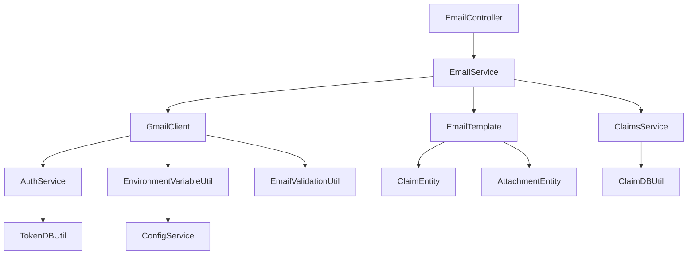

# Design Document

## Overview

The Email Sending for Claims feature adds Gmail API integration to complete the 3-phase claim submission workflow. This feature implements synchronous email sending with professional HTML templates, environment-configurable recipients, and atomic claim status updates. The design follows existing patterns from GoogleDriveClient and AuthService, ensuring consistent error handling, token management, and retry mechanisms across the application.

## Steering Document Alignment

### Technical Standards (tech.md)

**NestJS Module Pattern**: Following established module architecture with controllers, services, DTOs, and proper dependency injection as seen in Claims and Auth modules.

**Google API Integration**: Leverages existing googleapis patterns from GoogleDriveClient with OAuth2 authentication, token refresh, and exponential backoff retry logic.

**Environment Configuration**: Uses EnvironmentVariableUtil pattern with `getOrThrow()` for critical environment variables like BACKEND_EMAIL_RECIPIENT.

**Error Handling**: Implements consistent error transformation patterns matching GoogleDriveClient's handleDriveError approach with user-friendly messages.

**TypeScript Standards**: Follows Object.freeze() enum pattern, strict typing, and shared types via @project/types package.

### Project Structure (structure.md)

**Email Module Structure**: Extends existing `backend/src/modules/email/` module following established patterns:
```
email/
├── controllers/email.controller.ts    # HTTP endpoints (extends existing)
├── services/gmail-client.service.ts   # Gmail API integration (new)
├── services/email-template.service.ts # Template rendering (new)
├── services/email.service.ts          # Business logic coordinator (new)
├── utils/email-validation.util.ts     # Email format validation (new)
├── dtos/                             # Request/response types
│   ├── claim-email-request.dto.ts    # New claim email endpoint
│   └── claim-email-response.dto.ts   # Response with claim status
└── email.module.ts                   # Module definition (extended)
```

**Shared Types**: Email DTOs placed in `packages/types/src/dtos/email.dto.ts` for frontend/backend sharing.

**Integration Strategy**: Email module imports ClaimsModule (not direct DB access) for proper service-layer integration and transaction management.

## Code Reuse Analysis

### Existing Components to Leverage

- **AuthService.getUserTokens()**: Reuse existing token management and automatic refresh logic for Gmail API authentication
- **GoogleDriveClient patterns**: Reuse retry logic, error handling, and OAuth2 client creation patterns for Gmail API
- **EnvironmentVariableUtil**: Extend to include BACKEND_EMAIL_RECIPIENT configuration with validation
- **ClaimDBUtil**: Leverage existing claim update methods for atomic status transitions
- **Error transformation patterns**: Apply consistent error handling from GoogleDriveClient to Gmail API errors

### Integration Points

- **Auth Module**: Gmail API client uses existing OAuth token storage and refresh mechanisms
- **Claims Module**: Email service imports ClaimsService (not ClaimDBUtil) for proper transaction boundaries
- **Environment Configuration**: BACKEND_EMAIL_RECIPIENT added to EnvironmentVariableUtil with comma-separated email parsing
- **Shared Types**: Email DTOs shared between frontend and backend via @project/types
- **Database Transactions**: Email operations wrapped in ClaimsService transactions for atomicity

## Architecture

The email system follows a service-oriented architecture with clear separation of concerns. The GmailClient handles API communication, EmailTemplate handles HTML generation, and EmailController orchestrates the workflow. Error handling uses consistent patterns from existing Google API integrations.

### Modular Design Principles

- **Single File Responsibility**: GmailClient handles only Gmail API operations, EmailTemplate handles only HTML generation
- **Component Isolation**: Email templates are standalone with configurable data injection
- **Service Layer Separation**: Controller handles HTTP, Service handles business logic, Template handles presentation
- **Utility Modularity**: Email validation, HTML escaping, and retry logic are separate focused utilities



## Components and Interfaces

### EmailController
- **Purpose:** HTTP endpoint for claim email sending with authentication and validation
- **Interfaces:** POST /email/send-claim endpoint accepting { claimId: string } with 30-second timeout
- **Dependencies:** EmailService for business logic coordination
- **Reuses:** JwtAuthGuard, User decorator, existing DTO validation patterns

### EmailService (New)
- **Purpose:** Business logic coordinator for email operations with transaction management
- **Interfaces:** sendClaimEmail(userId, claimId), validateClaimForEmail(claimId, userId)
- **Dependencies:** GmailClient, EmailTemplate, ClaimsService for transaction boundaries
- **Reuses:** Service layer patterns from existing modules

### GmailClient
- **Purpose:** Gmail API communication with token management and retry logic
- **Interfaces:** sendEmail(userId, emailRequest), parseRecipients(recipientConfig)
- **Dependencies:** AuthService for tokens, EnvironmentVariableUtil, EmailValidationUtil
- **Reuses:** GoogleDriveClient retry patterns, AuthService token refresh, error handling

### EmailTemplate
- **Purpose:** HTML email template generation with XSS protection and structured content
- **Interfaces:** generateClaimEmail(claim, attachments, recipients), generateSubject(claim, user)
- **Dependencies:** ClaimEntity, AttachmentEntity, UserEntity for complete data binding
- **Template Structure:** HTML email with claim details table, attachment links, professional styling

### EmailValidationUtil (New)
- **Purpose:** Email format validation and comma-separated parsing
- **Interfaces:** validateEmail(email), parseRecipients(recipientString), validateRecipients(recipients[])
- **Dependencies:** None (pure utility functions)
- **Patterns:** Regex validation, error collection for batch validation

### EnvironmentVariableUtil (Extension)
- **Purpose:** Add BACKEND_EMAIL_RECIPIENT configuration with comma-separated support
- **Interfaces:** Extended IEnvironmentVariableList with emailRecipient field
- **Validation:** Startup validation of email format and comma-separated parsing
- **Reuses:** Existing getOrThrow() pattern with enhanced validation logic

## Data Models

### EmailSendRequest (Existing)
```typescript
export interface IEmailSendRequest {
  to: string;
  subject: string;
  body: string;
  isHtml?: boolean;
}
```

### EmailSendResponse (Existing)
```typescript
export interface IEmailSendResponse {
  success: boolean;
  messageId?: string;
  error?: string;
}
```

### ClaimEmailRequest (New)
```typescript
export interface IClaimEmailRequest {
  claimId: string;
}
```

### ClaimEmailResponse (New)
```typescript
export interface IClaimEmailResponse {
  success: boolean;
  messageId?: string;
  claim: IClaimMetadata;
  error?: string;
}
```

### Environment Configuration Extension
```typescript
interface IEnvironmentVariableList {
  // ... existing fields
  emailRecipient: string; // BACKEND_EMAIL_RECIPIENT (comma-separated)
}
```

### Email Template Structure

**Subject Line Format:**
```
"Claim Submission - {Category} - {Employee Name} - {Month}/{Year}"
```

**HTML Email Template:**
```html
<!DOCTYPE html>
<html>
<head>
    <meta charset="utf-8">
    <title>Claim Submission</title>
    <style>
        body { font-family: Arial, sans-serif; color: #333; }
        .container { max-width: 600px; margin: 0 auto; }
        .header { background: #f8f9fa; padding: 20px; }
        .content { padding: 20px; }
        .claim-details { border: 1px solid #ddd; margin: 20px 0; }
        .claim-row { padding: 10px; border-bottom: 1px solid #eee; }
        .attachments { margin: 20px 0; }
        .attachment-link { display: block; margin: 5px 0; }
    </style>
</head>
<body>
    <div class="container">
        <div class="header">
            <h2>New Claim Submission</h2>
        </div>
        <div class="content">
            <div class="claim-details">
                <div class="claim-row"><strong>Employee:</strong> {employeeName}</div>
                <div class="claim-row"><strong>Email:</strong> {employeeEmail}</div>
                <div class="claim-row"><strong>Category:</strong> {category}</div>
                <div class="claim-row"><strong>Period:</strong> {month}/{year}</div>
                <div class="claim-row"><strong>Amount:</strong> ${totalAmount}</div>
                <div class="claim-row"><strong>Description:</strong> {claimName}</div>
                <div class="claim-row"><strong>Submitted:</strong> {submissionDate}</div>
            </div>

            <div class="attachments">
                <h3>Attachments:</h3>
                {{#each attachments}}
                <a href="{driveShareableUrl}" class="attachment-link" target="_blank">
                    📄 {originalFilename} ({fileSize})
                </a>
                {{/each}}
            </div>

            <p><em>This claim has been submitted for processing.</em></p>
        </div>
    </div>
</body>
</html>
```

## Error Handling

### Error Scenarios

1. **Gmail API Authentication Failed**
   - **Handling:** Return 401 Unauthorized with re-authentication message
   - **User Impact:** Clear message: "Please re-authenticate with Google to send emails"

2. **Gmail API Rate Limit Exceeded**
   - **Handling:** Single retry with exponential backoff, then user-friendly error
   - **User Impact:** "Gmail service temporarily unavailable, please try again in a few minutes"

3. **Invalid Claim State**
   - **Handling:** Validate claim status is 'draft' before email sending
   - **User Impact:** "Can only send emails for draft claims"

4. **Missing Environment Configuration**
   - **Handling:** Application fails to start if BACKEND_EMAIL_RECIPIENT not configured
   - **User Impact:** Server error with configuration requirement message

5. **Template Rendering Failure**
   - **Handling:** Log error and fallback to plain text email format
   - **User Impact:** Email sent with basic text instead of HTML formatting

6. **Database Transaction Failure**
   - **Handling:** Use ClaimsService transaction boundaries to ensure atomicity
   - **User Impact:** "Email sending failed, please try again"

7. **Operation Timeout (30 seconds)**
   - **Handling:** Gmail API timeout with proper cleanup of partial operations
   - **User Impact:** "Email sending timed out, please try again"

8. **Multiple Recipient Configuration Error**
   - **Handling:** Validate all comma-separated emails at startup
   - **User Impact:** Application fails to start with clear validation message

9. **Claims Service Integration Error**
   - **Handling:** Proper error propagation from ClaimsService with context preservation
   - **User Impact:** Detailed error message about claim validation failure

## Testing Strategy

### Unit Testing

**EmailService (Business Logic):**
- Test transaction coordination between GmailClient and ClaimsService
- Test claim validation logic with various claim states
- Test error propagation and transformation
- Test timeout handling and cleanup operations

**GmailClient Service:**
- Mock googleapis Gmail client for API communication tests
- Test token refresh logic with mocked AuthService
- Test retry mechanism with simulated API failures
- Test comma-separated recipient parsing and validation
- Test error transformation for different Gmail API errors

**EmailTemplate Service:**
- Test HTML generation with complete claim data scenarios
- Test subject line generation with various claim categories
- Test XSS prevention with malicious input data
- Test template rendering with missing optional fields
- Test attachment URL formatting and file size display

**EmailValidationUtil:**
- Test email format validation with valid/invalid emails
- Test comma-separated email parsing with various formats
- Test batch validation with mixed valid/invalid emails
- Test edge cases (spaces, empty strings, malformed)

**EmailController:**
- Test authentication enforcement with JwtAuthGuard
- Test 30-second timeout implementation
- Test error responses for invalid claim states
- Test successful email sending with mocked EmailService

### Integration Testing

**EmailService + ClaimsService Integration:**
- Test transaction boundaries with real database connections
- Test claim status updates within email sending transactions
- Test rollback scenarios when email fails after claim validation
- Test concurrent email sending attempts for same claim

**End-to-End Email Flow:**
- Test complete workflow: claim creation → file upload → email sending
- Test claim status transitions: draft → sent → failed
- Test error scenarios with real database and mocked Gmail API
- Test environment configuration validation on startup with comma-separated recipients

**Gmail API Integration:**
- Test OAuth token refresh cycle with real tokens
- Test Gmail API error handling with various HTTP status codes
- Test email sending with actual Gmail API (in test environment)
- Test rate limiting and retry behavior
- Test multiple recipient email delivery

### End-to-End Testing

**User Email Workflow:**
- Create claim → Upload files → Trigger email send → Verify status update
- Test email sending failure → Verify claim marked as 'failed'
- Test retry email sending for failed claims
- Test email content matches expected template format