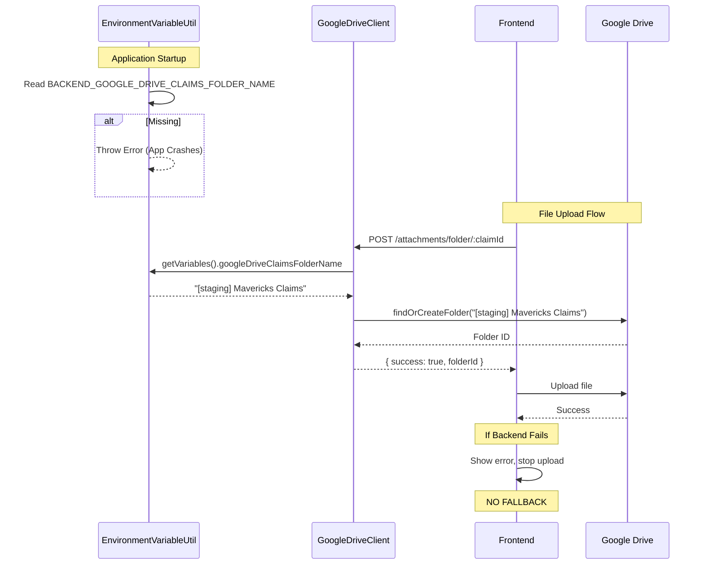

# Design Document

## Overview

This design implements **environment-based Google Drive folder naming** using a single environment variable (`BACKEND_GOOGLE_DRIVE_CLAIMS_FOLDER_NAME`) as the source of truth. The backend reads this at startup and uses it everywhere the root folder name is needed. The frontend fallback folder creation logic is **deleted entirely** to maintain data consistency and eliminate the hardcoded folder name problem at its source.

**Architecture Pattern:** Single source of truth in backend environment configuration → Backend-only folder creation → Frontend trusts backend or fails cleanly.

**Key Design Principle:** Eliminate complexity and special cases. The backend creates ALL folders using the configured name. The frontend never creates folders directly. If the backend fails, the operation fails - no workarounds, no hidden inconsistencies.

**Total Changes:** 3 files modified, ~30 lines of fallback code deleted, 0 new files, 0 new APIs.

## Steering Document Alignment

### Technical Standards (tech.md)

**TypeScript Strict Mode:**
- No new types needed - just configuration changes
- Existing strict typing maintained

**Environment Variable Management:**
- Follows existing `EnvironmentVariableUtil` pattern
- Single field added to existing interface
- No validation beyond non-empty check (Google Drive API validates names when used)

### Project Structure (structure.md)

**Files Modified:**
1. `backend/src/modules/common/utils/environment-variable.util.ts` - Add 1 field
2. `backend/src/modules/attachments/services/google-drive-client.service.ts` - Change 1 line
3. `frontend/src/hooks/attachments/useAttachmentUpload.ts` - Delete fallback (~30 lines)

**Zero New Files:**
- No new modules, DTOs, APIs, or utilities

## Architecture

### System Flow



### Design Principles

- **Simplicity:** One source of truth, one code path
- **Correctness:** Backend-only folder creation prevents inconsistency
- **Maintainability:** Delete more code than we add

## Implementation

### Change 1: EnvironmentVariableUtil (Backend)

**File:** `backend/src/modules/common/utils/environment-variable.util.ts`

**Add to interface:**
```typescript
type IEnvironmentVariableList = {
  // ... existing 23 fields
  googleDriveClaimsFolderName: string;
};
```

**Add to getVariables():**
```typescript
this.environmentVariableList = {
  // ... existing fields
  googleDriveClaimsFolderName: this.configService.getOrThrow(
    'BACKEND_GOOGLE_DRIVE_CLAIMS_FOLDER_NAME'
  ),
};
```

**That's it.** Existing caching and DI handle the rest.

---

### Change 2: GoogleDriveClient (Backend)

**File:** `backend/src/modules/attachments/services/google-drive-client.service.ts`

**Line 60 - Replace hardcoded string:**
```typescript
// BEFORE
const mavericksClaimsFolderId = await this.findOrCreateFolder(
  userId,
  'Mavericks Claims', // ← HARDCODED
);

// AFTER
const mavericksClaimsFolderId = await this.findOrCreateFolder(
  userId,
  this.environmentVariableUtil.getVariables().googleDriveClaimsFolderName,
);
```

**Note:** `EnvironmentVariableUtil` is already injected via AttachmentModule - no new dependencies needed.

---

### Change 3: useAttachmentUpload (Frontend)

**File:** `frontend/src/hooks/attachments/useAttachmentUpload.ts`

**Delete lines 261-283 (entire fallback try-catch):**
```typescript
// DELETE THIS ENTIRE BLOCK
try {
  const folderResponse = await apiClient.post(`/attachments/folder/${claimId}`);
  if (!folderResponse.success || !folderResponse.folderId) {
    throw new Error(...);
  }
  parentFolderId = folderResponse.folderId;
} catch (_error) {
  // FALLBACK: Frontend creates folder directly ← DELETE ALL THIS
  const claimsFolderResult =
    await driveClient.getOrCreateFolder('Mavericks Claims');
  if (!claimsFolderResult.success || !claimsFolderResult.data) {
    throw new Error(...);
  }
  const claimFolderResult = await driveClient.getOrCreateFolder(...);
  // ... more fallback logic
}
```

**Replace with:**
```typescript
// SIMPLE: Call backend, trust result or fail
const folderResponse = await apiClient.post(`/attachments/folder/${claimId}`);

if (!folderResponse.success || !folderResponse.folderId) {
  throw new Error(
    folderResponse.error || 'Failed to create claim folder. Please try again.'
  );
}

parentFolderId = folderResponse.folderId;
```

## Error Handling

### Missing Environment Variable

**What happens:** Application fails to start

**Error message:**
```
Error: Configuration validation failed
The following environment variables are required but not set: BACKEND_GOOGLE_DRIVE_CLAIMS_FOLDER_NAME
    at ConfigService.getOrThrow (config.service.ts:42)
    at EnvironmentVariableUtil.getVariables (environment-variable.util.ts:96)
```

**Resolution:** Add `BACKEND_GOOGLE_DRIVE_CLAIMS_FOLDER_NAME="[staging] Mavericks Claims"` to `.env`

---

### Backend Folder Creation Fails

**What happens:** File upload stops, error shown to user

**User sees:** "Failed to create claim folder. Please try again."

**Why this is correct:**
- If backend can't create folders, frontend shouldn't work around it
- Prevents data inconsistency (mixing backend-created and frontend-created folders)
- Forces fixing the actual problem instead of hiding it

## Testing

### Unit Tests

**Backend:**
```typescript
// environment-variable.util.spec.ts
it('should read folder name from environment', () => {
  process.env.BACKEND_GOOGLE_DRIVE_CLAIMS_FOLDER_NAME = '[test] Mavericks Claims';
  const vars = util.getVariables();
  expect(vars.googleDriveClaimsFolderName).toBe('[test] Mavericks Claims');
});

it('should throw when env var missing', () => {
  delete process.env.BACKEND_GOOGLE_DRIVE_CLAIMS_FOLDER_NAME;
  expect(() => util.getVariables()).toThrow();
});

// google-drive-client.service.spec.ts
it('should use env var for root folder', async () => {
  mockEnvUtil.getVariables.mockReturnValue({
    googleDriveClaimsFolderName: '[test] Mavericks Claims'
  });

  await client.createClaimFolder('user-1', 'claim-1');

  expect(findOrCreateFolder).toHaveBeenCalledWith('user-1', '[test] Mavericks Claims');
});
```

**Frontend:**
```typescript
// useAttachmentUpload.test.ts
it('should fail upload if backend folder creation fails', async () => {
  mockApiClient.post.mockRejectedValue(new Error('Backend error'));

  await expect(uploadFile(testFile)).rejects.toThrow('Failed to create claim folder');

  // Verify NO fallback folder creation attempted
  expect(driveClient.getOrCreateFolder).not.toHaveBeenCalled();
});
```

### Integration Tests

```typescript
// Verify folder created with correct environment name
test('creates folders using environment variable', async () => {
  process.env.BACKEND_GOOGLE_DRIVE_CLAIMS_FOLDER_NAME = '[test] Mavericks Claims';

  const response = await POST('/attachments/folder/claim-123');

  const driveFolder = await getDriveFolder(response.folderId);
  expect(driveFolder.parents[0].name).toBe('[test] Mavericks Claims');
});
```

### E2E Tests

```typescript
test('file upload with environment-specific folder', async ({ page }) => {
  await login(page);
  await uploadClaimFile(page, 'receipt.pdf');

  // Verify folder created in Google Drive with environment prefix
  const rootFolder = await findDriveFolder('[staging] Mavericks Claims');
  expect(rootFolder).toBeDefined();
});
```

## Migration Path

**Existing Data:** No migration needed
- Database stores folder IDs (not names)
- Old folders remain accessible
- New folders use new naming

**Deployment:**
1. Add `BACKEND_GOOGLE_DRIVE_CLAIMS_FOLDER_NAME` to all environment `.env` files
2. Deploy code changes
3. Restart backend services
4. Verify: Check logs for "Using root folder: [env] Mavericks Claims"
