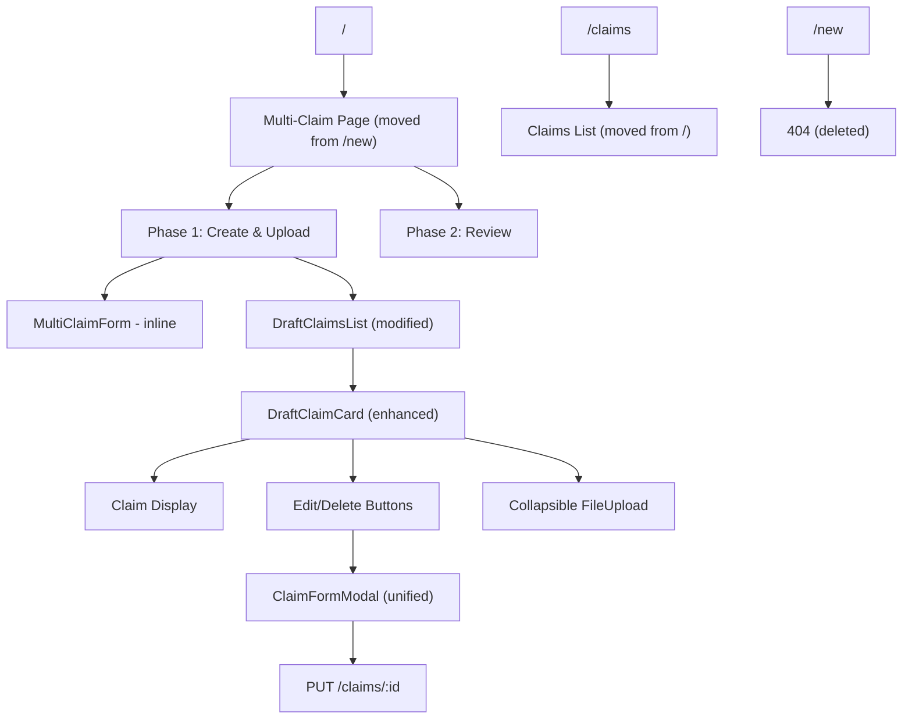
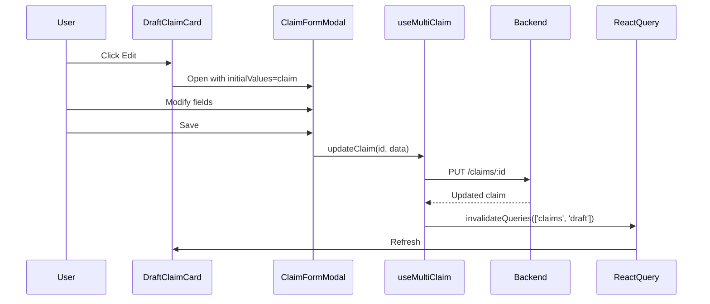

# Design Document

## Overview

Five UX improvements based on user feedback: route restructure, clickable phase navigation, phase merge, draft claim editing, and improved card design. The design minimizes new code by modifying existing components inline and reusing the backend `PUT /claims/:id` endpoint.

**Core Principle**: Solve user problems with minimal code changes. No premature abstractions.

## Steering Document Alignment

### Technical Standards (tech.md)

- TypeScript strict mode, no `any` types
- `Object.freeze()` pattern for enums (modify existing `MultiClaimPhase`)
- Path aliases: `@/` (frontend), `src/` (backend)
- Shared types via `@project/types`
- Reuse existing API endpoints (PUT /claims/:id)

### Project Structure (structure.md)

- Route components: `frontend/src/app/page.tsx` (home), `frontend/src/app/claims/page.tsx` (list)
- Component modifications in `frontend/src/components/claims/`
- Hook updates: `frontend/src/hooks/useMultiClaim.ts`
- No new backend files (zero backend changes)

## Code Reuse Analysis

### Existing Code to Modify

**1. useMultiClaim Hook** (`frontend/src/hooks/useMultiClaim.ts`)
- **Change**: Remove `MultiClaimPhase.UPLOAD` from enum (line 14-18)
- **Reuse**: All mutation hooks (createClaim, updateClaim, deleteClaim)
- **Result**: 2-phase enum instead of 3

**2. DraftClaimCard** (`frontend/src/components/claims/draft-claim-card.tsx`)
- **Change**: Add Edit button handler (currently shows toast, make it open modal)
- **Change**: Add collapsible file upload section below card content
- **Reuse**: Existing claim display, delete button, mobile layout
- **Result**: Single component with display + upload (NOT merged into one monster)

**3. MultiClaimForm** (`frontend/src/components/claims/MultiClaimForm.tsx`)
- **Change**: Convert to `ClaimFormModal` - support both create and edit modes
- **Change**: Add `initialValues` prop for edit mode
- **Reuse**: All form fields, validation logic, submission handling
- **Result**: ONE form for both operations

**4. Page Component** (`frontend/src/app/new/page.tsx` → `page.tsx`)
- **Change**: Add onClick handlers to inline PhaseIndicator (lines 122-224)
- **Change**: Show DraftClaimsList in Phase 1 (not separate phase)
- **Reuse**: Existing phase rendering, navigation buttons
- **Result**: Clickable phases without extraction

### Integration Points

**Backend API**:
- `GET /claims?status=draft`: Fetch draft claims (no changes)
- `PUT /claims/:id`: Update claim (already supports partial updates)
- Ownership validation: Already implemented (line 561-563 in claims.controller.ts)

**React Query**:
- Cache key: `['claims', 'draft']` (existing)
- Invalidation: `queryClient.invalidateQueries()` (existing pattern)

## Architecture

### System Architecture



**Key Changes**:
1. Routes: `/` = creation, `/claims` = list, `/new` deleted
2. Phase enum: Remove UPLOAD (2 phases instead of 3)
3. Form: ONE component for create/edit (initialValues prop)
4. Card: Display + collapsible upload (NOT merged monolith)
5. PhaseIndicator: Inline with onClick (NOT extracted)

### Data Flow: Edit Claim



## Components and Interfaces

### Component 1: ClaimFormModal (Modified from MultiClaimForm)

**Purpose**: Unified form for creating and editing claims

**Location**: `frontend/src/components/claims/ClaimFormModal.tsx` (rename from MultiClaimForm)

**Interface**:
```typescript
interface ClaimFormModalProps {
  isOpen: boolean;
  initialValues?: Partial<IClaimMetadata>; // undefined = create, claim data = edit
  onClose: () => void;
  onSave: (data: IClaimCreateRequest | IClaimUpdateRequest) => Promise<void>;
  isSaving: boolean;
}
```

**Changes from MultiClaimForm**:
- Wrap in Dialog component (modal instead of inline card)
- Add `initialValues` prop (pre-fill form for edit)
- Conditional `onSave` logic: create vs update based on `initialValues?.id`

**Reuses**:
- CategorySelect, MonthYearPicker, Input (100% reuse)
- Form validation rules (100% reuse)
- react-hook-form setup (100% reuse)

---

### Component 2: DraftClaimCard (Enhanced)

**Purpose**: Display claim with edit/delete + collapsible file upload

**Location**: `frontend/src/components/claims/draft-claim-card.tsx` (modify existing)

**Changes**:
```typescript
// ADD: Expansion state
const [isExpanded, setIsExpanded] = useState(false);

// MODIFY: Edit button handler
const handleEdit = () => {
  onEdit(claim); // Parent opens ClaimFormModal
};

// ADD: After existing CardContent
{isExpanded && (
  <CardContent className="border-t">
    <FileUploadComponent claimId={claim.id} />
  </CardContent>
)}

// ADD: Collapse/expand button in header
<Button onClick={() => setIsExpanded(!isExpanded)}>
  {isExpanded ? <ChevronUp /> : <ChevronDown />}
</Button>
```

**Props** (modified):
```typescript
interface DraftClaimCardProps {
  claim: IClaimMetadata;
  onEdit: (claim: IClaimMetadata) => void;  // NOW FUNCTIONAL
  onDelete: (claim: IClaimMetadata) => void;
  isDeleting?: boolean;
  defaultExpanded?: boolean; // NEW: for newly created claims
  className?: string;
}
```

**NOT merging**:
- Display logic stays separate from upload logic
- FileUploadComponent is conditionally rendered, NOT embedded as permanent child
- Card can be used without file upload if needed

---

### Component 3: Page Component (Route Changes)

**Location**: `frontend/src/app/page.tsx` (moved from `new/page.tsx`)

**Changes to PhaseIndicator** (inline, lines 122-224):
```typescript
// ADD: onClick handlers
const handlePhaseClick = (targetPhase: MultiClaimPhase) => {
  if (targetPhase === currentPhase) return; // No-op if already there

  if (targetPhase === MultiClaimPhase.REVIEW) {
    if (summary.claimsCount === 0) {
      toast.error('Please create at least one claim before reviewing');
      return;
    }
    moveToReviewPhase();
  } else {
    resetToCreationPhase();
  }
};

// MODIFY: Desktop phase divs (add onClick)
<div onClick={() => handlePhaseClick(MultiClaimPhase.CREATION)}>
  <Plus className="h-4 w-4" />
  Create & Upload Claims
</div>

<div onClick={() => handlePhaseClick(MultiClaimPhase.REVIEW)}>
  <Eye className="h-4 w-4" />
  Review & Submit
</div>
```

**Changes to Phase 1 Rendering**:
```typescript
{currentPhase === MultiClaimPhase.CREATION && (
  <>
    <ClaimFormModal
      isOpen={isCreateModalOpen}
      onClose={() => setIsCreateModalOpen(false)}
      onSave={createClaim}
      isSaving={loading.isCreatingClaim}
    />

    <DraftClaimsList
      onEditClaim={(claim) => {
        setEditingClaim(claim);
        setIsEditModalOpen(true);
      }}
    />

    <ClaimFormModal
      isOpen={isEditModalOpen}
      initialValues={editingClaim}
      onClose={() => setIsEditModalOpen(false)}
      onSave={(data) => updateClaim(editingClaim.id, data)}
      isSaving={loading.isUpdatingClaim}
    />
  </>
)}
```

---

### Component 4: useMultiClaim Hook (Simplified)

**Changes**:
```typescript
// BEFORE (3 phases)
export const MultiClaimPhase = Object.freeze({
  CREATION: 'creation',
  UPLOAD: 'upload',
  REVIEW: 'review',
} as const);

// AFTER (2 phases)
export const MultiClaimPhase = Object.freeze({
  CREATION: 'creation',
  REVIEW: 'review',
} as const);

// DELETE: moveToUploadPhase() function
// KEEP: moveToReviewPhase(), resetToCreationPhase()
```

**No other changes**: All mutation hooks remain identical.

## Data Models

**No new types**. Reuse existing:
- `IClaimMetadata`: Full claim data
- `IClaimCreateRequest`: Create payload
- `IClaimUpdateRequest`: Update payload (partial)
- `MultiClaimPhase`: Modified enum (2 values)

**Backend**: Zero changes. Existing DTOs and endpoints handle everything.

## Error Handling

**Three Critical Scenarios**:

1. **Edit - Monthly Limit Exceeded**
   - Backend: 422 with detailed message
   - Frontend: Toast error, modal stays open
   - User adjusts amount and retries

2. **Edit - Concurrent Modification**
   - Backend: Last write wins (acceptable for MVP)
   - Frontend: React Query invalidation prevents stale data
   - No conflict detection needed

3. **Phase Navigation - No Claims**
   - Frontend: Button disabled, phase indicator non-clickable
   - Validation: Toast error if bypassed
   - User creates claim first

**All other errors**: Standard HTTP status codes (404, 400, 500) with generic toast messages.

## Testing Strategy

**Unit Tests** (80% coverage):
- ClaimFormModal: Create vs edit mode, validation, save
- DraftClaimCard: Edit button, expansion toggle, file upload integration
- useMultiClaim: 2-phase transitions, updateClaim mutation

**Integration Tests**:
- Route navigation: `/` renders creation, `/new` returns 404
- Edit flow: Create → Edit → Save → Refresh list
- Monthly limit validation on edit

**E2E Tests** (Playwright):
- Complete journey: Login → Create → Edit → Upload → Submit
- Phase navigation via indicators
- Mobile touch targets (44px minimum)

## Performance Considerations

- Route transition: <300ms (Next.js App Router prefetching)
- Modal rendering: 60fps (Radix UI hardware acceleration)
- API response: <1s (PUT /claims/:id already optimized)

## Migration Strategy

1. Rename `MultiClaimForm.tsx` → `ClaimFormModal.tsx`, add Dialog wrapper
2. Modify `DraftClaimCard.tsx` to add expansion + edit handler
3. Update `useMultiClaim.ts` enum (remove UPLOAD)
4. Move `new/page.tsx` → `page.tsx`, add inline onClick handlers
5. Move `page.tsx` → `claims/page.tsx`
6. Delete `new/` directory
7. Delete `BulkUploadClaimCard.tsx` (replaced by enhanced DraftClaimCard)

**Rollback**: Revert git commits. No database changes, no API changes.

## Security Considerations

- Authorization: Existing ownership validation in PUT /claims/:id
- Input validation: Existing ValidationPipe + DTOs
- No new attack surface introduced

---

## Design Philosophy: Data Over Code

**What Changed**:
- Phase enum: 3 → 2 values
- Form components: 2 → 1 (create + edit unified)
- Card components: 2 → 1 enhanced (DraftClaimCard absorbs BulkUploadClaimCard)

**What Didn't Change**:
- State machine complexity (still have phase transitions)
- Upload workflow (still manual per-claim)
- Review phase (still separate validation step)

**Trade-off Acknowledged**: This design improves UX by moving UI around, not by simplifying state. True simplification would be auto-upload on claim creation (1 phase total). That's a future iteration if users still complain after these changes.

**Verdict**: Pragmatic solution that ships quickly and solves reported pain points without over-engineering.
