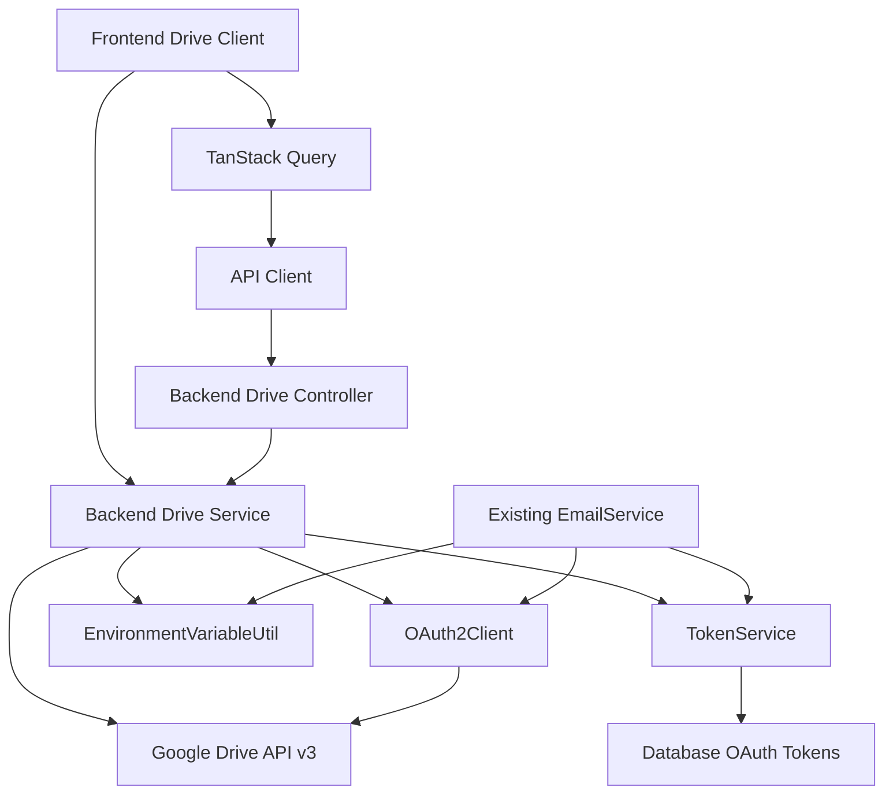

# Design Document

## Overview

The Google Drive API Client Setup feature provides a comprehensive integration layer for Google Drive API v3 within the existing TurboRepo monorepo architecture. This design creates both backend service capabilities and frontend client-side functionality, enabling secure file operations on employees' personal Google Drive accounts while maintaining the established patterns of OAuth token management, error handling, and modular design.

The implementation extends the existing Google APIs integration (currently used for Gmail) to include Drive functionality, leveraging the same OAuth2Client infrastructure and token management system. This design ensures consistency with the existing authentication patterns while adding the necessary Drive-specific capabilities.

## Steering Document Alignment

### Technical Standards (tech.md)

- **Google-First Integration**: Utilizes the existing `googleapis` library (v159+) already integrated for Gmail API
- **TypeScript Strict Mode**: All new components implement strict typing with no `any` types
- **Object.freeze() Pattern**: Drive API constants and enums follow the established pattern instead of TypeScript enums
- **TanStack Query Integration**: Frontend components use 5-minute stale time for efficient data fetching as specified
- **Error Handling**: Comprehensive error handling with retry mechanisms following the existing EmailService patterns

### Project Structure (structure.md)

- **Feature-Based Modules**: New `drive` module follows the established `/backend/src/modules/[feature]` structure
- **kebab-case Naming**: All new files follow `kebab-case` convention (`drive-service.ts`, `use-drive-upload.ts`)
- **ShadCN Components**: Frontend components leverage existing ShadCN UI components for consistency
- **Service Layer Pattern**: Drive service implements the same dependency injection and utility patterns as EmailService
- **React FC Pattern**: Frontend hooks use `FC` type with arrow function syntax as established

## Code Reuse Analysis

### Existing Components to Leverage

- **TokenService**: Extends existing OAuth token management for Drive API scope handling
- **OAuth2Client Infrastructure**: Reuses the initialized `google.auth.OAuth2` client from EmailService
- **EnvironmentVariableUtil**: Leverages existing environment configuration for Google API credentials
- **TanStack Query Patterns**: Follows established query patterns from `useAuth` and other hooks
- **Error Handling Utilities**: Extends existing error handling patterns with Drive-specific error codes

### Integration Points

- **Authentication System**: Integrates with existing Google OAuth flow to add `drive.file` scope
- **Database Schema**: Extends existing `oauth_tokens` table schema to support Drive API scopes
- **Frontend API Client**: Uses existing `apiClient` configuration for Drive-related endpoints
- **Shared Types**: Extends `@project/types` with Drive-specific DTOs and interfaces

## Architecture

The architecture follows a layered approach with clear separation of concerns, extending the existing patterns:



### Modular Design Principles

- **Single File Responsibility**: Each service handles one API domain (Drive operations separate from Gmail)
- **Component Isolation**: Drive client components independent of email functionality
- **Service Layer Separation**: Clear boundaries between Drive service, token management, and database operations
- **Utility Modularity**: Drive-specific utilities separate from general Google API utilities

## Components and Interfaces

### Backend Components

#### DriveService
- **Purpose**: Core Google Drive API operations with OAuth authentication
- **Interfaces**: File upload, folder creation, sharing permissions, file metadata operations
- **Dependencies**: TokenService, EnvironmentVariableUtil, OAuth2Client
- **Reuses**: OAuth token management patterns from EmailService, Google API client initialization

#### DriveController
- **Purpose**: HTTP endpoints for Drive operations (if needed for server-side operations)
- **Interfaces**: RESTful endpoints for Drive status checking and metadata operations
- **Dependencies**: DriveService
- **Reuses**: Controller patterns from EmailController and AuthController

### Frontend Components

#### useDriveClient Hook
- **Purpose**: Frontend Google Drive client initialization and management
- **Interfaces**: Drive client setup, authentication state, error handling
- **Dependencies**: Google API JavaScript client, authentication context
- **Reuses**: TanStack Query patterns from useAuth, error handling from existing hooks

#### useDriveUpload Hook
- **Purpose**: Client-side file upload functionality
- **Interfaces**: File selection, upload progress, error handling, success callbacks
- **Dependencies**: useDriveClient, file validation utilities
- **Reuses**: Mutation patterns from useLogout, error handling conventions

#### useDriveOperations Hook
- **Purpose**: Drive folder management and file organization
- **Interfaces**: Folder creation, file sharing, permission management
- **Dependencies**: useDriveClient
- **Reuses**: Query patterns for data fetching, caching strategies from existing hooks

## Data Models

### Backend DTOs (Class-based with Validation)

#### DriveUploadRequestDto
```typescript
// Implements validation for backend API endpoints
import { IsNotEmpty, IsOptional, IsString, MaxLength } from 'class-validator';

export class DriveUploadRequestDto {
  @IsNotEmpty({ message: 'File name is required' })
  @MaxLength(255, { message: 'File name too long (max 255 characters)' })
  fileName: string;

  @IsOptional()
  @IsString()
  parentFolderId?: string;

  @IsOptional()
  @MaxLength(1000, { message: 'Description too long (max 1000 characters)' })
  description?: string;
}
```

#### DriveOperationRequestDto
```typescript
import { IsNotEmpty, IsOptional, IsString, IsIn } from 'class-validator';

export class DriveOperationRequestDto {
  @IsNotEmpty({ message: 'Operation type is required' })
  @IsIn(['create-folder', 'get-metadata', 'update-permissions'])
  operation: string;

  @IsOptional()
  @IsString()
  parentFolderId?: string;

  @IsOptional()
  @IsString()
  folderName?: string;
}
```

### Response DTOs (Type-based for API responses)

#### DriveUploadResponseDto
```typescript
export type DriveUploadResponseDto = {
  success: boolean;
  fileId?: string;
  fileName?: string;
  webViewLink?: string;
  error?: string;
}
```

#### DriveFileMetadataDto
```typescript
export type DriveFileMetadataDto = {
  id: string;
  name: string;
  mimeType: string;
  size?: number;
  webViewLink?: string;
  webContentLink?: string;
  parents?: string[];
  createdTime: string;
  modifiedTime: string;
}
```

### Frontend Types (Interface-based)

#### DriveConfig
```typescript
interface DriveConfig {
  clientId: string;
  scope: string[];
  discoveryDocs: string[];
  apiKey?: string;
}
```

#### DriveUploadRequest
```typescript
interface DriveUploadRequest {
  file: File;
  fileName: string;
  parentFolderId?: string;
  description?: string;
}
```

## Error Handling

### Error Scenarios

1. **Authentication Failures**
   - **Handling**: Token refresh attempt, fallback to re-authentication flow
   - **User Impact**: Clear message directing to re-authenticate with Google

2. **API Quota Exceeded**
   - **Handling**: Exponential backoff with retry attempts, quota usage logging
   - **User Impact**: Informative message with estimated retry time

3. **Network Connectivity Issues**
   - **Handling**: Retry logic with connection state detection
   - **User Impact**: Offline mode indication with retry options

4. **File Size/Type Restrictions**
   - **Handling**: Client-side validation before upload attempt
   - **User Impact**: Immediate feedback with specific limitation details

5. **Insufficient Drive Permissions**
   - **Handling**: Scope verification and permission request flow
   - **User Impact**: Permission explanation with re-authorization button

6. **Drive Storage Quota Full**
   - **Handling**: Storage space checking before upload
   - **User Impact**: Clear storage limitation message with Google Drive management link

## Testing Strategy

### Unit Testing

- **DriveService**: Test all API operations with mocked googleapis client
- **Token Integration**: Test OAuth token refresh and scope validation
- **Error Handling**: Comprehensive error scenario testing with different API failure modes
- **File Validation**: Test client-side file type and size validation logic

### Integration Testing

- **OAuth Flow**: End-to-end authentication with Drive scope addition
- **API Connectivity**: Real Drive API calls in test environment
- **Token Refresh**: Integration with existing TokenService refresh logic
- **Database Operations**: Token storage and retrieval with Drive scope information

### End-to-End Testing

- **File Upload Workflow**: Complete user journey from file selection to successful upload
- **Permission Handling**: OAuth permission grant and scope verification
- **Error Recovery**: User experience during various failure scenarios
- **Multi-user Scenarios**: Drive operations with different user accounts and permissions

## Implementation Files

### Backend Files
- `/backend/src/modules/drive/services/drive.service.ts`
- `/backend/src/modules/drive/controllers/drive.controller.ts` (optional)
- `/backend/src/modules/drive/drive.module.ts`
- `/backend/src/modules/common/utils/drive-utils.ts`

### Frontend Files  
- `/frontend/src/hooks/queries/drive/use-drive-client.ts`
- `/frontend/src/hooks/queries/drive/use-drive-upload.ts`
- `/frontend/src/hooks/queries/drive/use-drive-operations.ts`
- `/frontend/src/lib/drive-client.ts`
- `/frontend/src/constants/drive-config.ts`

### Shared Types
- `/packages/types/src/dtos/drive-request.dto.ts` (Class-based DTOs for backend validation)
- `/packages/types/src/dtos/drive-response.dto.ts` (Type-based DTOs for API responses)
- `/packages/types/src/drive.type.ts` (Interface types for frontend)

## Environment Configuration

### Required Environment Variables
```bash
# Existing Google API credentials (already configured)
GOOGLE_CLIENT_ID=your_oauth_client_id
GOOGLE_CLIENT_SECRET=your_oauth_client_secret

# Additional Drive API configuration (if needed)
GOOGLE_DRIVE_API_KEY=your_api_key
GOOGLE_DRIVE_SCOPE=https://www.googleapis.com/auth/drive.file
```

### OAuth Scope Updates
```typescript
const REQUIRED_SCOPES = Object.freeze({
  GMAIL: 'https://www.googleapis.com/auth/gmail.send',
  DRIVE: 'https://www.googleapis.com/auth/drive.file',
} as const);
```

This design ensures seamless integration with existing systems while providing comprehensive Google Drive functionality that supports the core business requirements for digital expense claim processing.