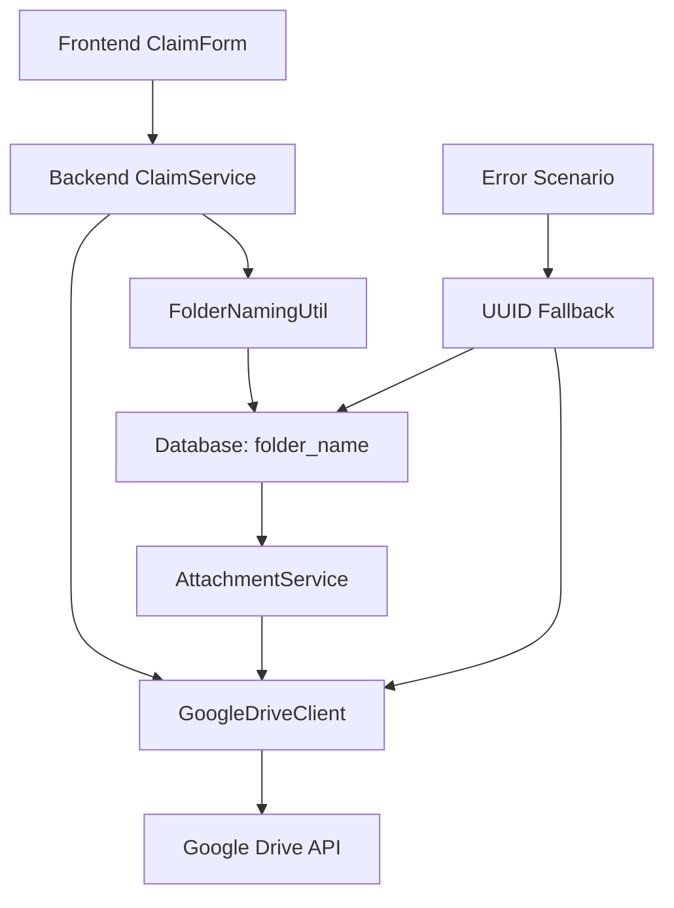

# Design Document

## Overview

This design implements a comprehensive Google Drive folder restructuring system that changes from UUID-based naming to descriptive format: `{year}-{month}-{timestamp}-{categoryCode}-{claimName}`. The solution includes database schema updates, backend folder generation utilities, frontend form enhancements, and robust error handling with UUID fallback strategies.

## Steering Document Alignment

### Technical Standards (tech.md)

**Object.freeze() Pattern**: Uses established enum pattern for category code mapping
```typescript
export const ClaimFolderType = Object.freeze({
  DESCRIPTIVE: 'descriptive',
  UUID: 'uuid',
} as const);
```

**3-Phase Workflow Compliance**: Maintains existing claim creation → file upload → email processing flow
- Phase 1: Claim creation now generates and stores folder_name
- Phase 2: File upload uses pre-generated folder_name
- Phase 3: Email processing references descriptive folder names

**TypeScript Strict Mode**: All new utilities follow strict typing with no `any` types

### Project Structure (structure.md)

**Backend Module Organization**: Follows established NestJS patterns
- New utilities in `backend/src/shared/utils/folder-naming.util.ts`
- Database migration in `backend/src/database/migrations/`
- Updates to existing `claims/` and `attachments/` modules

**Frontend Component Structure**: Enhances existing form patterns
- Updates to `frontend/src/components/forms/ClaimForm/ClaimDetails/`
- New validation utilities in `frontend/src/lib/utils/`

## Code Reuse Analysis

### Existing Components to Leverage

- **GoogleDriveClient**: Extend `createClaimFolder()` method to accept folder name parameter
- **ClaimService**: Enhance claim creation to generate folder names before saving
- **ClaimForm Components**: Add claim name input with real-time validation
- **useAttachmentUpload Hook**: Modify to use pre-generated folder names from backend
- **Claims Entity**: Add new `folder_name` column with backward compatibility

### Integration Points

- **Database Schema**: Adds `folder_name VARCHAR(255) NULL` to existing claims table
- **Google Drive API**: Leverages existing OAuth flow and folder creation logic
- **Form Validation**: Extends existing validation patterns with claim name rules
- **Error Handling**: Integrates with existing retry and fallback mechanisms

## Architecture

The solution follows modular design principles with clear separation of concerns:

### Modular Design Principles
- **Single File Responsibility**: Folder naming logic isolated in dedicated utility
- **Component Isolation**: Frontend form components handle claim name input independently
- **Service Layer Separation**: Business logic separated from data access and presentation
- **Utility Modularity**: Naming utilities are framework-agnostic and reusable



## Components and Interfaces

### Backend Components

#### FolderNamingUtil
- **Purpose:** Generate descriptive folder names with validation and sanitization
- **Interfaces:**
  ```typescript
  generateFolderName(claim: ClaimData): string
  sanitizeClaimName(input: string): string
  validateFolderName(folderName: string): boolean
  ```
- **Dependencies:** None (pure utility functions)
- **Reuses:** Existing ClaimCategory enum pattern

#### Enhanced ClaimService
- **Purpose:** Generate and store folder names during claim creation
- **Interfaces:**
  ```typescript
  createClaim(claimData: CreateClaimDto): Promise<ClaimResponse>
  generateClaimFolderName(claimData: ClaimData): string
  ```
- **Dependencies:** FolderNamingUtil, ClaimRepository
- **Reuses:** Existing claim creation flow, database patterns

#### Enhanced GoogleDriveClient
- **Purpose:** Create folders using descriptive or UUID naming with collision detection
- **Interfaces:**
  ```typescript
  createClaimFolder(userId: string, folderName: string): Promise<string>
  detectFolderType(folderName: string): ClaimFolderType
  checkFolderExists(userId: string, folderName: string): Promise<boolean>
  generateUniqueFolderName(userId: string, baseName: string): Promise<string>
  ```
- **Dependencies:** Google Drive API, FolderNamingUtil
- **Reuses:** Existing OAuth token management, retry logic

## Collision Detection and Resolution

### Folder Uniqueness Strategy

**Pre-creation Check:**
1. Before creating folder, check if name already exists in user's Drive
2. Use Google Drive API search: `name='folder-name' and parents in 'user-root-folder'`
3. If exists, generate unique suffix and retry

**Collision Resolution Algorithm:**
```typescript
async function generateUniqueFolderName(baseName: string): Promise<string> {
  let attempts = 0;
  let currentName = baseName;

  while (attempts < 3) {
    const exists = await checkFolderExists(currentName);
    if (!exists) return currentName;

    // Generate suffix: -1234 (hyphen + 4 random digits)
    const suffix = `-${Math.floor(1000 + Math.random() * 9000)}`;
    currentName = baseName + suffix;
    attempts++;
  }

  // Fallback to UUID if all attempts fail
  throw new Error('Folder collision resolution failed, falling back to UUID');
}
```

**Suffix Format Specification:**
- Format: `-NNNN` where NNNN is 4-digit random number (1000-9999)
- Example: `2025-09-1234567890-telco-phone-bill-1234`
- Maximum 3 retry attempts before UUID fallback
- Collision check uses exact string matching in Google Drive API

### Frontend Components

#### ClaimNameInput Component
- **Purpose:** Collect and validate claim names with real-time feedback
- **Interfaces:**
  ```typescript
  interface ClaimNameInputProps {
    value: string;
    onChange: (value: string) => void;
    category: ClaimCategory;
    required?: boolean;
    maxLength?: number; // Default 30
    showCharacterCount?: boolean; // Default true
    placeholder?: string; // Default "Brief description (e.g., 'Phone Bill Q3')"
  }
  ```
- **Dependencies:** React, validation utilities
- **Reuses:** Existing form component patterns, validation hooks

#### Detailed UX Requirements

**Character Limit Enforcement:**
- Maximum 30 characters with real-time character counter display
- Format: "25/30" shown below input field
- Auto-truncation with "..." when exceeding limits
- Warning message: "Claim name too long (30 max). Will be truncated."

**Category-Based Behavior:**
- When category === 'others': Field marked required with red asterisk (*)
- When category !== 'others': Field marked optional
- Required validation only applies to 'others' category
- Empty field for non-'others' categories defaults to 'default'

**Real-time Validation Feedback:**
- Placeholder text: "Brief description (e.g., 'Phone Bill Q3')"
- Tooltip on focus: "Used for folder naming. Max 30 chars, letters/numbers/spaces only"
- Invalid character error: "Only letters, numbers, spaces, and hyphens allowed"
- Regex validation: `/^[a-zA-Z0-9\s\-]{1,30}$/`
- Real-time folder preview: "Folder will be named: 2025-09-1234567890-telco-my-phone-bill"

**Visual States:**
- Default: Gray border, placeholder visible
- Focus: Blue border, tooltip appears
- Valid input: Green check icon
- Invalid input: Red border, error message below
- Character limit warning: Orange border at 25+ characters

#### Enhanced ClaimForm
- **Purpose:** Integrate claim name input with preview functionality
- **Interfaces:** Extends existing ClaimForm interfaces
- **Dependencies:** ClaimNameInput, existing form components
- **Reuses:** Existing form validation, submission flow

### Shared Utilities

#### FolderPreviewUtil (Frontend)
- **Purpose:** Generate folder name previews for user feedback
- **Interfaces:**
  ```typescript
  generatePreview(claimData: Partial<ClaimData>): string
  generatePreviewWithValidation(claimData: Partial<ClaimData>): PreviewResult
  ```
- **Dependencies:** Shared ClaimCategory types
- **Reuses:** Same naming logic as backend

```typescript
interface PreviewResult {
  preview: string;
  isValid: boolean;
  warnings: string[];
  willUseFallback: boolean;
}
```

#### Category Utilities
- **Purpose:** Category code mapping and validation logic
- **Interfaces:**
  ```typescript
  getCategoryCode(category: ClaimCategory): string
  isClaimNameRequired(category: ClaimCategory): boolean
  getDefaultClaimName(category: ClaimCategory): string
  ```
- **Implementation:**
  ```typescript
  export const CategoryMappings = Object.freeze({
    'telco': 'telco',
    'fitness': 'fitness',
    'dental': 'dental',
    'skill-enhancement': 'skill-enhancement',
    'company-event': 'company-event',
    'company-lunch': 'company-lunch',
    'company-dinner': 'company-dinner',
    'others': 'others'
  } as const);

  function isClaimNameRequired(category: ClaimCategory): boolean {
    return category === 'others';
  }
  ```

## Data Models

### Enhanced Claim Entity
```typescript
interface ClaimEntity {
  id: string;                    // Existing UUID
  folder_name: string | null;    // NEW: Descriptive folder name
  user_id: string;
  category: ClaimCategory;
  claim_name: string | null;     // NEW: User-provided claim name
  month: number;
  year: number;
  total_amount: number;
  status: ClaimStatus;
  created_at: Date;
  updated_at: Date;
}
```

### ClaimData Interface
```typescript
interface ClaimData {
  year: number;
  month: number;
  category: ClaimCategory;
  claimName?: string;           // Optional for non-'others', required for 'others'
  employeeName?: string;        // For fallback scenarios
  timestamp?: number;           // Override for testing (Unix seconds)
}
```

### ValidationResult Interface
```typescript
interface ValidationResult {
  isValid: boolean;
  sanitized: string;
  errors: string[];
  warnings: string[];
  truncated: boolean;
}
```

### FolderNamingOptions Interface
```typescript
interface FolderNamingOptions {
  maxClaimNameLength: number;   // Default: 30
  truncationSuffix: string;     // Default: '...'
  collisionRetries: number;     // Default: 3
  fallbackToUuid: boolean;      // Default: true
}
```

### FolderCreationResult
```typescript
interface FolderCreationResult {
  success: boolean;
  folderId?: string;
  folderName: string;
  type: ClaimFolderType;
  fallbackUsed: boolean;
  error?: string;
}
```

## Error Handling

### Error Scenarios

1. **Folder Name Generation Failure**
   - **Handling:** Fall back to UUID-based naming, log warning
   - **User Impact:** Transparent - folder created with UUID, user notified via toast

2. **Google Drive Folder Creation Failure**
   - **Handling:** Retry with sanitized name, then fallback to UUID
   - **User Impact:** Progressive fallback with appropriate error messages

3. **Database Migration Issues**
   - **Handling:** Graceful degradation - NULL folder_name falls back to UUID
   - **User Impact:** Existing functionality preserved during migration

4. **Character Limit Exceeded**
   - **Handling:** Auto-truncate at 27 chars + "..." (total 30)
   - **User Impact:** Real-time preview shows truncated version
   - **Implementation:** `claimName.substring(0, 27) + '...'`

5. **Invalid Characters in Claim Name**
   - **Handling:** Real-time sanitization and validation feedback
   - **User Impact:** Immediate feedback with suggested corrections

6. **Folder Name Collision**
   - **Handling:** Append random suffix, retry up to 3 times
   - **User Impact:** Transparent resolution with unique folder creation

## Testing Strategy

### Unit Testing

**Backend Tests:**
- `FolderNamingUtil.test.ts`: Test all naming scenarios, edge cases, character limits
- `ClaimService.test.ts`: Test enhanced claim creation with folder name generation
- `GoogleDriveClient.test.ts`: Test folder creation with both naming types

**Frontend Tests:**
- `ClaimNameInput.test.tsx`: Test validation, character counting, sanitization
- `ClaimForm.test.tsx`: Test integration with claim name input and preview

### Integration Testing

**API Tests:**
- Claim creation flow with folder name generation
- File upload using pre-generated folder names
- Error scenarios with fallback to UUID
- Database migration compatibility

**Drive API Tests:**
- Folder creation with descriptive names
- Folder detection and type identification
- Collision handling and retry logic

### End-to-End Testing

**User Scenarios:**
1. **Complete claim submission** with custom claim name
2. **Category-specific behavior** (required name for 'others', optional for others)
3. **Error recovery** when Drive API fails
4. **Backward compatibility** with existing UUID-based claims
5. **Character limit handling** with truncation
6. **Real-time validation** and preview feedback

## Implementation Phases

### Phase 1: Database and Backend Infrastructure
1. Create database migration for `folder_name` and `claim_name` columns
2. **Database Migration Strategy** (see Migration section below)
3. Implement `FolderNamingUtil` with comprehensive testing
4. Update `ClaimService` to generate folder names
5. Enhance `GoogleDriveClient` with fallback logic

## Database Migration Strategy

### Migration Requirements

**New Schema Changes:**
```sql
ALTER TABLE claims ADD COLUMN folder_name VARCHAR(255) NULL;
ALTER TABLE claims ADD COLUMN claim_name VARCHAR(30) NULL;
```

**Existing Data Population:**
```sql
-- Populate existing claims with UUID-based folder_name for backward compatibility
UPDATE claims
SET folder_name = id::text
WHERE folder_name IS NULL;
```

**Migration Verification:**
- Ensure all existing claims have non-null folder_name values
- Verify folder_name format detection works for both UUID and descriptive formats
- Test GoogleDriveClient can handle both naming conventions

**Rollback Strategy:**
```sql
-- Emergency rollback if needed
ALTER TABLE claims DROP COLUMN folder_name;
ALTER TABLE claims DROP COLUMN claim_name;
```

**Data Consistency Checks:**
1. Count claims before migration: `SELECT COUNT(*) FROM claims;`
2. Count populated folder_name after: `SELECT COUNT(*) FROM claims WHERE folder_name IS NOT NULL;`
3. Verify UUID format detection: `SELECT COUNT(*) FROM claims WHERE folder_name ~ '^[0-9a-f]{8}-[0-9a-f]{4}-[0-9a-f]{4}-[0-9a-f]{4}-[0-9a-f]{12}$';`
4. Test folder access for sample existing claims

**Migration Performance:**
- Run during low-usage period
- Use batched updates for large datasets (>10k records)
- Monitor migration progress with logging
- Estimated time: <1 minute for typical dataset sizes

### Phase 2: Frontend Integration
1. Create `ClaimNameInput` component with validation
2. Update `ClaimForm` to include claim name field
3. Implement real-time preview functionality
4. Add form validation for claim names

### Phase 3: Testing and Migration
1. Comprehensive unit and integration testing
2. Database migration with existing data compatibility
3. Error handling verification
4. Performance testing with character limits

### Phase 4: Deployment and Monitoring
1. Deploy with feature flag for gradual rollout
2. Monitor folder creation success rates
3. Track fallback usage for optimization
4. User feedback collection and iteration

This design ensures a robust, scalable solution that maintains backward compatibility while providing the enhanced folder organization requested.