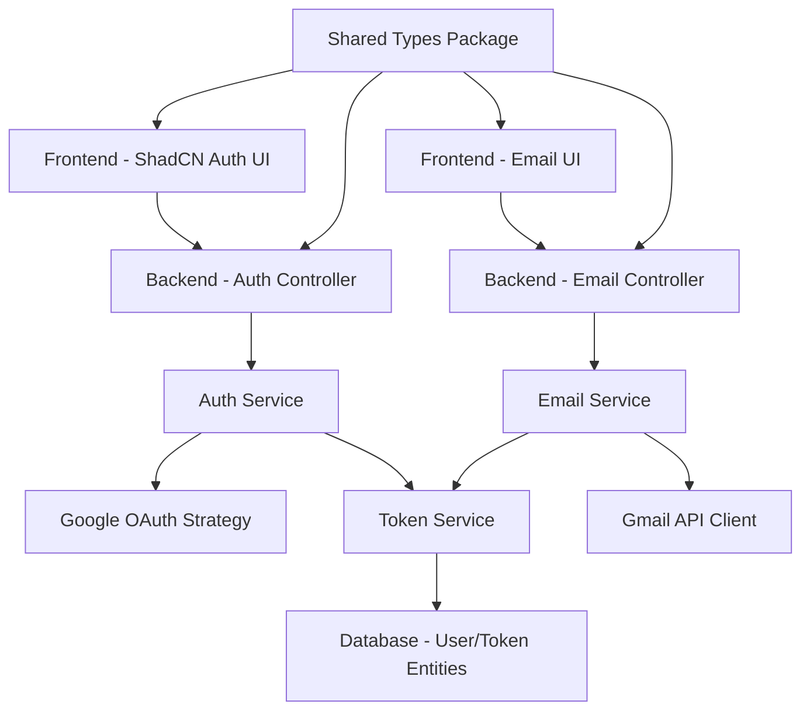

# Design Document

## Overview

This design implements Google OAuth 2.0 authentication and Gmail API email sending functionality within the existing TurboRepo monorepo architecture. The solution integrates seamlessly with the current NestJS backend, Next.js frontend with ShadCN components, and shared TypeScript types package while maintaining the established patterns and conventions.

## Steering Document Alignment

### Technical Standards (tech.md)
The design follows TypeScript strict mode requirements with no `any` types, utilizes the existing `@project/types` shared package for type safety across workspaces, and maintains the established modular NestJS architecture with proper separation of concerns.

### Project Structure (structure.md)
Implementation will follow the existing project organization with new modules added to `backend/src/modules/`, ShadCN components in `frontend/src/components/`, and shared types in `packages/types/src/dtos/`. The design leverages the current TurboRepo workspace dependencies and build orchestration.

## Code Reuse Analysis

### Existing Components to Leverage
- **BaseDBUtil**: Extend existing database utility class for user and token management operations
- **AppConfig**: Utilize existing configuration pattern for OAuth and Gmail API settings
- **ApiClient**: Extend current Axios-based API client for OAuth-related frontend requests
- **ReactQueryProvider**: Leverage existing TanStack Query setup for OAuth state management
- **ShadCN Components**: Use established UI components (Button, Form, Input, Toast, Dialog)

### Integration Points
- **Database**: Extend current TypeORM setup with new User and OAuthToken entities
- **Environment Configuration**: Add OAuth credentials to existing `.env` pattern
- **API Routes**: Follow current NestJS controller/service pattern for new auth endpoints
- **Frontend State**: Integrate with existing TanStack Query patterns for authentication state

## Architecture

The design implements a modular OAuth and email system that integrates with the existing monorepo architecture. The solution uses established patterns including NestJS modules, TypeORM entities, ShadCN UI components, and shared TypeScript types.

### Modular Design Principles
- **Single File Responsibility**: Separate auth strategy, token service, email service, and UI components
- **Component Isolation**: OAuth components, email components, and database entities are isolated modules
- **Service Layer Separation**: Clear separation between auth controllers, business logic services, and data access
- **Utility Modularity**: Token management, email composition, and API clients as focused utilities



## Components and Interfaces

### Auth Module (Backend)
- **Purpose:** Handle Google OAuth authentication flow and session management
- **Interfaces:** 
  - `POST /auth/google` - Initiate OAuth flow
  - `GET /auth/google/callback` - Handle OAuth callback
  - `GET /auth/profile` - Get user profile
  - `POST /auth/logout` - Logout user
- **Dependencies:** `@nestjs/passport`, `passport-google-oauth20`, `TokenService`
- **Reuses:** `BaseDBUtil`, `AppConfig`, existing database configuration

### Token Service (Backend)
- **Purpose:** Manage OAuth token storage, encryption, and refresh operations
- **Interfaces:**
  - `storeTokens(userId, tokens)` - Store encrypted tokens
  - `refreshAccessToken(userId)` - Refresh expired access tokens
  - `getValidToken(userId)` - Get valid access token for user
- **Dependencies:** `TypeORM`, encryption libraries
- **Reuses:** `BaseDBUtil` for database operations, existing environment config

### Email Service (Backend)
- **Purpose:** Send emails via Gmail API using user's authenticated account
- **Interfaces:**
  - `sendEmail(userId, emailData)` - Send email through Gmail API
  - `validateEmailData(emailData)` - Validate email parameters
- **Dependencies:** `googleapis`, `TokenService`
- **Reuses:** Existing validation patterns, error handling utilities

### Auth Components (Frontend)
- **Purpose:** Provide OAuth authentication UI using ShadCN components
- **Interfaces:**
  - `<GoogleAuthButton />` - Trigger OAuth flow
  - `<AuthStatus />` - Display authentication status
  - `<LoginForm />` - OAuth login interface
- **Dependencies:** ShadCN Button, Dialog, Toast components
- **Reuses:** Existing `apiClient`, TanStack Query patterns, ShadCN design system

### Email Components (Frontend)
- **Purpose:** Email composition and sending interface using ShadCN forms
- **Interfaces:**
  - `<EmailComposer />` - Email composition form
  - `<EmailStatus />` - Send status feedback
  - `<EmailHistory />` - Sent email tracking
- **Dependencies:** ShadCN Form, Input, Textarea, Button components
- **Reuses:** Existing form validation patterns, `apiClient`, TanStack Query

## Data Models

### User Entity
```typescript
interface User {
  id: string; // UUID primary key
  googleId: string; // Google account identifier
  email: string; // User's email address
  name: string; // Display name
  picture?: string; // Profile picture URL
  createdAt: Date;
  updatedAt: Date;
  tokens: OAuthToken[];
}
```

### OAuthToken Entity
```typescript
interface OAuthToken {
  id: string; // UUID primary key
  userId: string; // Foreign key to User
  accessToken: string; // Encrypted access token
  refreshToken: string; // Encrypted refresh token
  expiresAt: Date; // Token expiration
  scopes: string[]; // OAuth scopes granted
  createdAt: Date;
  updatedAt: Date;
  user: User;
}
```

### EmailSendRequest DTO
```typescript
interface EmailSendRequest {
  to: string; // Recipient email
  subject: string; // Email subject
  body: string; // Email content
  html?: boolean; // HTML content flag
  cc?: string[]; // CC recipients
  bcc?: string[]; // BCC recipients
}
```

### AuthResponse DTO
```typescript
interface AuthResponse {
  user: {
    id: string;
    email: string;
    name: string;
    picture?: string;
  };
  isAuthenticated: boolean;
}
```

## Error Handling

### Error Scenarios
1. **OAuth Flow Failures**
   - **Handling:** Catch OAuth errors, log details, redirect to error page with user-friendly message
   - **User Impact:** Clear error message via ShadCN toast notification with option to retry

2. **Token Refresh Failures**
   - **Handling:** Automatically trigger re-authentication flow, clear invalid tokens
   - **User Impact:** Seamless redirect to OAuth flow with context preservation

3. **Gmail API Quota Exceeded**
   - **Handling:** Implement exponential backoff, queue emails, notify user of delay
   - **User Impact:** ShadCN toast showing quota status and estimated retry time

4. **Database Connection Errors**
   - **Handling:** Use existing error handling patterns, retry with circuit breaker
   - **User Impact:** Generic error message, automatic retry, escalation to admin if persistent

5. **Email Validation Failures**
   - **Handling:** Client-side validation with ShadCN form validation, server-side verification
   - **User Impact:** Real-time form feedback with specific validation errors

## Testing Strategy

### Unit Testing
- **Token Service**: Test token encryption, refresh logic, expiration handling
- **Email Service**: Test Gmail API integration, email composition, error scenarios
- **Auth Service**: Test OAuth flow steps, user creation, session management
- **Frontend Components**: Test OAuth button interactions, email form validation, state management

### Integration Testing
- **OAuth Flow**: End-to-end OAuth authentication with Google test accounts
- **Email Sending**: Integration with Gmail API using test credentials
- **Database Operations**: User and token CRUD operations with test database
- **API Endpoints**: Full request/response cycle testing for all auth and email endpoints