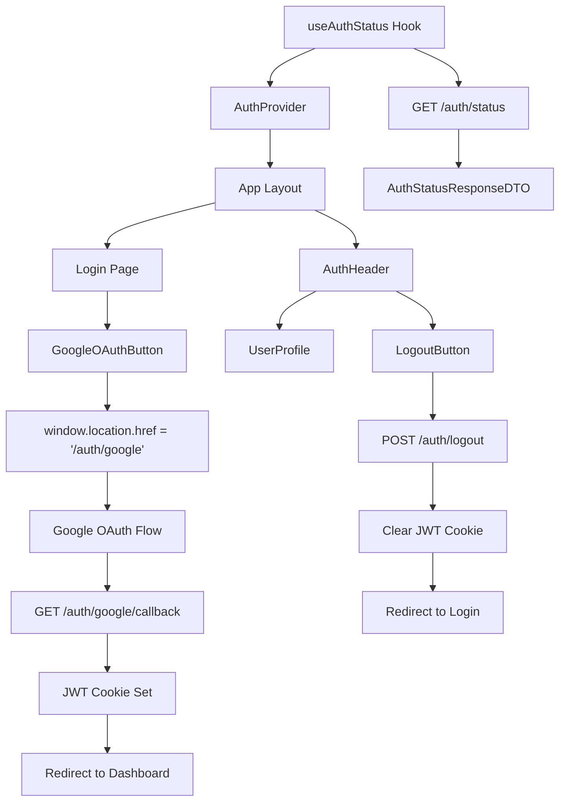
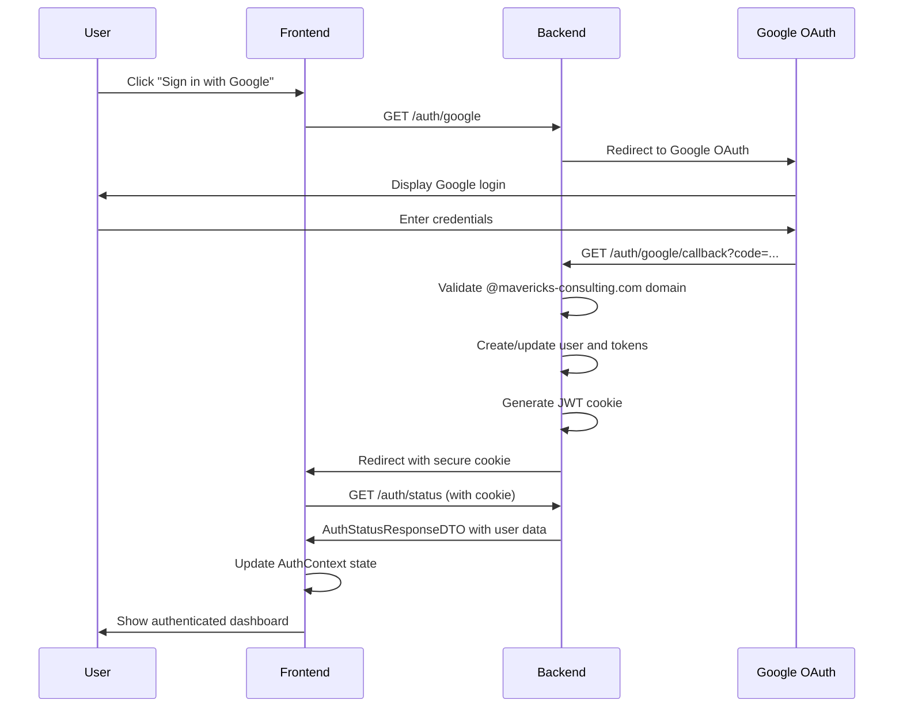

# Design Document

## Overview

The Google OAuth Frontend UI provides a complete authentication interface that integrates seamlessly with existing backend OAuth endpoints (`/auth/google`, `/auth/google/callback`, `/auth/logout`, `/auth/status`) to enable @mavericks-consulting.com employees to access the Mavericks Claim Submission System. This design leverages existing authentication infrastructure while creating minimal, focused UI components that follow established project patterns.

## Steering Document Alignment

### Technical Standards (tech.md)

- **TurboRepo Architecture**: Components organized within Next.js frontend workspace following monorepo structure
- **TypeScript Strict Mode**: All components use proper typing with shared types from `@project/types`
- **Object.freeze() Pattern**: Authentication status management follows established enum patterns
- **Dark Mode Only**: Exclusive dark theme using existing CSS custom properties and Tailwind configuration
- **Mobile-Responsive**: Touch-optimized interface leveraging existing responsive design patterns

### Project Structure (structure.md)

- **Next.js App Router**: Authentication routes in `frontend/src/app/(auth)/` following established routing patterns
- **Component Organization**: Auth UI components in `components/auth/`, reusing `components/ui/` base components
- **Hook Pattern**: Authentication hooks in `hooks/auth/` following existing `hooks/queries/` structure with React Query
- **API Integration**: Extending existing `apiClient` patterns with proper error handling and cookie management

## Code Reuse Analysis

### Existing Components to Leverage

- **Button Component**: Reuse `components/ui/button.tsx` with variant customization for Google OAuth branding
- **ApiClient**: Extend existing `lib/api-client.ts` (already configured with `withCredentials: true` for cookie handling)
- **Error Handler**: Utilize `hooks/queries/helper/error-handler.ts` for OAuth-specific error processing
- **React Query Pattern**: Follow existing `useHealthCheck` pattern for authentication status management
- **Toast System**: Leverage existing Sonner integration for authentication feedback and error display

### Integration Points

- **Backend OAuth Endpoints**: Direct integration with existing endpoints including rate limiting support
  - `/auth/google` (with `@OAuthProtected('initiate')` rate limiting)
  - `/auth/google/callback` (with `@OAuthProtected('callback')` rate limiting)
  - `/auth/logout` (with `@AuthGeneralRateLimit()` protection)
  - `/auth/status` (no rate limiting for status checks)
- **Backend DTOs**: Use actual `AuthStatusResponseDTO`, `AuthenticatedResponseDTO`, `UnauthenticatedResponseDTO`
- **JWT Cookie System**: Work with existing secure cookie configuration (httpOnly, secure, sameSite: 'lax', 24h maxAge)
- **Type System**: Leverage existing `IUser`, `IAuthStatusResponse` from `@project/types`

## Architecture

The authentication system implements a provider pattern with React Context for global state management, integrated with TanStack Query for server state synchronization and automatic retry logic. All components follow single responsibility principle with clear separation of concerns.

### Modular Design Principles

- **Single File Responsibility**: AuthProvider manages only context state, OAuth button handles only initiation
- **Component Isolation**: Login page, authentication header, and OAuth components are separate, reusable modules
- **Service Layer Separation**: Authentication API calls separated from UI logic through custom hooks
- **Utility Modularity**: Authentication utilities focused on single purposes (status checking, logout handling)





## Components and Interfaces

### AuthProvider (Global State Management)
- **Purpose:** React Context provider for global authentication state with automatic status synchronization
- **Interfaces:**
  ```typescript
  interface AuthContextType {
    user: IUser | null
    isAuthenticated: boolean
    isLoading: boolean
    logout: () => Promise<void>
    refetch: () => Promise<void>
  }
  ```
- **Dependencies:** useAuthStatus hook, TanStack Query, logout API endpoint
- **Reuses:** Existing IUser type, error handling patterns, toast notifications

### GoogleOAuthButton (OAuth Initiation)
- **Purpose:** Google-branded OAuth button with proper loading and error states
- **Interfaces:**
  ```typescript
  interface GoogleOAuthButtonProps {
    className?: string
    size?: 'sm' | 'default' | 'lg'
    disabled?: boolean
    onError?: (error: string) => void
  }
  ```
- **Dependencies:** Button component, Google brand assets
- **Reuses:** Existing Button variants and sizes, loading state patterns

### AuthHeader (Navigation Integration)
- **Purpose:** Authentication status display in application header with user menu
- **Interfaces:**
  - Authenticated state: User avatar, name, dropdown with Profile/Logout
  - Unauthenticated state: "Sign In" link
  - Loading state: Skeleton placeholder
- **Dependencies:** AuthProvider context, avatar component, dropdown menu
- **Reuses:** Existing layout patterns, navigation components, dropdown implementations

### LoginPage (Authentication Entry Point)
- **Purpose:** Dedicated login page with OAuth flow and comprehensive error handling
- **Interfaces:**
  - URL parameters: `?error=auth_failed` for OAuth failures
  - Responsive layout with centered Google OAuth button
  - Error display with specific messaging
- **Dependencies:** GoogleOAuthButton, error display utilities, URL parameter parsing
- **Reuses:** Page layout patterns, error toast system, responsive design utilities

### useAuthStatus (Authentication State Hook)
- **Purpose:** TanStack Query hook for authentication status with automatic retry and caching
- **Interfaces:**
  ```typescript
  function useAuthStatus(): {
    data: AuthStatusResponseDTO | undefined
    user: IUser | null
    isAuthenticated: boolean
    isLoading: boolean
    error: unknown
    refetch: () => Promise<QueryObserverResult>
  }
  ```
- **Dependencies:** TanStack Query, apiClient, existing query key patterns
- **Reuses:** Query key structure from existing hooks, error handling from ErrorHandler class

### useLogout (Logout Management Hook)
- **Purpose:** Logout functionality with loading states and error handling
- **Interfaces:**
  ```typescript
  function useLogout(): {
    logout: () => Promise<void>
    isLoading: boolean
    error: unknown
  }
  ```
- **Dependencies:** TanStack Query mutation, apiClient, AuthProvider context
- **Reuses:** Mutation patterns, error handling, toast notifications

## Data Models

### AuthContextState (Frontend Context State)
```typescript
interface AuthContextState {
  user: IUser | null            // From @project/types
  isAuthenticated: boolean      // Derived from user presence
  isLoading: boolean           // Query loading state
}
```

### AuthStatusResponseDTO (Backend Response)
```typescript
// Already exists in backend
class AuthStatusResponseDTO implements IAuthStatusResponse {
  isAuthenticated: boolean
  user?: IUser
}
```

### GoogleOAuthError (Error Handling)
```typescript
interface GoogleOAuthError {
  type: 'domain_restriction' | 'network_error' | 'oauth_failure' | 'jwt_creation_error'
  message: string
  userMessage: string  // User-friendly error message
}
```

## Error Handling

### Error Scenarios

1. **OAuth Domain Restriction Error**
   - **Trigger:** User attempts login with non-@mavericks-consulting.com account
   - **Handling:** Backend redirects to `/login?error=auth_failed`, frontend displays domain-specific message
   - **User Impact:** "Access denied: Only @mavericks-consulting.com accounts are allowed"

2. **Network Connection Error**
   - **Trigger:** Network failure during authentication API calls
   - **Handling:** TanStack Query automatic retry (3 attempts), exponential backoff
   - **User Impact:** Toast: "Connection failed. Retrying..." with retry count

3. **Authentication Status Check Failure**
   - **Trigger:** /auth/status endpoint returns error
   - **Handling:** Graceful degradation to unauthenticated state, background retry every 30 seconds
   - **User Impact:** Show login interface, silent background retry

4. **JWT Cookie Creation Failure**
   - **Trigger:** OAuth succeeds but backend fails to set JWT cookie
   - **Handling:** Backend redirects to login with error parameter, frontend shows retry message
   - **User Impact:** "Authentication failed. Please try again."

5. **Rate Limiting Error**
   - **Trigger:** Too many OAuth attempts trigger backend rate limiting
   - **Handling:** Display rate limit message with retry timeout
   - **User Impact:** "Too many login attempts. Please wait 60 seconds and try again."

## Testing Strategy

### Unit Testing

- **Component Testing:** 
  - GoogleOAuthButton: Render states, click handling, Google branding
  - AuthHeader: User display, dropdown menu, loading states
  - AuthProvider: Context value updates, logout functionality
- **Hook Testing:**
  - useAuthStatus: API response handling, loading states, error scenarios
  - useLogout: Successful logout, error handling, loading states
- **Utility Testing:** Error message extraction, authentication status derivation

### Integration Testing

- **Authentication Flow:** Complete OAuth flow simulation with MSW (Mock Service Worker)
- **Error Scenarios:** Domain restriction simulation, network failure testing
- **State Management:** Authentication state persistence across component renders
- **Cookie Handling:** JWT cookie setting and clearing verification
- **Rate Limiting:** Rate limit error handling and retry logic

### End-to-End Testing

- **Complete User Journey:** Login with valid @mavericks-consulting.com account → Dashboard → Logout
- **Error Scenarios:** Login attempt with external domain, network disconnection handling
- **Session Persistence:** Authentication persistence across browser refresh and tab switching
- **Mobile Responsiveness:** Touch interaction testing, responsive layout verification
- **Performance Requirements:** 100ms authentication status checks, 200ms mobile rendering