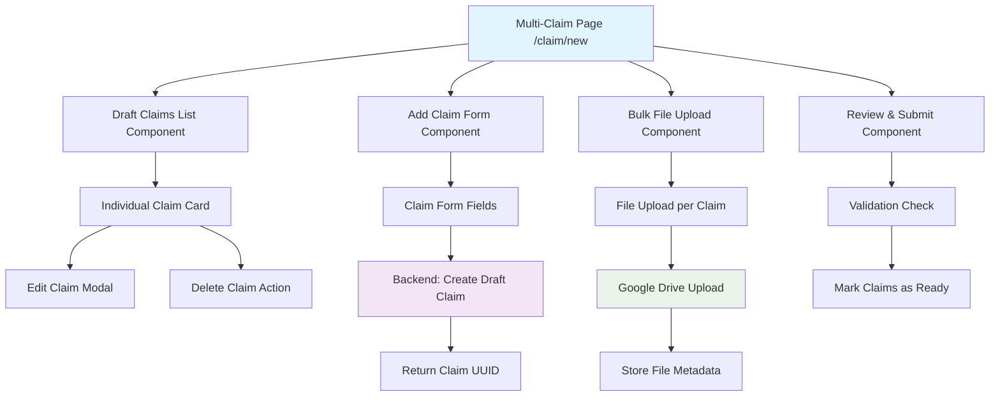

# Design Document

## Overview

The Multi-Claim Submission feature implements a comprehensive interface at `/claim/new` that enables employees to create and manage multiple expense claims simultaneously. This design follows the critical 2-phase workflow where claims are created first in draft status to provide UUIDs for file organization, followed by efficient bulk file attachment. The implementation leverages existing claim and attachment infrastructure while introducing new multi-claim orchestration components.

## Steering Document Alignment

### Technical Standards (tech.md)
- **Object.freeze() Pattern**: Utilizes existing ClaimStatus and ClaimCategory enums following the established pattern
- **TypeScript Standards**: Maintains strict typing throughout with proper DTOs and interfaces
- **Module Architecture**: Extends existing claims and attachments modules with clear separation of concerns
- **2-Phase Data Flow**: Implements "Claim Creation → File Upload" sequence as documented in tech.md
- **Database Constraints**: Leverages existing claim entity validation and foreign key relationships

### Project Structure (structure.md)
- **Backend Modules**: Extends existing claims module with new multi-claim endpoints and services
- **Frontend Components**: Follows established component patterns with multi-step form architecture
- **DTOs Structure**: Creates 2-phase workflow DTOs building on existing claim creation patterns
- **Testing**: Maintains existing unit and integration testing approaches with new test coverage

## Code Reuse Analysis

### Existing Components to Leverage
- **ClaimEntity & ClaimDBUtil**: Reuse existing claim creation and management infrastructure
- **AttachmentEntity & AttachmentDBUtil**: Leverage existing file metadata storage and Drive integration
- **ClaimForm Component**: Extend existing form component for individual claim creation within multi-claim context
- **FileUploadComponent & AttachmentList**: Reuse existing file upload and attachment management components
- **AuthProvider & JWT Guards**: Apply existing authentication patterns to new multi-claim endpoints
- **React Query Patterns**: Extend existing data fetching and caching strategies for bulk operations

### Integration Points
- **Claims Module**: Add new controllers and services for multi-claim operations while maintaining existing single-claim workflows
- **Attachments Module**: Integrate file upload workflow using existing Google Drive client-side upload infrastructure
- **Database Schema**: Utilize existing claim and attachment entities without schema changes
- **Frontend Routing**: Add new `/claim/new` route following existing Next.js App Router patterns
- **UI Components**: Build on existing card, button, form, and input components for consistent design

## Architecture

The multi-claim submission system implements a state-driven architecture where draft claims provide the foundation for organized file management. The design separates claim creation, file attachment, and review phases while maintaining data consistency and user experience continuity.

### Modular Design Principles
- **Single File Responsibility**: Separate components for claim list management, individual claim forms, bulk file upload, and submission orchestration
- **Component Isolation**: Multi-claim components isolated from single-claim workflows, allowing both to coexist
- **Service Layer Separation**: Distinct services for bulk claim operations, individual claim management, and file attachment coordination
- **Utility Modularity**: Focused utilities for draft claim validation, bulk operations, and state management



## Components and Interfaces

### Backend: Existing Claims Endpoints (Reused)
- **Purpose:** Leverage existing single claim operations for multi-claim functionality
- **Interfaces (Existing):**
  - `POST /claims` → Create individual draft claim (called multiple times from frontend)
  - `GET /claims` → Retrieve user's claims (filtered by status=draft for draft claims list)
  - `PUT /claims/:id` → Update individual claim details
  - `DELETE /claims/:id` → Delete individual draft claim
  - `PUT /claims/:id/status` → Update claim status (draft → ready)
- **Dependencies:** Existing ClaimController, ClaimService, AuthGuard
- **Reuses:** All existing claim validation logic, user authentication patterns, database utilities

### Frontend: MultiClaimSubmissionPage
- **Purpose:** Main orchestration component for the multi-claim submission workflow
- **Interfaces:**
  - Route: `/claim/new`
  - State management for draft claims list, current editing claim, upload progress
  - Calls existing `POST /claims` endpoint individually for each claim creation
  - Calls existing `GET /claims?status=draft` to fetch draft claims list
- **Dependencies:** Existing Claims API endpoints, React Query for state management
- **Reuses:** Existing AuthProvider, toast notifications, loading states, claim API client

### Frontend: DraftClaimsList Component
- **Purpose:** Display and manage list of draft claims with edit/delete capabilities
- **Interfaces:**
  - `onEditClaim(claimId: string)` → Call existing `PUT /claims/:id` endpoint for updates
  - `onDeleteClaim(claimId: string)` → Call existing `DELETE /claims/:id` endpoint
  - `onAddFiles(claimId: string)` → Navigate to file upload for specific claim
- **Dependencies:** Existing Claims API endpoints, confirmation dialogs
- **Reuses:** Existing Card, Button components, status display utilities, claim API client

### Frontend: BulkFileUploadComponent
- **Purpose:** Coordinate file uploads across multiple claims with progress tracking
- **Interfaces:**
  - `onFileSelect(claimId: string, files: File[])` → Handle file selection for specific claim
  - `onUploadProgress(claimId: string, progress: number)` → Track upload progress per claim
  - `onUploadComplete(claimId: string, attachments: AttachmentMetadata[])` → Handle successful uploads
- **Dependencies:** DriveUploadClient, AttachmentService API
- **Reuses:** Existing FileUploadComponent, progress indicators, error handling

### Frontend: ClaimReviewComponent
- **Purpose:** Final review interface showing all claims with attachments before marking ready
- **Interfaces:**
  - `onMarkReady(claimIds: string[])` → Call existing `PUT /claims/:id/status` for each claim individually
  - `onEditClaim(claimId: string)` → Return to editing individual claim
  - Display summary of claims, file counts, total amounts
- **Dependencies:** Existing Claims API endpoints for status updates
- **Reuses:** Existing summary display patterns, validation feedback, claim API client

## Data Models

### ClaimCreateRequest (Existing)
```typescript
// Reuse existing interface - no bulk request needed
interface ClaimCreateRequest {
  category: ClaimCategory;
  claimName: string;
  month: number;
  year: number;
  totalAmount: number;
}
```

### DraftClaimSummary
```typescript
interface DraftClaimSummary {
  id: string;
  category: ClaimCategory;
  claimName: string;
  month: number;
  year: number;
  totalAmount: number;
  status: ClaimStatus.DRAFT;
  attachmentCount: number;
  createdAt: Date;
  updatedAt: Date;
}
```

### MultiClaimStatusResponse (Frontend-Only)
```typescript
// Computed on frontend from individual GET /claims responses
interface MultiClaimStatusResponse {
  draftClaims: DraftClaimSummary[];
  totalAmount: number;
  claimsWithAttachments: number;
  claimsWithoutAttachments: number;
  canMarkReady: boolean;
}
```

### BulkFileUploadProgress
```typescript
interface BulkFileUploadProgress {
  claimId: string;
  files: {
    fileName: string;
    progress: number;
    status: 'pending' | 'uploading' | 'completed' | 'failed';
    error?: string;
  }[];
  overallProgress: number;
}
```

## Error Handling

### Error Scenarios

1. **Draft Claim Creation Failure**
   - **Handling:** Validate each claim individually before calling POST /claims, handle partial failures gracefully
   - **User Impact:** Show specific validation errors per claim, allow correction and retry

2. **File Upload Failure During Bulk Operation**
   - **Handling:** Continue other uploads, maintain individual claim file status, provide retry mechanism
   - **User Impact:** Show per-claim upload status, highlight failed uploads with retry buttons

3. **Google Drive Quota Exceeded During Multi-File Upload**
   - **Handling:** Pause remaining uploads, show clear quota error message, provide guidance
   - **User Impact:** "Google Drive storage full. Free up space to continue uploading files."

4. **Network Interruption During Bulk Operations**
   - **Handling:** Preserve draft claims state, resume file uploads from last checkpoint
   - **User Impact:** "Connection restored. Resuming uploads..." with progress continuation

5. **Concurrent Modification of Draft Claims**
   - **Handling:** Optimistic locking with refresh detection, merge conflict resolution
   - **User Impact:** "Claims were updated in another session. Refreshing..." with data reload

6. **Monthly Limit Validation Across Multiple Claims**
   - **Handling:** Frontend aggregates amounts before calling POST /claims, shows validation errors
   - **User Impact:** "Total telco claims (SGD 180) exceed monthly limit (SGD 150). Please adjust amounts."

## Testing Strategy

### Unit Testing

**Backend Tests:**
- No new backend components needed - existing Claims endpoints handle individual operations
- Validation utilities: Test existing claim validation logic continues to work correctly

**Frontend Tests:**
- DraftClaimsList: Test claim display, edit/delete actions, state management
- BulkFileUploadComponent: Mock file uploads, test progress tracking and error handling
- ClaimReviewComponent: Test summary calculations, mark ready functionality

### Integration Testing

**API Integration:**
- Individual claim creation: Multiple calls to existing POST /claims endpoint
- File upload: Integration with existing Google Drive API and metadata storage
- Draft claim management: Using existing PUT /claims/:id and DELETE /claims/:id endpoints

**Frontend Integration:**
- Complete multi-claim workflow: Create claims → Upload files → Review → Mark ready
- Error recovery: Network failures, validation errors, upload retries
- State persistence: Browser refresh, navigation, concurrent sessions

### End-to-End Testing

**User Scenarios:**
1. **Happy Path**: Create 3 claims → Upload files to each → Review summary → Mark ready
2. **Validation Errors**: Exceed monthly limits → Show aggregated errors → Correct amounts → Proceed
3. **File Upload Issues**: Large files, quota exceeded, network interruption → Error handling → Retry mechanism
4. **Draft Management**: Create claims → Edit individual claims → Delete unwanted claims → Continue workflow
5. **Mobile Experience**: Touch-optimized multi-claim creation → File selection → Review on mobile devices

**Performance Testing:**
- Sequential claim creation: Creating 10 claims via individual API calls with responsive UI
- File upload scalability: Multiple large files across different claims
- State management: Efficient React re-renders during sequential operations