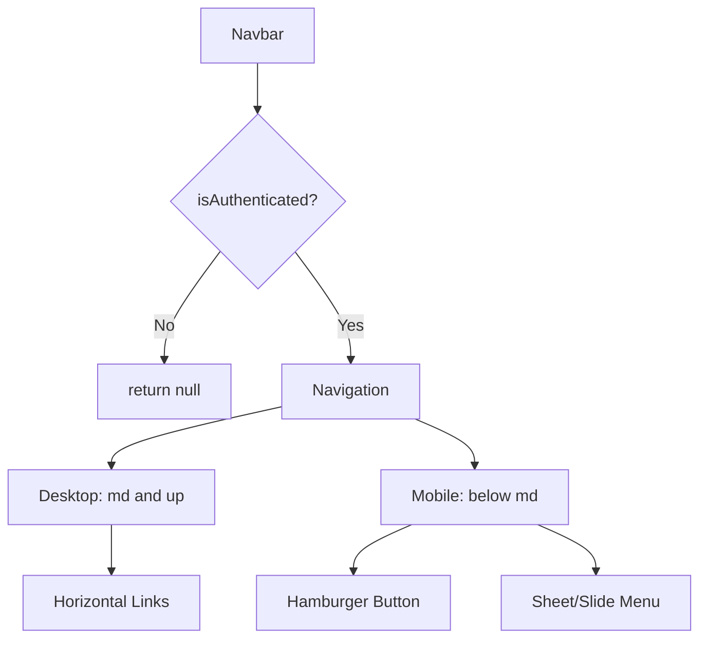

# Design Document

## Overview

Navigation bar with 2 links: "New Claim" (/) and "Claim History" (/claims). Desktop shows horizontal nav. Mobile shows hamburger menu. Hide when not authenticated. That's it.

## Steering Document Alignment

### Technical Standards (tech.md)

- TypeScript strict mode, no `any`
- Use existing `useAuth()` hook (read-only, no modifications)
- Tailwind CSS with `cn()` utility
- lucide-react icons (Menu, X)
- Next.js Link for routing

### Project Structure (structure.md)

```
frontend/src/components/
├── navigation/
│   ├── navbar.tsx      # ~50 lines
│   └── index.ts
```

Integrate at `frontend/src/app/layout.tsx:39`

## Code Reuse Analysis

**What We're Using**:
- `useAuth()` from `@/components/providers/auth-provider` - authentication state
- `usePathname()` from `next/navigation` - active route detection
- `Link` from `next/link` - navigation
- `Button` from `@/components/ui/button` - hamburger button
- `cn()` from `@/lib/utils` - className merging
- Icons from `lucide-react` - Menu, X

**What We're Adding**:
- shadcn/ui Sheet component for mobile menu (recommended)
- OR simple custom slide-out div if Sheet unavailable (fallback)

## Architecture

### Component Structure



### Implementation Approach

**Desktop (≥768px)**:
```typescript
<nav className="hidden md:flex gap-1">
  {NAV_ITEMS.map(item => (
    <Link
      href={item.href}
      className={cn(
        'px-3 py-2 rounded-md text-sm',
        pathname === item.href ? 'bg-accent' : 'text-muted-foreground'
      )}
    >
      {item.label}
    </Link>
  ))}
</nav>
```

**Mobile (<768px)** - Option 1 (Recommended):
```typescript
<Sheet open={isOpen} onOpenChange={setIsOpen}>
  <SheetTrigger asChild>
    <Button variant="ghost" size="icon" className="md:hidden">
      <Menu className="h-5 w-5" />
    </Button>
  </SheetTrigger>
  <SheetContent side="left">
    {NAV_ITEMS.map(item => (
      <Link href={item.href} onClick={() => setIsOpen(false)}>
        {item.label}
      </Link>
    ))}
  </SheetContent>
</Sheet>
```

**Mobile (<768px)** - Option 2 (Fallback if no Sheet):
```typescript
// Hamburger button
<Button
  variant="ghost"
  size="icon"
  className="md:hidden"
  onClick={() => setIsOpen(true)}
>
  <Menu className="h-5 w-5" />
</Button>

// Simple slide-out (when isOpen)
{isOpen && (
  <>
    <div className="fixed inset-0 bg-black/50 z-40" onClick={() => setIsOpen(false)} />
    <div className="fixed top-0 left-0 h-full w-64 bg-card border-r z-50 p-4">
      <Button variant="ghost" size="icon" onClick={() => setIsOpen(false)}>
        <X className="h-5 w-5" />
      </Button>
      {NAV_ITEMS.map(item => (
        <Link href={item.href} onClick={() => setIsOpen(false)}>
          {item.label}
        </Link>
      ))}
    </div>
  </>
)}
```

## Data Models

```typescript
interface NavItem {
  label: string;
  href: string;
}

const NAV_ITEMS: NavItem[] = [
  { label: 'New Claim', href: '/' },
  { label: 'Claim History', href: '/claims' },
];
```

## Complete Component Implementation

```typescript
'use client';

import { useState } from 'react';
import Link from 'next/link';
import { usePathname } from 'next/navigation';
import { Menu } from 'lucide-react';
import { useAuth } from '@/components/providers/auth-provider';
import { Button } from '@/components/ui/button';
import { Sheet, SheetContent, SheetTrigger } from '@/components/ui/sheet';
import { cn } from '@/lib/utils';

const NAV_ITEMS = [
  { label: 'New Claim', href: '/' },
  { label: 'Claim History', href: '/claims' },
];

export const Navbar = () => {
  const { isAuthenticated, isLoading } = useAuth();
  const pathname = usePathname();
  const [isOpen, setIsOpen] = useState(false);

  if (isLoading || !isAuthenticated) return null;

  return (
    <>
      {/* Desktop */}
      <nav className="hidden md:flex gap-1">
        {NAV_ITEMS.map((item) => (
          <Link
            key={item.href}
            href={item.href}
            className={cn(
              'px-3 py-2 rounded-md text-sm font-medium transition-colors',
              pathname === item.href
                ? 'bg-accent text-accent-foreground'
                : 'text-muted-foreground hover:bg-accent hover:text-accent-foreground'
            )}
          >
            {item.label}
          </Link>
        ))}
      </nav>

      {/* Mobile */}
      <Sheet open={isOpen} onOpenChange={setIsOpen}>
        <SheetTrigger asChild>
          <Button variant="ghost" size="icon" className="md:hidden">
            <Menu className="h-5 w-5" />
            <span className="sr-only">Open menu</span>
          </Button>
        </SheetTrigger>
        <SheetContent side="left">
          <nav className="flex flex-col gap-4 mt-8">
            {NAV_ITEMS.map((item) => (
              <Link
                key={item.href}
                href={item.href}
                onClick={() => setIsOpen(false)}
                className={cn(
                  'px-3 py-2 rounded-md text-sm font-medium',
                  pathname === item.href
                    ? 'bg-accent text-accent-foreground'
                    : 'text-muted-foreground hover:bg-accent'
                )}
              >
                {item.label}
              </Link>
            ))}
          </nav>
        </SheetContent>
      </Sheet>
    </>
  );
};
```

**Total: ~50 lines**

## Error Handling

**Scenario: Sheet component doesn't exist**
- Solution: Install shadcn/ui Sheet component OR use fallback Option 2
- Command: `npx shadcn@latest add sheet`

**Scenario: Navigation to invalid route**
- Next.js handles this (404 page)

**Scenario: Auth provider missing**
- useAuth() throws error automatically

That's it. No special cases.

## Testing Strategy

### Unit Tests

```typescript
// navbar.test.tsx
describe('Navbar', () => {
  it('returns null when not authenticated', () => {
    mockUseAuth({ isAuthenticated: false });
    const { container } = render(<Navbar />);
    expect(container).toBeEmptyDOMElement();
  });

  it('renders desktop nav when authenticated', () => {
    mockUseAuth({ isAuthenticated: true });
    const { getByText } = render(<Navbar />);
    expect(getByText('New Claim')).toBeInTheDocument();
    expect(getByText('Claim History')).toBeInTheDocument();
  });

  it('highlights active route', () => {
    mockUseAuth({ isAuthenticated: true });
    mockUsePathname('/claims');
    const { getByText } = render(<Navbar />);
    expect(getByText('Claim History')).toHaveClass('bg-accent');
  });
});
```

### Integration Tests

- Login → Navbar appears
- Click "Claim History" → Navigate to /claims, item highlighted
- Mobile: Click hamburger → Menu opens
- Mobile: Click nav link → Menu closes, navigate

## Performance Considerations

**No Premature Optimization**:
- No React.memo (component renders twice total)
- No useCallback (2 nav items)
- No useMemo (2 nav items)

Component is simple. Renders fast. Done.

**Bundle Size**: <5KB (Sheet component already in use elsewhere if it exists)

## Accessibility

**Built-in from components**:
- Sheet handles focus trap, ESC key, backdrop clicks
- Button has proper focus states
- Link is keyboard accessible

**Manual additions**:
- `<span className="sr-only">Open menu</span>` for hamburger button
- Active route uses visual styling (color + background)

## Implementation Steps

### Option A: With Sheet Component (Recommended)

1. Check if Sheet exists: `ls frontend/src/components/ui/sheet.tsx`
2. If not, install: `npx shadcn@latest add sheet`
3. Create `navbar.tsx` using implementation above
4. Add to layout.tsx at line 39
5. Done

### Option B: Without Sheet (Fallback)

1. Create `navbar.tsx` using fallback Option 2
2. Add CSS transition for slide animation
3. Add to layout.tsx at line 39
4. Done

## Layout Integration

**Current (layout.tsx:34-42)**:
```tsx
<header className="border-b border-border bg-card">
  <div className="container mx-auto flex h-16 items-center justify-between px-4">
    <AppTitle />
    <div className="flex flex-row gap-3">
      {/* TODO: Add nav bar */}
      <AuthHeader />
    </div>
  </div>
</header>
```

**After**:
```tsx
<header className="border-b border-border bg-card">
  <div className="container mx-auto flex h-16 items-center justify-between px-4">
    <AppTitle />
    <div className="flex flex-row gap-3">
      <Navbar />
      <AuthHeader />
    </div>
  </div>
</header>
```

Done.
