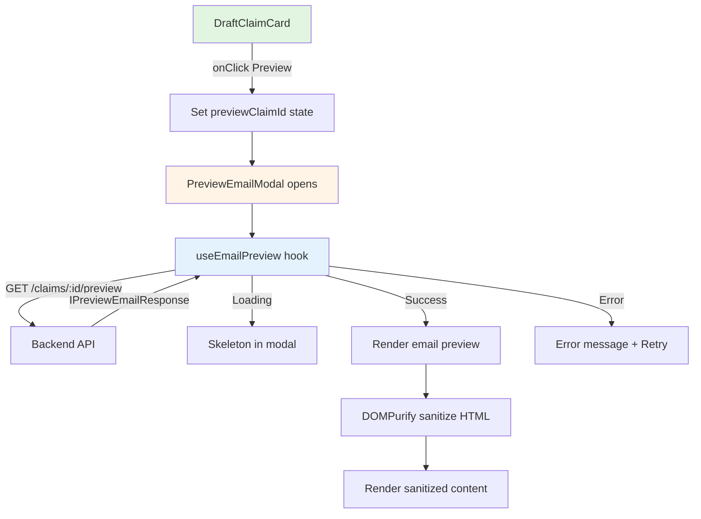

# Design Document: Email Preview Frontend UI

## Overview

The **Email Preview Frontend UI** adds a modal component to display email preview content. The design prioritizes maximum code reuse - leveraging existing Dialog, Button, and Skeleton components while adding only the minimal necessary new code.

**Core Principle**: Preview is a read-only display feature. No data modification, no complex state management. Fetch data, render it, done.

**Total New Files**: 2 (one modal component, one hook)
**Modified Files**: 1 (DraftClaimCard + parent component)
**Lines of Code**: ~200 estimated
**New Dependencies**: 1 (DOMPurify for HTML sanitization)

## Steering Document Alignment

### Technical Standards (tech.md)

**TypeScript Strict Mode**:
- All components use strict TypeScript with zero `any` types
- Import `IPreviewEmailResponse` from `@project/types`
- Props interfaces defined for all components

**Path Aliases**:
- Use `@/` for all frontend imports
- Use `@project/types` for shared types

**Object.freeze Pattern**:
- No new enums needed - reuse existing patterns

### Project Structure (structure.md)

**Frontend Organization**:
```
frontend/src/
├── components/
│   ├── email/
│   │   └── PreviewEmailModal.tsx       # NEW: Modal component (includes inline sanitize)
│   └── claims/
│       └── draft-claim-card.tsx        # MODIFY: Add onPreview prop and button
└── hooks/
    └── email/
        └── useEmailPreview.ts          # NEW: React Query hook
```

**Follows Existing Patterns**:
- Modal pattern from `ClaimFormModal`
- Hook pattern from `useEmailSending`
- Component organization in feature directories

## Code Reuse Analysis

### Existing Components to Leverage

**1. Dialog Component** (`frontend/src/components/ui/dialog.tsx`):
- `Dialog`, `DialogContent`, `DialogHeader`, `DialogTitle` - Modal structure
- Built-in accessibility (focus trap, ARIA, escape to close)
- Built-in animations and overlay
- **Usage**: Wrap preview content, apply `max-w-4xl` class for larger size

**2. Button Component** (`frontend/src/components/ui/button.tsx`):
- `variant="ghost"` for Preview button in DraftClaimCard
- Consistent styling with Edit/Delete buttons
- **Usage**: Add Preview button following existing pattern

**3. Skeleton Component** (`frontend/src/components/ui/skeleton.tsx`):
- Loading placeholder
- **Usage**: Show while preview is loading

**4. DraftClaimCard** (`frontend/src/components/claims/draft-claim-card.tsx`):
- Existing card with Edit/Delete buttons
- Mobile-responsive button layout pattern
- **Modification**: Add `onPreview` prop and Preview button

### Existing Hooks to Leverage

**1. useEmailSending** (`frontend/src/hooks/email/useEmailSending.ts`):
- Pattern: `useMutation` with error handling
- **Reference**: Follow same structure for `useEmailPreview` using `useQuery`

**2. Query Keys** (`frontend/src/hooks/queries/keys/key.ts`):
- `QueryGroup` enum - add EMAIL group (already exists)
- `getQueryKey` helper for consistent key generation

### Existing Utilities to Leverage

**1. apiClient** (`frontend/src/lib/api-client.ts`):
- `apiClient.get<T>()` for fetching preview
- `ApiError` class for error handling
- **Usage**: `apiClient.get<IPreviewEmailResponse>(`/claims/${claimId}/preview`)`

**2. cn utility** (`frontend/src/lib/utils.ts`):
- Class name merging for conditional styles
- **Usage**: Mobile-responsive classes

### Integration Points

**Existing API Endpoint**:
- `GET /api/claims/:id/preview` (already implemented)
- Returns `IPreviewEmailResponse` from `@project/types`

**Parent Components**:
- `DraftClaimCard` - Add Preview button and modal trigger
- No changes to page components - modal is self-contained

## Architecture

### High-Level Design



### Modular Design Principles

**Single File Responsibility**:
- `PreviewEmailModal.tsx`: Modal UI only (presentation)
- `useEmailPreview.ts`: Data fetching only (logic)
- `DraftClaimCard.tsx`: Existing component with minimal addition

**Component Isolation**:
- Modal is self-contained with all display logic
- Hook handles all API communication
- No global state changes

**No Abstraction Over-Engineering**:
- No separate "RecipientHeader" component - inline in modal (it's ~20 lines)
- No separate "EmailBody" component - inline with DOMPurify call
- Collapsible state handled by simple useState - no Collapsible wrapper needed

## Components and Interfaces

### Component 1: PreviewEmailModal

**Purpose**: Display email preview in a responsive modal with collapsible recipient header

**File**: `frontend/src/components/email/PreviewEmailModal.tsx`

**Props Interface**:
```typescript
interface PreviewEmailModalProps {
  claimId: string | null;  // null = modal closed
  onClose: () => void;
}
```

**Internal Structure**:
```typescript
export const PreviewEmailModal: React.FC<PreviewEmailModalProps> = ({
  claimId,
  onClose,
}) => {
  const [recipientsExpanded, setRecipientsExpanded] = useState(false);
  const { data, isLoading, isError, error, refetch } = useEmailPreview(claimId);

  const isOpen = claimId !== null;

  return (
    <Dialog open={isOpen} onOpenChange={(open) => !open && onClose()}>
      <DialogContent className="max-w-4xl max-h-[90vh] flex flex-col sm:max-h-[85vh]">
        <DialogHeader>
          <DialogTitle>Email Preview</DialogTitle>
        </DialogHeader>

        {isLoading && <LoadingState />}
        {isError && <ErrorState error={error} onRetry={refetch} />}
        {data && <PreviewContent data={data} expanded={recipientsExpanded} onToggle={...} />}
      </DialogContent>
    </Dialog>
  );
};
```

**Dependencies**:
- Dialog components from `@/components/ui/dialog`
- Button from `@/components/ui/button`
- Skeleton from `@/components/ui/skeleton`
- useEmailPreview hook
- DOMPurify for HTML sanitization

**Reuses**:
- Complete Dialog component structure
- Existing button and skeleton styles
- Dark mode theme automatically

**Mobile Responsiveness**:
- Full screen via `fixed inset-0` on mobile (override DialogContent positioning)
- `max-h-[90vh]` with `overflow-y-auto` for scrollable content
- Touch-friendly expand/collapse button (min 44px height)

### Component 2: useEmailPreview Hook

**Purpose**: Fetch email preview data using React Query

**File**: `frontend/src/hooks/email/useEmailPreview.ts`

**Interface**:
```typescript
export const useEmailPreview = (claimId: string | null) => {
  return useQuery<IPreviewEmailResponse, ApiError>({
    queryKey: ['email', 'preview', claimId],
    queryFn: () => apiClient.get<IPreviewEmailResponse>(`/claims/${claimId}/preview`),
    enabled: claimId !== null,
    staleTime: 0,           // Always fetch fresh (no caching per requirement)
    gcTime: 0,              // Don't cache
    retry: false,           // Don't auto-retry (user has manual retry button)
  });
};
```

**Dependencies**:
- `@tanstack/react-query` (existing)
- `apiClient` from `@/lib/api-client`
- `IPreviewEmailResponse` from `@project/types`

**Reuses**:
- Query pattern from existing hooks
- apiClient for HTTP calls
- ApiError for error typing

### Component 3: DraftClaimCard Modification

**Purpose**: Add Preview button to existing draft claim card

**File**: `frontend/src/components/claims/draft-claim-card.tsx` (MODIFY)

**Props Addition**:
```typescript
export interface DraftClaimCardProps {
  claim: IClaimMetadata;
  onEdit: (claim: IClaimMetadata) => void;
  onDelete: (claim: IClaimMetadata) => void;
  onPreview: (claim: IClaimMetadata) => void;  // NEW
  isDeleting?: boolean;
  defaultExpanded?: boolean;
  className?: string;
}
```

**Button Addition** (after Expand/Collapse, before Edit):
```typescript
<Button
  variant="ghost"
  size="sm"
  onClick={() => onPreview(claim)}
  disabled={isDeleting}
  className="flex-1 sm:flex-none min-h-10 sm:min-h-8 touch-manipulation cursor-pointer"
  aria-label="Preview email"
>
  <Eye className="h-4 w-4 sm:mr-0 mr-1" />
  <span className="sm:sr-only">Preview</span>
</Button>
```

**Icon**: Use `Eye` from `lucide-react` (already available)

## Data Models

### IPreviewEmailResponse (Existing)

**File**: `packages/types/src/dtos/email/preview-email-response.dto.ts` (already exists)

```typescript
export type IPreviewEmailResponse = {
  subject: string;        // Email subject line
  htmlBody: string;       // HTML content (backend escapes, we sanitize again)
  recipients: string[];   // Primary recipient emails
  cc: string[];           // CC email addresses
  bcc: string[];          // BCC email addresses
};
```

### No New Data Models Required

Preview is read-only display of existing API response. No new types needed.

## Error Handling

### Error Scenarios

**1. Claim Not Found (404)**
- **Source**: Backend returns 404
- **Handling**: Display "Claim not found. It may have been deleted."
- **UI**: Error icon + message + Close button
- **No Retry**: Claim doesn't exist, retrying won't help

**2. Access Denied (403)**
- **Source**: Backend returns 403
- **Handling**: Display "You don't have permission to preview this claim."
- **UI**: Error icon + message + Close button
- **No Retry**: Permission issue, retrying won't help

**3. Not Draft Status (400)**
- **Source**: Backend returns 400
- **Handling**: Display "Preview is only available for draft claims."
- **UI**: Error icon + message + Close button
- **No Retry**: Status won't change by retrying

**4. Server Error (500)**
- **Source**: Backend returns 500
- **Handling**: Display "Failed to load preview. Please try again."
- **UI**: Error icon + message + "Try Again" button
- **Retry**: Yes, server errors may be transient

**5. Network Error**
- **Source**: Axios network failure
- **Handling**: Display "Unable to connect. Please check your connection."
- **UI**: Error icon + message + "Try Again" button
- **Retry**: Yes, network issues may resolve

### Error Display Pattern

```typescript
const ErrorState: React.FC<{ error: ApiError | null; onRetry: () => void }> = ({
  error,
  onRetry,
}) => {
  const { message, canRetry } = getErrorDisplay(error);

  return (
    <div className="flex flex-col items-center justify-center py-8 text-center" role="alert">
      <AlertCircle className="h-12 w-12 text-destructive mb-4" />
      <p className="text-sm text-muted-foreground mb-4">{message}</p>
      {canRetry && (
        <Button variant="outline" onClick={onRetry}>
          Try Again
        </Button>
      )}
    </div>
  );
};

const getErrorDisplay = (error: ApiError | null): { message: string; canRetry: boolean } => {
  if (!error) return { message: 'An error occurred', canRetry: true };

  switch (error.status) {
    case 404: return { message: 'Claim not found. It may have been deleted.', canRetry: false };
    case 403: return { message: "You don't have permission to preview this claim.", canRetry: false };
    case 400: return { message: 'Preview is only available for draft claims.', canRetry: false };
    default: return { message: 'Failed to load preview. Please try again.', canRetry: true };
  }
};
```

## Testing Strategy

### Unit Testing

**useEmailPreview Hook** (`useEmailPreview.test.ts`):
- Should return loading state initially when claimId provided
- Should return data on successful fetch
- Should return error on API failure
- Should not fetch when claimId is null
- Should return correct query key structure

**PreviewEmailModal Component** (`PreviewEmailModal.test.tsx`):
- Should render loading skeleton when loading
- Should render error message when error occurs
- Should render preview content when data loaded
- Should call onClose when close button clicked
- Should call onClose when escape pressed
- Should expand/collapse recipients when header clicked
- Should sanitize HTML before rendering
- Should be closed when claimId is null

**DraftClaimCard Modification** (`draft-claim-card.test.tsx`):
- Should render Preview button
- Should call onPreview with claim when Preview clicked
- Should disable Preview button when isDeleting

### Integration Testing

**API Integration**:
- Should fetch preview from correct endpoint
- Should handle 401 authentication error
- Should handle 403 authorization error
- Should handle 404 not found error
- Should handle 400 bad request error

### End-to-End Testing

**User Flow**:
```gherkin
Scenario: Preview draft claim email
  Given user is logged in
  And user has a draft claim with attachments
  When user clicks Preview button on draft claim card
  Then preview modal opens
  And modal shows loading spinner
  And after loading completes, modal shows:
    - Subject line at top
    - Collapsed recipients header
    - Email body with claim details
  When user clicks recipients header
  Then recipients expand to show To/CC/BCC
  When user clicks X or presses Escape
  Then modal closes
```

**Error Flow**:
```gherkin
Scenario: Preview fails with server error
  Given user is logged in
  And backend returns 500 error
  When user clicks Preview button
  Then modal opens with loading spinner
  And after loading fails, modal shows error message
  And "Try Again" button is visible
  When user clicks "Try Again"
  Then loading spinner appears again
```

## Security Considerations

**HTML Sanitization**:
- Backend escapes user input in `EmailTemplateService.escapeHtml()`
- Frontend adds second layer with DOMPurify before rendering
- Defense in depth - even if backend has bug, frontend sanitizes

**DOMPurify Configuration**:
```typescript
import DOMPurify from 'dompurify';

const sanitizeHtml = (html: string): string => {
  return DOMPurify.sanitize(html, {
    ALLOWED_TAGS: ['div', 'span', 'p', 'br', 'strong', 'em', 'a', 'ul', 'ol', 'li', 'table', 'tr', 'td', 'th', 'thead', 'tbody', 'img', 'h1', 'h2', 'h3', 'h4', 'h5', 'h6'],
    ALLOWED_ATTR: ['href', 'src', 'alt', 'style', 'class'],
    ALLOW_DATA_ATTR: false,
  });
};
```

**No Sensitive Data Leakage**:
- Preview only shows data user owns (backend validates ownership)
- No credentials or tokens in frontend code

## Performance Considerations

**No Caching**:
- `staleTime: 0` and `gcTime: 0` ensure fresh preview every time
- Claim data may change between previews - always show latest

**Lazy Loading**:
- DOMPurify import can be dynamic if bundle size is concern
- Modal only mounts when opened (Dialog `open` prop)

**Render Optimization**:
- `React.memo` on modal component
- HTML sanitization runs once on data load, not on re-renders

## Implementation Notes

**Linus-Style Simplicity Checklist**:
- [x] No new abstractions - use existing Dialog directly
- [x] No over-engineered state management - useState for expand/collapse
- [x] No separate sub-components - inline ErrorState/LoadingState (~15 lines each)
- [x] Reuse everything possible - Dialog, Button, Skeleton, apiClient
- [x] Single file for modal - all preview display logic in one place
- [x] Simple hook - just useQuery with minimal config
- [x] Inline HTML sanitization - no separate sanitize.ts file for 5 lines

**What We're NOT Building**:
- ❌ Separate RecipientHeader component (too small, just inline)
- ❌ Separate EmailBodyRenderer component (just DOMPurify + div)
- ❌ Separate sanitize.ts utility file (inline 5-line function)
- ❌ Context or Redux for preview state (useState is enough)
- ❌ Custom caching logic (React Query handles it, we disable it)
- ❌ Real-time preview updates (manual button per requirement)

**Critical Implementation Rules**:
- ✅ Use existing Dialog component - no custom modal
- ✅ Use existing Button component - no custom styling
- ✅ Follow DraftClaimCard button pattern exactly
- ✅ Use apiClient.get - no raw axios calls
- ✅ Sanitize ALL HTML with DOMPurify before rendering
