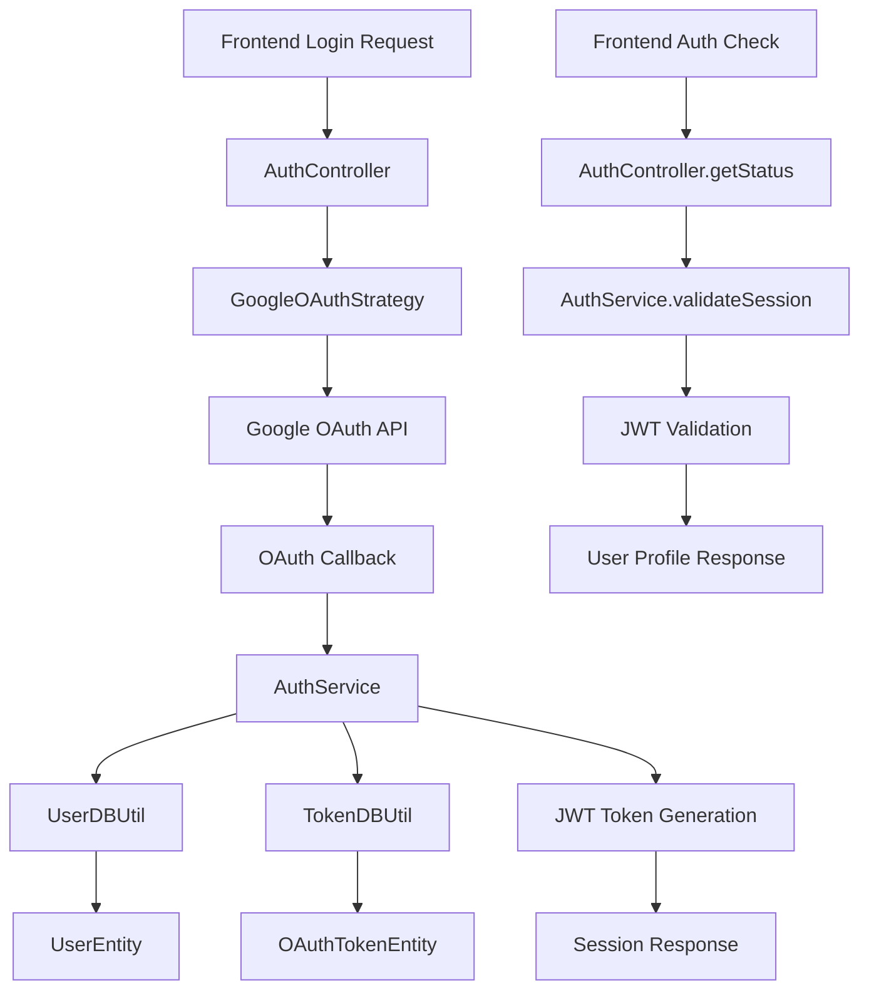

# Design Document

## Overview

The Google OAuth login implementation provides secure authentication infrastructure for the Mavericks Claim Submission System. This feature builds upon existing User and OAuth token entities to create a complete authentication flow that integrates with Google Workspace services while enforcing domain restrictions for @mavericks-consulting.com accounts.

The design leverages NestJS authentication patterns with Passport.js strategies, implements secure token management, and provides RESTful API endpoints for frontend integration. The architecture follows established project patterns for modularity, error handling, and database operations.

## Steering Document Alignment

### Technical Standards (tech.md)

- **TypeScript Strict Mode**: All components use strict typing with no `any` types
- **Object.freeze() Pattern**: Authentication states and error codes follow the established enum pattern
- **Module Architecture**: Clear separation of controllers (HTTP), services (business logic), and utilities (data access)
- **DTO Structure**: Request/response DTOs implement interfaces from `@project/types` package
- **Error Handling**: Consistent error responses across all auth endpoints
- **Database Integration**: Leverages existing TypeORM entities and BaseDBUtil patterns

### Project Structure (structure.md)

- **Auth Module Organization**: Follows established NestJS module pattern with controllers/, services/, dtos/, entities/, and utils/ subdirectories
- **File Naming**: Follows project conventions (kebab-case directories, PascalCase components)
- **Import Paths**: Uses `src/` prefix for backend imports and `@project/types` for shared types
- **Testing Structure**: Unit tests alongside source files, integration tests in dedicated test files

## Code Reuse Analysis

### Existing Components to Leverage

- **UserEntity**: Extends existing entity with Google profile fields (email, name, picture, googleId)
- **OAuthTokenEntity**: Utilizes existing token storage with provider, access/refresh tokens, expiration, and scopes
- **TokenDBUtil**: Leverages existing database utility for OAuth token CRUD operations
- **UserDBUtil**: Uses existing user database operations for user creation and lookup
- **BaseDBUtil**: Inherits established database patterns for consistent data access
- **DTO Pattern**: Follows existing HealthCheckResDTO pattern for consistent API responses

### Integration Points

- **Database Schema**: Integrates with existing PostgreSQL schema through TypeORM entities
- **Type System**: Connects with `@project/types` package for shared interfaces
- **Module System**: Imports existing UserModule for user management operations
- **Environment Configuration**: Uses existing environment variable patterns for Google OAuth credentials
- **Testing Framework**: Integrates with existing Vitest setup and API test patterns

## Architecture

The authentication system follows a layered architecture with clear separation of concerns:

1. **Presentation Layer**: Controllers handle HTTP requests and responses
2. **Business Logic Layer**: Services manage OAuth flows, token validation, and user sessions
3. **Data Access Layer**: Utilities handle database operations using existing BaseDBUtil patterns
4. **External Integration Layer**: Passport strategies manage Google OAuth communication

### Modular Design Principles

- **Single File Responsibility**: Each file handles one authentication concern (OAuth strategy, token service, auth controller)
- **Component Isolation**: Authentication logic isolated from business domain logic (claims, drive, email)
- **Service Layer Separation**: Clear boundaries between HTTP handling, business rules, and data persistence
- **Utility Modularity**: Token operations, user operations, and OAuth operations in separate utility classes



## Components and Interfaces

### GoogleOAuthStrategy (Passport Strategy)
- **Purpose:** Handles Google OAuth 2.0 flow and domain validation
- **Interfaces:** 
  - `validate(accessToken, refreshToken, profile)` - Passport validation callback
  - Domain restriction enforcement for @mavericks-consulting.com
- **Dependencies:** Google OAuth API, UserDBUtil, TokenDBUtil
- **Reuses:** Existing UserEntity and OAuthTokenEntity schemas

### AuthController
- **Purpose:** HTTP endpoints for authentication operations
- **Interfaces:**
  - `POST /auth/google` - Initiate OAuth flow
  - `GET /auth/google/callback` - Handle OAuth callback
  - `GET /auth/status` - Check authentication status
  - `GET /auth/profile` - Get current user profile
  - `POST /auth/logout` - Terminate session
- **Dependencies:** AuthService for business logic
- **Reuses:** Existing DTO patterns from HealthCheckResDTO

### AuthService
- **Purpose:** Business logic for authentication, session management, and token lifecycle
- **Interfaces:**
  - `handleOAuthCallback(profile, tokens)` - Process successful OAuth
  - `validateSession(jwt)` - Validate user session
  - `refreshTokens(userId)` - Automatic token refresh
  - `logout(userId)` - Session termination
- **Dependencies:** UserDBUtil, TokenDBUtil, JWT library
- **Reuses:** Existing database utility patterns and error handling

### AuthGuard (JWT Guard)
- **Purpose:** Protect routes requiring authentication
- **Interfaces:**
  - `canActivate(context)` - Route protection logic
  - JWT token validation and user context injection
- **Dependencies:** AuthService for token validation
- **Reuses:** NestJS guard patterns and existing request context handling

## Data Models

### AuthResponseDTO
```typescript
export class AuthResponseDTO implements IAuthResponse {
  user: IUser | null;
  isAuthenticated: boolean;
  message?: string;
  
  constructor(params: {
    user: UserEntity | null;
    isAuthenticated: boolean;
    message?: string;
  });
}
```

### AuthStatusDTO
```typescript
export class AuthStatusDTO implements IAuthStatusResponse {
  isAuthenticated: boolean;
  user?: IUser;
  
  constructor(params: {
    isAuthenticated: boolean;
    user?: UserEntity;
  });
}
```

### OAuthProfileData (Internal)
```typescript
interface OAuthProfileData {
  email: string;
  name: string;
  picture: string;
  googleId: string;
  accessToken: string;
  refreshToken: string;
  expiresAt: Date;
  scope: string;
}
```

### AuthenticationState (Object.freeze pattern)
```typescript
export const AuthenticationState = Object.freeze({
  AUTHENTICATED: 'authenticated',
  UNAUTHENTICATED: 'unauthenticated',
  TOKEN_EXPIRED: 'token_expired',
  DOMAIN_RESTRICTED: 'domain_restricted',
} as const);
export type AuthenticationState = (typeof AuthenticationState)[keyof typeof AuthenticationState];
```

## Error Handling

### Error Scenarios

1. **Domain Restriction Violation**
   - **Handling:** Validate email domain during OAuth callback, reject non-@mavericks-consulting.com accounts
   - **User Impact:** Clear error message: "Access restricted to Mavericks Consulting employees. Please use your @mavericks-consulting.com email address."

2. **Google OAuth API Failure**
   - **Handling:** Catch OAuth errors, log for debugging, provide generic user-friendly message
   - **User Impact:** "Authentication service temporarily unavailable. Please try again later."

3. **Token Refresh Failure**
   - **Handling:** Attempt refresh once, if failed redirect to re-authentication flow
   - **User Impact:** Seamless re-authentication redirect without data loss

4. **Database Connection Errors**
   - **Handling:** Use existing error handling patterns, return appropriate HTTP status codes
   - **User Impact:** "Service temporarily unavailable" with retry suggestion

5. **Invalid JWT Token**
   - **Handling:** Clear invalid session, redirect to login without error exposure
   - **User Impact:** Silent redirect to login page for security

### Error Response Format
```typescript
export class AuthErrorDTO {
  success: false;
  error: {
    code: string;
    message: string;
    details?: any;
  };
  timestamp: string;
}
```

## Testing Strategy

### Unit Testing

- **AuthService**: Mock UserDBUtil and TokenDBUtil to test business logic isolation
- **GoogleOAuthStrategy**: Mock Google profile responses to test domain validation
- **AuthController**: Mock AuthService to test HTTP handling and response formatting
- **DTO Classes**: Test data transformation and validation logic
- **Error Handling**: Test all error scenarios with appropriate mocking

### Integration Testing

- **OAuth Flow**: End-to-end OAuth simulation with test Google account
- **Database Operations**: Test user creation and token storage with test database
- **API Endpoints**: Test all auth endpoints with various authentication states
- **Token Refresh**: Test automatic token refresh behavior with expired tokens
- **Domain Validation**: Test both valid and invalid domain scenarios

### End-to-End Testing

- **Complete Login Flow**: User initiates login → Google OAuth → successful authentication → dashboard access
- **Session Persistence**: User closes browser → reopens → maintains authentication
- **Logout Flow**: User logs out → session cleared → requires re-authentication
- **Error Recovery**: Network failures during OAuth → appropriate error handling → retry success
- **Domain Restriction**: Non-company email attempts login → proper rejection → clear error message

### Test Data Requirements

- **Valid Test Account**: @mavericks-consulting.com Google account for positive tests
- **Invalid Test Account**: External Gmail account for domain restriction tests
- **Mock Google Responses**: Simulated OAuth profiles for unit testing
- **Database Fixtures**: Existing user data for authentication state testing