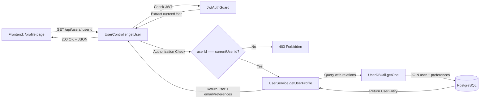

# Design Document

## Overview

This feature adds a GET /api/users/:userId endpoint to retrieve user profile data including username and email preferences. The implementation follows the **"eliminate special cases"** principle - it's a straightforward read operation that reuses existing patterns from the PATCH endpoint without any complexity.

**Core principle**: Complete the CRUD operations (we have Create, Update, Delete - missing Read). No fancy patterns needed. Read data, check authorization, return result. Done.

## Steering Document Alignment

### Technical Standards (tech.md)

**NestJS Module Pattern**
- Follows existing UserController + UserService architecture
- Reuses UserDBUtil for database queries (eliminates N+1 with relation loading)
- Leverages JwtAuthGuard for authentication
- Applies same authorization pattern as PATCH endpoint

**TypeScript Standards**
- Strict mode compliance
- No `any` types
- Response type uses UserEntity directly (entity already has proper typing)
- Path aliases: `src/` prefix for backend imports

**API Design**
- RESTful GET operation on `/api/users/:userId`
- Swagger/OpenAPI annotations for documentation
- Consistent error responses (401, 403, 404, 500)
- Rate limiting applied via existing throttler configuration

### Project Structure (structure.md)

**Backend Module Organization**
```
backend/src/modules/user/
├── controllers/
│   └── user.controller.ts          # Add GET endpoint here
├── services/
│   └── user.service.ts             # Add getUserProfile() method
├── dtos/                           # No new DTOs needed
├── entities/
│   ├── user.entity.ts              # Existing (no changes)
│   └── user-email-preference.entity.ts  # Existing (no changes)
└── utils/
    └── user-db.util.ts             # Existing (no changes)
```

**No new files needed** - add GET endpoint to existing UserController and getUserProfile() method to existing UserService. This is the Linus way: extend existing code, don't create new abstractions.

## Code Reuse Analysis

### Existing Components to Leverage

**100% Code Reuse - Zero New Abstractions**

1. **JwtAuthGuard** (`src/modules/auth/guards/jwt-auth.guard.ts`)
   - Validates JWT token from cookie
   - Extracts user from token
   - Returns 401 if unauthenticated
   - **Guard Pattern**: NOT configured globally - controllers apply guards explicitly
   - **UserController Pattern**: Class-level guard (line 46) because ALL user endpoints require authentication
   - **Usage**: GET endpoint inherits from class-level decorator - NO method decorator needed

2. **UserDBUtil** (`src/modules/user/utils/user-db.util.ts`)
   - BaseDBUtil.getOne() method with relation loading
   - Single query for user + emailPreferences (eliminates N+1 problem)
   - **Usage**: `userDBUtil.getOne({ criteria: { id: userId }, relation: { emailPreferences: true } })`

3. **UserEntity** (`src/modules/user/entities/user.entity.ts`)
   - Already has emailPreferences OneToMany relation
   - TypeORM loads relations automatically
   - **Usage**: Return entity directly as response (no DTO mapping needed)

4. **Authorization Pattern** (from PATCH endpoint in `user.controller.ts:201`)
   ```typescript
   if (currentUser.id !== userId) {
     throw new ForbiddenException('Cannot update other users');
   }
   ```
   - **Usage**: Copy exact same pattern for GET endpoint (change message to "Cannot view other users' profiles")

5. **Swagger Decorators** (from PATCH endpoint)
   - `@ApiTags('Users')`, `@ApiOperation()`, `@ApiResponse()`, etc.
   - **Usage**: Same pattern with GET-specific descriptions

### Integration Points

**No Integration Changes** - Pure read operation using existing infrastructure:

- **Database**: User + user_email_preferences tables (already exist, no schema changes)
- **Authentication**: JWT cookie validation (already exists via JwtAuthGuard)
- **Authorization**: userId comparison (same as PATCH endpoint)
- **API Layer**: NestJS REST controller (extend existing UserController)

## Architecture

**"Good Taste" Design - Eliminate Special Cases**

**Guard Strategy Note**: JwtAuthGuard is NOT configured globally in this application. Controllers apply guards based on their needs:
- **Class-level guard**: When ALL endpoints require authentication (UserController, ClaimsController)
- **Method-level guards**: When endpoints have mixed authentication requirements (AuthController: public OAuth + protected profile)

UserController uses class-level guard because ALL user endpoints (PATCH for updates, GET for retrieval) require authentication. No user operations are public.



**No special cases. No edge cases. Straightforward read operation.**

### Modular Design Principles

**Single File Responsibility** - adhered perfectly:
- `user.controller.ts`: HTTP layer (add GET endpoint)
- `user.service.ts`: Business logic (add getUserProfile method)
- `user-db.util.ts`: Data access (reuse getOne method, no changes)
- `user.entity.ts`: Data model (no changes)

**Component Isolation** - zero coupling added:
- GET endpoint does NOT depend on PATCH endpoint
- Service method is independent (can be called from other modules)
- Database util remains generic (relation parameter handles flexibility)

**Service Layer Separation** - clean boundaries:
- Controller: HTTP concerns (params, guards, responses)
- Service: Business logic (authorization, data retrieval)
- DBUtil: Data access (TypeORM queries)

## Components and Interfaces

### Component 1: UserController.getUser() - HTTP Endpoint

**Purpose**: Handle GET /api/users/:userId request with authentication and authorization

**Interfaces**:
```typescript
@Get(':userId')
async getUser(
  @Param('userId') userId: string,
  @User() currentUser: UserEntity
): Promise<UserEntity>
```

**Dependencies**:
- `JwtAuthGuard`: Authentication (inherited from class-level `@UseGuards` decorator - no method decorator needed)
- `UserService.getUserProfile()`: Data retrieval
- `@User()` decorator: Extract authenticated user from JWT

**Reuses**:
- Authorization pattern from PATCH endpoint (line 201-206)
- Swagger decorators pattern from PATCH endpoint
- Logger pattern from PATCH endpoint

**Implementation Logic**:
1. Log request: `this.logger.log(\`Profile retrieval request for userId: \${userId}\`)`
2. Authorization check: `if (currentUser.id !== userId) throw new ForbiddenException('Cannot view other users\\' profiles')`
3. Delegate to service: `const user = await this.userService.getUserProfile(userId)`
4. Log success: `this.logger.log(\`Profile retrieved successfully for userId: \${userId}\`)`
5. Return user entity

### Component 2: UserService.getUserProfile() - Business Logic

**Purpose**: Retrieve user profile with email preferences, enforcing business rules

**Interfaces**:
```typescript
async getUserProfile(userId: string): Promise<UserEntity>
```

**Dependencies**:
- `UserDBUtil.getOne()`: Database query with relations
- `NotFoundException`: Error handling for missing user

**Reuses**:
- UserDBUtil.getOne() method (same as updateUser method at line 56)
- Error handling pattern from updateUser (line 62-64)

**Implementation Logic**:
1. Log action: `this.logger.log(\`Retrieving user profile for userId: \${userId}\`)`
2. Query database: `const user = await this.userDBUtil.getOne({ criteria: { id: userId }, relation: { emailPreferences: true } })`
3. Validate exists: `if (!user) throw new NotFoundException(\`User with ID \${userId} not found\`)`
4. Log success: `this.logger.log(\`Successfully retrieved user profile for userId: \${userId}\`)`
5. Return user with relations

**No business logic complexity** - just query and return. No validation needed (read-only operation).

## Data Models

### UserEntity (Existing - No Changes)

```typescript
{
  id: string (UUID)
  email: string
  name: string
  picture: string | null
  googleId: string
  emailPreferences?: UserEmailPreferenceEntity[]
  createdAt: Date
  updatedAt: Date
  deletedAt?: Date | null
}
```

**Relation Loading**: TypeORM loads `emailPreferences` when specified in `relation` parameter:
```typescript
{ emailPreferences: true }
```

### UserEmailPreferenceEntity (Existing - No Changes)

```typescript
{
  id: string (UUID)
  userId: string
  type: 'cc' | 'bcc'
  emailAddress: string
  createdAt: Date
  updatedAt: Date
  deletedAt?: Date | null
}
```

**Response Format** (UserEntity returned directly):
```json
{
  "id": "123e4567-e89b-12d3-a456-426614174000",
  "email": "user@mavericks-consulting.com",
  "name": "John Doe",
  "picture": "https://...",
  "googleId": "1234567890",
  "emailPreferences": [
    {
      "id": "uuid",
      "userId": "uuid",
      "type": "cc",
      "emailAddress": "manager@example.com",
      "createdAt": "2025-01-01T00:00:00Z",
      "updatedAt": "2025-01-01T00:00:00Z"
    }
  ],
  "createdAt": "2025-01-01T00:00:00Z",
  "updatedAt": "2025-01-01T00:00:00Z"
}
```

**No DTO mapping needed** - UserEntity structure matches frontend requirements exactly. This is "good taste" - the data structure naturally fits the use case without transformation.

## Error Handling

### Error Scenarios

1. **Unauthenticated Request**
   - **Trigger**: Missing or invalid JWT token
   - **Handling**: JwtAuthGuard throws UnauthorizedException (handled by NestJS)
   - **Response**: HTTP 401 with `{ statusCode: 401, message: 'Unauthorized' }`
   - **User Impact**: Frontend redirects to login page

2. **Unauthorized Access (Different User)**
   - **Trigger**: `currentUser.id !== userId`
   - **Handling**: `throw new ForbiddenException('Cannot view other users\\' profiles')`
   - **Response**: HTTP 403 with error message
   - **User Impact**: Error message displayed ("You can only view your own profile")

3. **User Not Found**
   - **Trigger**: `userDBUtil.getOne()` returns null
   - **Handling**: `throw new NotFoundException(\`User with ID \${userId} not found\`)`
   - **Response**: HTTP 404 with error message
   - **User Impact**: Error message displayed ("Profile not found")

4. **Database Query Failure**
   - **Trigger**: PostgreSQL connection error, query timeout
   - **Handling**: NestJS exception filter catches database errors
   - **Response**: HTTP 500 with `{ statusCode: 500, message: 'Internal server error' }`
   - **User Impact**: Generic error message, user prompted to retry

**No special error cases** - all handled by existing NestJS exception filters. This is pragmatic: reuse the framework, don't reinvent error handling.

## Testing Strategy

### Unit Testing

**UserController Tests** (`user.controller.test.ts` - extend existing file):
- GET endpoint returns user profile for authenticated user
- GET endpoint throws 403 when accessing other user's profile
- GET endpoint throws 404 when user not found
- Authorization check works correctly (userId comparison)
- Logger called with correct messages

**UserService Tests** (`user.service.test.ts` - extend existing file):
- `getUserProfile()` returns user with emailPreferences relation loaded
- `getUserProfile()` throws NotFoundException when user not found
- Database query includes emailPreferences relation
- Logger called with correct messages

**Mock Strategy**:
- Mock UserDBUtil.getOne() to return test user entity
- Mock Logger to verify log calls
- No database needed (unit tests use mocks)

### Integration Testing

**API Tests** (`api-test/src/tests/user.test.ts` - create new file):

**Test Cases**:
1. **GET /api/users/:userId - Success**
   - Setup: Create test user with email preferences via internal endpoint
   - Action: GET request with valid JWT token for same user
   - Assert: 200 status, user profile returned with email preferences array

2. **GET /api/users/:userId - Forbidden (Different User)**
   - Setup: Create two test users (User A, User B)
   - Action: User A attempts to GET User B's profile
   - Assert: 403 status, error message "Cannot view other users' profiles"

3. **GET /api/users/:userId - Not Found**
   - Setup: Generate random UUID (no user exists)
   - Action: GET request with valid JWT token
   - Assert: 404 status, error message "User with ID ... not found"

4. **GET /api/users/:userId - Unauthorized (No JWT)**
   - Setup: None
   - Action: GET request without authentication cookie
   - Assert: 401 status, "Unauthorized" message

**Integration Pattern**:
- Use existing internal test data endpoints (POST /internal/test-data)
- Real HTTP requests via backend server
- Real database queries (test database)
- Real JWT token generation
- Cleanup via DELETE /internal/test-data after tests

### End-to-End Testing

**User Scenario**: Employee views profile page

**Steps**:
1. User logs in via Google OAuth
2. User navigates to /profile page
3. Frontend calls GET /api/users/:userId
4. Backend returns user profile + email preferences
5. Frontend displays username and email preferences in form

**E2E Test** (manual verification for now):
- Navigate to /profile after login
- Verify username displayed correctly
- Verify existing email preferences shown (if any)
- Verify empty state when no email preferences
- Verify error handling (try accessing /profile/invalid-uuid in URL)

**Future Automation**: Playwright tests for frontend + backend integration (not in this spec scope)

---

## Design Summary

**Linus's Principles Applied**:

✅ **Good Taste**: No special cases - straightforward read operation, guard inherited from class level (not duplicated on method)
✅ **Simplicity**: Reuse existing patterns, no new abstractions
✅ **Pragmatism**: Solve real problem (missing Read in CRUD)
✅ **Zero Breakage**: New endpoint, no modifications to existing code

**Code Impact**:
- **Modified files**: 2 (user.controller.ts, user.service.ts)
- **New files**: 1 (api-test/src/tests/user.test.ts)
- **Lines added**: ~150 (controller endpoint + service method + tests)
- **Dependencies added**: 0 (reuse everything)

**This is how you design software: identify the pattern, reuse it, ship it. No bullshit.**
