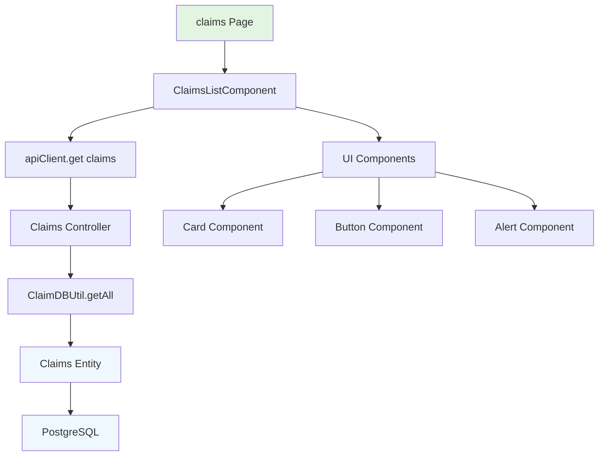

# Design Document

## Overview

The "View Claims" feature leverages the existing claims infrastructure to display a user's expense claims in a simple, clean listing interface. The backend API already exists (GET `/claims`) - this feature focuses on creating a proper frontend claims list component to replace the current demo form at `/claims`.

## Steering Document Alignment

### Technical Standards (tech.md)
- **Data Structure Analysis**: Claims entity already has proper indexing on `userId`, `status`, and `createdAt` - perfect for listing queries
- **TypeScript Standards**: Uses existing `IClaimMetadata[]` from `@project/types` - no new types needed
- **API Patterns**: Reuses established pattern with `apiClient.get<IClaimListResponse>('/claims')`
- **Authentication**: Leverages existing JWT auth guards and `@User()` decorator

### Project Structure (structure.md)
- **Frontend Structure**: Follows Next.js App Router at `/claims` page
- **Component Organization**: New `ClaimsListComponent.tsx` in `/components/claims/`
- **API Integration**: Uses existing `/lib/api-client.ts` pattern
- **Shared Types**: Reuses `IClaimListResponse` and `IClaimMetadata` from `packages/types`

## Code Reuse Analysis

### Existing Components to Leverage
- **API Client**: `/lib/api-client.ts` - already configured with axios, auth cookies, error handling
- **Auth Provider**: `/components/providers/auth-provider.tsx` - handles authentication state
- **UI Components**: `/components/ui/` - Button, Card, Alert for consistent styling
- **Claims Entity**: Database entity with proper TypeScript types and validation

### Integration Points
- **Claims Controller**: `GET /claims` endpoint already implemented with proper error handling, filtering, and authentication
- **Database**: Claims table indexed on `userId` for efficient user-specific queries
- **Authentication**: JWT auth guard ensures only authenticated users access their claims
- **Types**: `IClaimListResponse` already defined with success/error states

## Architecture

**Simplicity First**: This is a pure read operation with zero complexity. Display user's claims ordered by creation date (newest first). No pagination, filtering UI, or advanced features initially.

**Data Flow**:
1. `/claims` page renders
2. `ClaimsListComponent` calls `GET /claims` via `apiClient`
3. Display claims in cards with status, amount, category, date
4. Show empty state if no claims exist
5. Handle API errors gracefully

### Modular Design Principles
- **Single File Responsibility**: `ClaimsListComponent.tsx` only handles claims display logic
- **Component Isolation**: Reuse existing `Card`, `Button`, `Alert` UI components
- **Service Layer Separation**: API calls via existing `apiClient`, no custom hooks needed
- **Utility Modularity**: Date formatting via existing `utils.ts`



## Components and Interfaces

### ClaimsListComponent
- **Purpose**: Display authenticated user's claims in a responsive list
- **Interfaces**:
  - Props: None (gets user context from auth provider)
  - State: `claims: IClaimMetadata[]`, `loading: boolean`, `error: string | null`
- **Dependencies**: `apiClient`, `@project/types`, UI components
- **Reuses**: Existing API client, auth context, UI components, utility functions

### Updated /claims Page
- **Purpose**: Route handler that renders ClaimsListComponent
- **Interfaces**: Next.js page component (no props)
- **Dependencies**: `ClaimsListComponent`
- **Reuses**: Existing page layout patterns, auth provider context

## Data Models

### IClaimMetadata (Existing)
```typescript
{
  id: string;
  userId: string;
  category: ClaimCategory;
  claimName: string | null;
  month: number;
  year: number;
  totalAmount: number;
  status: ClaimStatus; // draft, sent, paid, failed
  submissionDate: string | null;
  attachments?: IAttachmentMetadata[];
  createdAt: string;
  updatedAt: string;
}
```

### IClaimListResponse (Existing)
```typescript
{
  success: boolean;
  claims?: IClaimMetadata[];
  total?: number;
  error?: string;
}
```

## Error Handling

### Error Scenarios
1. **Network Failure**: Internet connectivity issues
   - **Handling**: Show user-friendly "Unable to load claims" message with retry button
   - **User Impact**: Clear indication of network issue, ability to retry

2. **Authentication Failure**: JWT token expired or invalid
   - **Handling**: Redirect to login page (handled by existing auth provider)
   - **User Impact**: Seamless redirect to re-authenticate

3. **API Server Error**: Database connection issues, server problems
   - **Handling**: Display generic error message, log details for debugging
   - **User Impact**: "Something went wrong, please try again" with retry option

4. **Empty Claims**: User has no claims yet
   - **Handling**: Show encouraging empty state with "Create your first claim" CTA
   - **User Impact**: Clear guidance on next steps

## Testing Strategy

### Unit Testing
- **ClaimsListComponent**: Mock API responses, test loading states, error states, empty states
- **API Integration**: Mock `apiClient.get` calls, verify correct endpoint usage
- **UI Rendering**: Test claim card rendering, status styling, date formatting

### Integration Testing
- **Auth Integration**: Test authenticated API calls with valid JWT tokens
- **Error Handling**: Test network failures, server errors, auth failures
- **Full User Flow**: Load page → authenticate → fetch claims → display results

### End-to-End Testing
- **Claims Listing**: Login → navigate to /claims → verify claims display correctly
- **Empty State**: New user with no claims sees proper empty state
- **Mobile Responsiveness**: Test claims list on mobile viewports (>70% expected usage)

## Mobile-First Implementation Details

### Responsive Design
- **Cards Layout**: Single column on mobile, grid on desktop
- **Touch Targets**: 44px minimum for interactive elements
- **Typography**: Readable font sizes (16px+) with proper contrast
- **Dark Mode**: Exclusively dark theme as per product requirements

### Performance Considerations
- **API Response**: Claims endpoint returns all user claims (expected <100 initially)
- **Loading State**: Immediate skeleton loading while fetching
- **Error Retry**: Exponential backoff on failed requests
- **Memory Usage**: Clean component unmounting, no memory leaks

### Status Visual Hierarchy
- **Draft**: Gray/neutral styling indicating work in progress
- **Sent**: Blue/info styling showing submission complete
- **Paid**: Green/success styling celebrating completion
- **Failed**: Red/error styling requiring user attention

## Implementation Files

### Frontend Changes
1. **Replace**: `frontend/src/app/claims/page.tsx` - Remove demo form, add ClaimsListComponent
2. **Create**: `frontend/src/components/claims/ClaimsListComponent.tsx` - Main claims listing logic
3. **Create**: `frontend/src/components/claims/__tests__/ClaimsListComponent.test.tsx` - Component tests

### Backend (No Changes Required)
- Claims controller GET endpoint already implemented
- Authentication already enforced via JWT guards
- Database queries already optimized with proper indexing

### Types (No Changes Required)
- `IClaimListResponse` and `IClaimMetadata` already defined
- Status and category enums already implemented with Object.freeze pattern

## Security Considerations

### Authentication
- JWT auth guard already enforces user authentication
- Claims filtered by `userId` server-side (never client-side)
- No sensitive data exposure in error messages

### Authorization
- Users can only see their own claims (enforced at database level)
- No admin/elevated permissions required for this feature
- API endpoint already implements proper user context filtering

**This design follows the principle of maximum reuse with minimal new code - we're essentially just connecting existing, well-tested backend infrastructure to a simple frontend display component.**