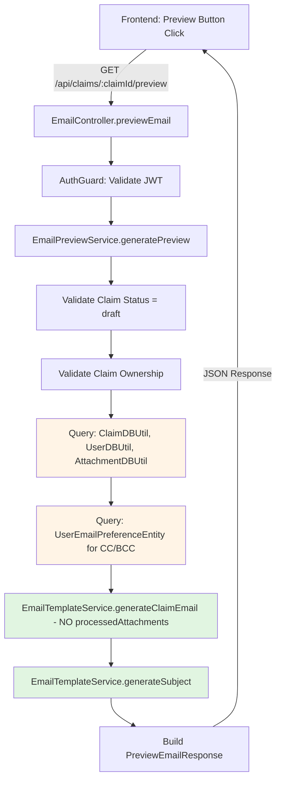

# Design Document: Email Preview Feature

## Overview

The **Email Preview Feature** adds a lightweight, metadata-only preview capability to the existing email module. It reuses the complete email rendering pipeline (EmailTemplateService) while bypassing external API calls (Gmail, Drive) to provide instant preview feedback. The design prioritizes code reuse, zero template drift, and seamless integration into the existing 3-phase claim workflow.

**Core Principle**: Preview uses identical rendering logic as actual email sending to guarantee 100% accuracy.

**Integration Point**: Extends existing `backend/src/modules/email/` module with new preview endpoint and lightweight service layer.

## Steering Document Alignment

### Technical Standards (tech.md)

**TypeScript Strict Mode**:
- All preview code uses strict TypeScript with zero `any` types
- Shared DTOs via `@project/types` package for backend-frontend consistency
- Path aliases: `src/` for backend imports

**Object.freeze Pattern**:
- No new enums required (reuse existing ClaimStatus, ClaimCategory)
- If future expansion needs preview-specific constants, use Object.freeze pattern

**NestJS Module Pattern**:
```
email/
├── controllers/
│   └── email.controller.ts      # Add preview endpoint here
├── services/
│   ├── email.service.ts          # Existing email send logic
│   ├── email-template.service.ts # Existing template rendering (REUSE)
│   └── email-preview.service.ts  # NEW: Preview orchestration
├── dtos/
│   └── index.ts                  # Export preview DTOs
└── email.module.ts               # Register preview service
```

**Database Layer**:
- Reuse existing `ClaimDBUtil`, `AttachmentDBUtil`, `UserDBUtil`
- Query `UserEmailPreferenceEntity` repository directly (pattern from EmailService:91-101)

### Project Structure (structure.md)

**Backend Module Organization**:
- Preview functionality lives in `backend/src/modules/email/` (existing module)
- No new module creation needed - extends email module responsibilities
- Follows standard controller → service → database utility pattern

**Shared Types Package**:
```
packages/types/src/
├── dtos/
│   └── email/
│       ├── preview-email-request.dto.ts   # NEW
│       └── preview-email-response.dto.ts  # NEW
└── index.ts                               # Export new DTOs
```

**Testing Structure**:
```
backend/src/modules/email/
├── services/
│   ├── email-preview.service.ts
│   └── __tests__/
│       └── email-preview.service.spec.ts  # NEW: Unit tests
└── controllers/
    └── __tests__/
        └── email.controller.spec.ts       # EXTEND: Add preview tests
```

## Code Reuse Analysis

### Existing Components to Leverage

**1. EmailTemplateService** (backend/src/modules/email/services/email-template.service.ts):
- **Method**: `generateClaimEmail(claim, user, attachments, processedAttachments?)` (line 36)
- **Usage**: Call with `processedAttachments` as `undefined` to generate preview without Drive API calls
- **Method**: `generateSubject(claim)` (line 81)
- **Usage**: Generate subject line identically to actual send
- **Benefit**: Zero template drift - preview uses exact same rendering logic

**2. EmailService Validation** (backend/src/modules/email/services/email.service.ts):
- **Method**: `validateClaimForSending(userId, claimId)` (line 226)
- **Usage**: Reuse complete validation logic (ownership, status, claim existence)
- **Modification Needed**: Extract to shared method or duplicate validation for preview-specific rules
- **Benefit**: Consistent validation across preview and send

**3. Database Utilities**:
- **ClaimDBUtil.getOne()**: Fetch claim with user relation
- **AttachmentDBUtil.findByClaimId()**: Fetch attachment metadata
- **UserDBUtil.getOne()**: Fetch user details
- **UserEmailPreferenceEntity Repository**: Query CC/BCC preferences (pattern from EmailService:91-101)

**4. Environment Configuration**:
- **EnvironmentVariableUtil.getVariables()**: Access `emailRecipients` configuration
- **Usage**: Include primary recipients in preview response

### Integration Points

**Existing Email Module**:
- **Integration**: Add preview endpoint to `EmailController`
- **Pattern**: Follow existing email send endpoint structure
- **Dependency**: Inject `EmailPreviewService` into controller

**Database Schema**:
- **No Schema Changes**: Preview uses existing tables (claims, users, attachments, user_email_preferences)
- **Query Pattern**: Read-only operations, no writes
- **Transaction**: No transaction needed (read-only)

**Frontend Integration** (future):
- **API Client**: Add `getEmailPreview(claimId)` to `frontend/src/lib/api/`
- **React Hook**: `useEmailPreview(claimId)` for state management
- **UI Component**: Modal/panel to display preview content

## Architecture

### High-Level Design



**Key Design Decision**: Pass `processedAttachments: undefined` to `EmailTemplateService.generateClaimEmail()` to trigger legacy mode rendering that only uses `AttachmentEntity[]` metadata without Drive API calls.

### Modular Design Principles

**Single File Responsibility**:
- **email-preview.service.ts**: Preview orchestration only (validation, querying, response building)
- **email-template.service.ts**: Template rendering only (existing, no modifications)
- **email.controller.ts**: HTTP request/response handling (add one preview endpoint)

**Component Isolation**:
- Preview service has zero dependencies on GmailClient or AttachmentProcessorService
- Preview service depends only on: DBUtils, EmailTemplateService, EnvironmentUtil
- No circular dependencies

**Service Layer Separation**:
- **Controller Layer**: HTTP validation, authentication/authorization
- **Service Layer**: Business logic (validation, orchestration)
- **Data Access Layer**: DBUtils for database queries
- **Template Layer**: EmailTemplateService for HTML generation

**Utility Modularity**:
- Reuse existing utilities without modification
- No new utility files needed

### Data Flow

**Request Flow**:
1. User clicks "Preview Email" → Frontend sends `GET /api/claims/:claimId/preview`
2. NestJS pipes extract `:claimId` from URL params
3. AuthGuard validates JWT, extracts `userId`
4. Controller calls `EmailPreviewService.generatePreview(userId, claimId)`
5. Service validates claim status (must be draft)
6. Service validates claim ownership (userId must match claim.userId)
7. Service queries database for claim, user, attachments, email preferences
8. Service calls `EmailTemplateService.generateClaimEmail()` and `generateSubject()`
9. Service builds `PreviewEmailResponse` with all data
10. Controller returns JSON response

**Error Flow**:
- Invalid JWT → 401 Unauthorized
- Claim not found → 404 Not Found
- Wrong user → 403 Forbidden
- Claim not draft → 400 Bad Request with clear message
- Database error → 500 Internal Server Error

## Components and Interfaces

### Component 1: EmailPreviewService

**Purpose**: Orchestrate preview generation by validating claim, querying data, and delegating rendering to EmailTemplateService

**File**: `backend/src/modules/email/services/email-preview.service.ts`

**Public Interface**:
```typescript
@Injectable()
export class EmailPreviewService {
  constructor(
    private readonly claimDBUtil: ClaimDBUtil,
    private readonly attachmentDBUtil: AttachmentDBUtil,
    private readonly userDBUtil: UserDBUtil,
    private readonly emailTemplateService: EmailTemplateService,
    private readonly environmentUtil: EnvironmentVariableUtil,
    @InjectRepository(UserEmailPreferenceEntity)
    private readonly emailPreferenceRepository: Repository<UserEmailPreferenceEntity>,
  ) {}

  /**
   * Generate email preview for a draft claim
   * @param userId - Authenticated user ID (from JWT)
   * @param claimId - Claim UUID to preview
   * @returns PreviewEmailResponse with subject, HTML, recipients, CC, BCC
   * @throws NotFoundException if claim not found
   * @throws ForbiddenException if user doesn't own claim
   * @throws BadRequestException if claim status is not draft
   */
  async generatePreview(
    userId: string,
    claimId: string,
  ): Promise<PreviewEmailResponse>;
}
```

**Dependencies**:
- ClaimDBUtil (query claims)
- AttachmentDBUtil (query attachments)
- UserDBUtil (query user)
- EmailTemplateService (render email)
- EnvironmentVariableUtil (get email recipients)
- UserEmailPreferenceEntity Repository (query CC/BCC)

**Reuses**:
- Validation pattern from EmailService.validateClaimForSending()
- Query pattern for email preferences from EmailService (lines 91-101)
- Template rendering from EmailTemplateService

**Logic Flow**:
1. Query claim with `claimDBUtil.getOne({ criteria: { id: claimId }, relation: { user: true } })`
2. Validate claim exists → throw NotFoundException if not
3. Validate ownership: `claim.userId === userId` → throw ForbiddenException if not
4. Validate status: `claim.status === ClaimStatus.DRAFT` → throw BadRequestException if not
5. Query user: `userDBUtil.getOne({ criteria: { id: userId } })`
6. Query attachments: `attachmentDBUtil.findByClaimId({ claimId })`
7. Query email preferences: `emailPreferenceRepository.find({ where: { userId } })`
8. Separate CC/BCC: Filter preferences by type
9. Generate HTML: `emailTemplateService.generateClaimEmail(claim, user, attachments)` (NO processedAttachments)
10. Generate subject: `emailTemplateService.generateSubject(claim)`
11. Get recipients: `environmentUtil.getVariables().emailRecipients`
12. Return `PreviewEmailResponse`

### Component 2: EmailController (Extended)

**Purpose**: Handle HTTP preview endpoint with authentication and authorization

**File**: `backend/src/modules/email/controllers/email.controller.ts`

**New Endpoint**:
```typescript
@Controller('claims')
export class EmailController {
  constructor(private readonly emailPreviewService: EmailPreviewService) {}

  /**
   * Preview email content for a draft claim
   * GET /api/claims/:claimId/preview
   */
  @Get(':claimId/preview')
  @UseGuards(JwtAuthGuard)
  async previewEmail(
    @CurrentUser() user: JwtPayload,
    @Param('claimId', new ParseUUIDPipe()) claimId: string,
  ): Promise<PreviewEmailResponse> {
    return this.emailPreviewService.generatePreview(user.userId, claimId);
  }
}
```

**Reuses**:
- Existing `JwtAuthGuard` for authentication
- Existing `@CurrentUser()` decorator for user extraction
- NestJS `ParseUUIDPipe` for claimId validation

**Error Handling**:
- NestJS exception filters automatically convert service exceptions to HTTP responses
- NotFoundException → 404
- ForbiddenException → 403
- BadRequestException → 400
- InternalServerErrorException → 500

### Component 3: EmailTemplateService (No Changes)

**Purpose**: Render email HTML and subject line (existing component)

**File**: `backend/src/modules/email/services/email-template.service.ts`

**Usage for Preview**:
```typescript
// Call WITHOUT processedAttachments parameter to use legacy mode
const htmlBody = this.emailTemplateService.generateClaimEmail(
  claim,
  user,
  attachments,
  // processedAttachments: undefined - triggers legacy rendering
);

const subject = this.emailTemplateService.generateSubject(claim);
```

**Why No Changes Needed**:
- Method already supports optional `processedAttachments` parameter
- When undefined, uses legacy `generateAttachmentsContent()` method
- Legacy method only uses `AttachmentEntity[]` metadata (no Drive API calls)
- Guarantees preview matches send operation exactly

## Data Models

### PreviewEmailRequest (Query Params)

**File**: `packages/types/src/dtos/email/preview-email-request.dto.ts`

```typescript
/**
 * Request structure for email preview
 * Passed via URL params: GET /api/claims/:claimId/preview
 */
export interface IPreviewEmailRequest {
  claimId: string; // UUID from URL param
}
```

**Validation**:
- `claimId` validated by NestJS `ParseUUIDPipe`
- No request body needed (GET endpoint)

### PreviewEmailResponse

**File**: `packages/types/src/dtos/email/preview-email-response.dto.ts`

```typescript
/**
 * Response structure for email preview
 * Contains complete email context for frontend rendering
 */
export interface IPreviewEmailResponse {
  /**
   * Email subject line
   * Format: "{userName} - Claim for {category} ({MM}/{YYYY}) (${amount})"
   * Example: "John Doe - Claim for Fitness & Wellness (12/2024) ($150.00)"
   */
  subject: string;

  /**
   * HTML email body
   * Rendered using EmailTemplateService with all claim data
   * Includes attachment sections but Drive links are not clickable
   */
  htmlBody: string;

  /**
   * Primary recipient email addresses
   * From environment configuration (CLAIM_SUBMISSION_RECIPIENT_EMAIL)
   * Example: ["finance@mavericks-consulting.com"]
   */
  recipients: string[];

  /**
   * CC (Carbon Copy) email addresses
   * From user_email_preferences table where type = 'cc'
   * Empty array if no CC preferences configured
   */
  cc: string[];

  /**
   * BCC (Blind Carbon Copy) email addresses
   * From user_email_preferences table where type = 'bcc'
   * Empty array if no BCC preferences configured
   */
  bcc: string[];
}
```

**Example Response**:
```json
{
  "subject": "John Doe - Claim for Fitness & Wellness (12/2024) ($150.00)",
  "htmlBody": "<html>...</html>",
  "recipients": ["finance@mavericks-consulting.com"],
  "cc": ["manager@mavericks-consulting.com"],
  "bcc": []
}
```

### No Database Schema Changes

**Existing Tables Used**:
- `claims` - Claim data (category, amount, month, year, etc.)
- `users` - User information (name, email)
- `attachments` - File metadata (filename, size, driveUrl)
- `user_email_preferences` - CC/BCC preferences

**Query Pattern**:
- All queries are read-only
- No transactions needed
- Maximum 4 database queries per preview request

## Error Handling

### Error Scenarios

**1. Claim Not Found**
- **Trigger**: `claimId` doesn't exist in database
- **Handling**: `ClaimDBUtil.getOne()` returns null → throw `NotFoundException('Claim not found')`
- **HTTP Response**: 404 Not Found
- **User Impact**: Frontend displays "Claim not found. It may have been deleted."

**2. Unauthorized Access**
- **Trigger**: User tries to preview another user's claim
- **Handling**: Check `claim.userId !== userId` → throw `ForbiddenException('Access denied: You do not own this claim')`
- **HTTP Response**: 403 Forbidden
- **User Impact**: Frontend displays "You don't have permission to preview this claim."

**3. Invalid Claim Status**
- **Trigger**: Claim status is sent/paid/failed (not draft)
- **Handling**: Check `claim.status !== ClaimStatus.DRAFT` → throw `BadRequestException('Preview only available for draft claims')`
- **HTTP Response**: 400 Bad Request
- **User Impact**: Frontend displays "Preview is only available for draft claims. You can view sent emails in your Gmail inbox."

**4. Invalid Claim ID Format**
- **Trigger**: `claimId` is not a valid UUID
- **Handling**: NestJS `ParseUUIDPipe` automatically validates → throws `BadRequestException`
- **HTTP Response**: 400 Bad Request
- **User Impact**: Frontend displays "Invalid claim ID format."

**5. User Not Found**
- **Trigger**: Authenticated userId doesn't exist in database (rare, auth issue)
- **Handling**: `UserDBUtil.getOne()` returns null → throw `InternalServerErrorException('User data not found')`
- **HTTP Response**: 500 Internal Server Error
- **User Impact**: Frontend displays "An error occurred. Please try logging in again."

**6. Database Connection Error**
- **Trigger**: PostgreSQL connection failure
- **Handling**: Database utilities throw error → catch in service → throw `InternalServerErrorException('Database error')`
- **HTTP Response**: 500 Internal Server Error
- **User Impact**: Frontend displays "Service temporarily unavailable. Please try again."

**7. Template Rendering Error**
- **Trigger**: EmailTemplateService encounters malformed data
- **Handling**: Catch error → throw `InternalServerErrorException('Failed to generate preview')`
- **HTTP Response**: 500 Internal Server Error
- **User Impact**: Frontend displays "Failed to generate preview. Please contact support."

### Error Response Format

**Standard NestJS Exception Response**:
```json
{
  "statusCode": 404,
  "message": "Claim not found",
  "error": "Not Found"
}
```

**Frontend Error Handling**:
- Display user-friendly error messages
- Log technical errors for debugging
- Provide actionable next steps (e.g., "Go back to claims list")

## Testing Strategy

### Unit Testing

**EmailPreviewService Tests** (`email-preview.service.spec.ts`):

**Test Suite 1: Successful Preview Generation**
- ✓ Should generate preview for valid draft claim
- ✓ Should include subject line matching actual email format
- ✓ Should include HTML body with claim data
- ✓ Should include primary recipients from environment
- ✓ Should include CC emails from user preferences
- ✓ Should include BCC emails from user preferences
- ✓ Should handle empty CC/BCC arrays when no preferences exist

**Test Suite 2: Validation Errors**
- ✓ Should throw NotFoundException when claim doesn't exist
- ✓ Should throw ForbiddenException when user doesn't own claim
- ✓ Should throw BadRequestException when claim status is SENT
- ✓ Should throw BadRequestException when claim status is PAID
- ✓ Should throw BadRequestException when claim status is FAILED

**Test Suite 3: Data Queries**
- ✓ Should query ClaimDBUtil with correct claim ID
- ✓ Should query UserDBUtil with authenticated user ID
- ✓ Should query AttachmentDBUtil with claim ID
- ✓ Should query UserEmailPreferenceEntity repository with user ID

**Test Suite 4: Template Rendering**
- ✓ Should call EmailTemplateService.generateClaimEmail with correct params
- ✓ Should pass undefined as processedAttachments parameter
- ✓ Should call EmailTemplateService.generateSubject with claim

**Mocking Strategy**:
- Mock all DBUtils with Vitest mock functions
- Mock EmailTemplateService with spy functions
- Mock UserEmailPreferenceEntity repository with test data
- Mock EnvironmentVariableUtil with test configuration

### Integration Testing

**API Endpoint Tests** (`api-test/src/tests/email-preview.test.ts`):

**Test Suite 1: Happy Path**
- ✓ GET /api/claims/:claimId/preview returns 200 with valid preview
- ✓ Response includes all required fields (subject, htmlBody, recipients, cc, bcc)
- ✓ Subject matches format: "{userName} - Claim for {category} ({MM}/{YYYY}) (${amount})"
- ✓ HTML body contains claim data (category, amount, attachments)

**Test Suite 2: Authentication**
- ✓ Returns 401 when JWT token missing
- ✓ Returns 401 when JWT token expired
- ✓ Returns 401 when JWT token invalid

**Test Suite 3: Authorization**
- ✓ Returns 403 when user tries to preview another user's claim
- ✓ Returns 200 when user previews their own claim

**Test Suite 4: Validation**
- ✓ Returns 400 when claimId is not UUID format
- ✓ Returns 404 when claim doesn't exist
- ✓ Returns 400 when claim status is not draft

**Test Suite 5: Email Preferences**
- ✓ Preview includes CC emails when user has CC preferences
- ✓ Preview includes BCC emails when user has BCC preferences
- ✓ Preview returns empty arrays when no preferences exist

**Test Suite 6: Attachment Handling**
- ✓ Preview shows "📎 Attached Files" section for attachments smaller than 5MB
- ✓ Preview shows "☁️ Files on Google Drive" section for attachments 5MB or larger
- ✓ Preview shows both sections when claim has mixed attachment sizes
- ✓ Preview shows "No attachments" message when claim has no attachments

**Test Data Setup**:
- Use test-data endpoints to create draft claims
- Create test attachments with varying sizes
- Create test email preferences (CC/BCC)
- Clean up test data after each test

### End-to-End Testing

**User Scenario 1: Basic Preview**
```gherkin
Given an employee is logged in
And has created a draft claim with basic details
When they click "Preview Email" button
Then they see a modal displaying the email preview
And the subject line matches the claim details
And the email body shows all claim information
And the recipients list shows finance email
```

**User Scenario 2: Preview with Attachments**
```gherkin
Given an employee has a draft claim
And has uploaded 2 attachments (receipt.pdf 1.2MB, contract.pdf 8.5MB)
When they preview the email
Then they see "📎 Attached Files" section with receipt.pdf (1.2 MB)
And they see "☁️ Files on Google Drive" section with contract.pdf (8.5 MB)
```

**User Scenario 3: Preview with Email Preferences**
```gherkin
Given an employee has configured CC: manager@mavericks-consulting.com
And has configured BCC: accounting@mavericks-consulting.com
When they preview their draft claim email
Then they see CC: manager@mavericks-consulting.com in the preview
And they see BCC: accounting@mavericks-consulting.com in the preview
```

**User Scenario 4: Error Handling**
```gherkin
Given an employee is viewing sent claim details
When they try to preview the sent claim
Then they see an error message "Preview is only available for draft claims"
And they are advised to check their Gmail inbox for the sent email
```

**E2E Test Tools**:
- Playwright for browser automation
- Test against local development environment
- Verify frontend displays preview correctly
- Verify error messages are user-friendly

### Performance Testing

**Response Time Validation**:
- ✓ Preview generation completes in under 500ms for typical claims (5 attachments)
- ✓ No external API calls (no Drive API, no Gmail API)
- ✓ Database queries execute in under 100ms total

**Load Testing**:
- ✓ Endpoint handles 100 concurrent preview requests without degradation
- ✓ Database connection pool manages preview queries efficiently

**Benchmark Test**:
```typescript
describe('Performance: Preview Generation', () => {
  it('should complete preview in <500ms', async () => {
    const start = Date.now();
    const preview = await emailPreviewService.generatePreview(userId, claimId);
    const duration = Date.now() - start;
    expect(duration).toBeLessThan(500);
  });
});
```

## Security Considerations

**Authentication**:
- JWT validation via `JwtAuthGuard`
- Token extracted from HttpOnly cookie
- User ID extracted from validated token payload

**Authorization**:
- Claim ownership verification: `claim.userId === authenticatedUserId`
- No cross-user preview access allowed
- Database query includes userId filter for defense in depth

**XSS Protection**:
- EmailTemplateService already escapes all user input via `escapeHtml()` method
- HTML output is safe for rendering in frontend
- No additional escaping needed

**SQL Injection Protection**:
- TypeORM parameterized queries prevent SQL injection
- No raw SQL queries used
- UUID validation via ParseUUIDPipe prevents injection

**Rate Limiting**:
- Apply standard API rate limiting (100 requests/minute per user)
- No special rate limit needed for preview (fast, metadata-only)

**Data Exposure**:
- Preview only returns data user already owns
- Email preferences only returned for authenticated user
- No sensitive data leaked

## Performance Optimizations

**Database Query Optimization**:
- Use selective field loading (only needed fields)
- Combine queries where possible
- Add database indexes if preview queries slow down (monitor in production)

**Template Rendering Optimization**:
- EmailTemplateService uses simple string manipulation (fast)
- No external API calls during rendering
- Template file read once and cached by Node.js

**Response Caching**:
- No caching implemented for MVP (generate fresh preview each time)
- Future optimization: Cache preview for 60 seconds if user clicks repeatedly
- Invalidate cache when claim data changes

**Memory Management**:
- No file content loaded into memory (metadata only)
- HTML string output is small (typically under 10KB)
- Database connections returned to pool immediately

## Migration and Rollout Plan

**Phase 1: Backend Implementation**
1. Create `EmailPreviewService` with unit tests
2. Extend `EmailController` with preview endpoint
3. Create DTOs in `@project/types`
4. Add integration tests

**Phase 2: Testing and Validation**
1. Run full test suite (unit + integration)
2. Manual testing with Postman/curl
3. Verify preview matches actual sent emails 100%

**Phase 3: Frontend Integration** (future)
1. Create API client function `getEmailPreview(claimId)`
2. Create React hook `useEmailPreview(claimId)`
3. Create preview modal component
4. Add "Preview Email" button to claim form

**Phase 4: Deployment**
1. Deploy backend with preview endpoint
2. Monitor performance metrics (response time, error rate)
3. Deploy frontend preview UI
4. Collect user feedback

**Rollback Plan**:
- Preview is read-only and non-critical
- Can disable endpoint via feature flag if issues arise
- No database migrations needed, so rollback is simple

## Future Enhancements

**Email Content Editing** (Not in MVP):
- Allow users to customize email subject/body before sending
- Store custom content in database
- Preview reflects customizations

**Preview History** (Not in MVP):
- Store generated previews for audit trail
- Allow users to see what preview looked like before claim was sent

**Real-time Preview** (Not in MVP):
- WebSocket connection for live preview updates
- Preview regenerates as user types in claim form

**PDF Preview** (Not in MVP):
- Generate PDF version of email for printing/saving
- Use HTML-to-PDF library

**Template Versioning** (Not in MVP):
- Store email template version with each claim
- Preview uses correct template version for historical claims

## Dependencies

**Backend Dependencies** (Existing):
- `@nestjs/common` - Controllers, decorators, exceptions
- `@nestjs/typeorm` - Repository injection
- `typeorm` - Database queries
- Existing DBUtils (ClaimDBUtil, AttachmentDBUtil, UserDBUtil)
- Existing services (EmailTemplateService, EnvironmentVariableUtil)

**Shared Dependencies** (Existing):
- `@project/types` - Shared TypeScript types

**Testing Dependencies** (Existing):
- `vitest` - Unit testing framework
- Custom API test suite - Integration testing

**No New Dependencies Required**

## Acceptance Criteria for Design Completion

✓ Design document follows template structure
✓ All requirements from requirements.md are addressed
✓ Code reuse strategy clearly documented
✓ Component responsibilities clearly defined
✓ Data models defined with TypeScript interfaces
✓ Error handling covers all failure scenarios
✓ Testing strategy includes unit, integration, E2E tests
✓ Security considerations documented
✓ Performance targets defined (under 500ms response time)
✓ Alignment with steering documents verified
