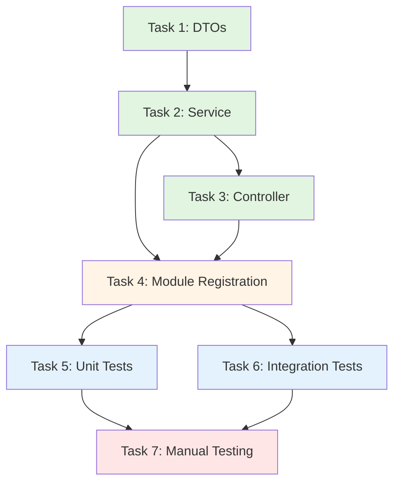

# Tasks Document: Email Preview Feature

## Implementation Tasks

- [ ] 1. Create preview email DTOs in @project/types package
  - Files:
    - `packages/types/src/dtos/email/preview-email-response.dto.ts` (NEW)
    - `packages/types/src/dtos/email/index.ts` (MODIFY - add export)
    - `packages/types/src/index.ts` (MODIFY - add export)
  - Define IPreviewEmailResponse interface with subject, htmlBody, recipients, cc, bcc fields
  - Export from email DTOs barrel file and main package index
  - Purpose: Establish type-safe contract for preview API response
  - _Leverage: Existing DTO patterns in packages/types/src/dtos/email/, Object.freeze pattern from tech.md_
  - _Requirements: Requirement 6 (API Endpoint Design), Non-Functional Requirements (TypeScript Standards)_
  - _Prompt: Implement the task for spec preview-email-content, first run spec-workflow-guide to get the workflow guide then implement the task: Role: TypeScript Developer specializing in type systems and shared packages | Task: Create IPreviewEmailResponse interface in packages/types/src/dtos/email/preview-email-response.dto.ts following Requirement 6 acceptance criteria (subject, htmlBody, recipients, cc, bcc fields), export from barrel files, and follow existing DTO patterns from packages/types/src/dtos/email/ | Restrictions: Do not use TypeScript enum, must use Object.freeze pattern if needed, maintain strict TypeScript mode with zero any types, follow existing export patterns | _Leverage: packages/types/src/dtos/email/ for existing DTO patterns, tech.md for Object.freeze pattern guidelines | _Requirements: Requirement 6 (API response structure), Non-Functional Requirements (TypeScript strict mode, @project/types shared types) | Success: Interface defines all required fields with correct types (subject: string, htmlBody: string, recipients: string[], cc: string[], bcc: string[]), properly exported from email/index.ts and main index.ts, compiles without errors, follows project naming conventions. After completing the task, mark task 1 as in-progress [-] in tasks.md before starting, then log implementation details using log-implementation tool with artifacts (interfaces created, exports added), and finally mark as complete [x] in tasks.md_

- [ ] 2. Create EmailPreviewService for preview orchestration
  - Files:
    - `backend/src/modules/email/services/email-preview.service.ts` (NEW)
  - Implement preview orchestration service with generatePreview method
  - Add validation logic (claim status, ownership, existence)
  - Query database for claim, user, attachments, email preferences
  - Call EmailTemplateService to generate HTML and subject
  - Build and return PreviewEmailResponse
  - Purpose: Provide business logic layer for email preview generation
  - _Leverage: EmailTemplateService.generateClaimEmail(), EmailTemplateService.generateSubject(), ClaimDBUtil, AttachmentDBUtil, UserDBUtil, UserEmailPreferenceEntity repository pattern from EmailService:91-101, validation pattern from EmailService.validateClaimForSending()_
  - _Requirements: Requirement 1 (Preview Email Content), Requirement 2 (Attachment Display), Requirement 3 (Email Preferences), Requirement 4 (Access Control), Requirement 5 (Claim Status Restrictions), Requirement 7 (Performance)_
  - _Prompt: Implement the task for spec preview-email-content, first run spec-workflow-guide to get the workflow guide then implement the task: Role: Backend Developer with expertise in NestJS service layer and business logic | Task: Create EmailPreviewService in backend/src/modules/email/services/email-preview.service.ts implementing generatePreview(userId, claimId) method following Requirements 1-5 and 7, reusing EmailTemplateService.generateClaimEmail() (without processedAttachments parameter to avoid Drive API calls), EmailTemplateService.generateSubject(), and database utilities (ClaimDBUtil, AttachmentDBUtil, UserDBUtil, UserEmailPreferenceEntity repository) | Restrictions: Must NOT call AttachmentProcessorService (no Drive API calls), must NOT call GmailClient (no Gmail API calls), must validate claim status === DRAFT only, must validate claim ownership (userId matches), must query email preferences using pattern from EmailService:91-101, must inject UserEmailPreferenceEntity repository using @InjectRepository decorator, must throw appropriate NestJS exceptions (NotFoundException, ForbiddenException, BadRequestException), must complete in under 500ms | _Leverage: backend/src/modules/email/services/email-template.service.ts for generateClaimEmail() and generateSubject() methods, backend/src/modules/email/services/email.service.ts lines 91-101 for email preferences query pattern and lines 226-299 for validation pattern, backend/src/modules/claims/utils/claim-db.util.ts, backend/src/modules/claims/utils/attachment-db.util.ts, backend/src/modules/user/utils/user-db.util.ts, backend/src/modules/user/entities/user-email-preference.entity.ts, backend/src/modules/common/utils/environment-variable.util.ts | _Requirements: Requirement 1 (preview generation with validation), Requirement 2 (attachment display without Drive API), Requirement 3 (CC/BCC preferences), Requirement 4 (ownership validation), Requirement 5 (draft status only), Requirement 7 (under 500ms, no external APIs) | Success: Service implements generatePreview method with correct signature, validates claim exists and returns NotFoundException if not, validates ownership and throws ForbiddenException if wrong user, validates status === DRAFT and throws BadRequestException otherwise, queries claim/user/attachments/preferences using DBUtils, calls EmailTemplateService.generateClaimEmail with claim/user/attachments (NO processedAttachments), calls EmailTemplateService.generateSubject, queries email recipients from EnvironmentVariableUtil, separates CC/BCC from preferences, returns PreviewEmailResponse with all fields, uses @Injectable decorator, injects all dependencies via constructor, follows NestJS patterns, compiles without TypeScript errors. After completing the task, mark task 2 as in-progress [-] in tasks.md before starting, then log implementation details using log-implementation tool with artifacts (classes created with methods, integrations with EmailTemplateService and DBUtils), and finally mark as complete [x] in tasks.md_

- [ ] 3. Add preview endpoint to EmailController
  - Files:
    - `backend/src/modules/email/controllers/email.controller.ts` (MODIFY - add endpoint)
  - Add GET /api/claims/:claimId/preview endpoint
  - Apply JwtAuthGuard for authentication
  - Extract userId from JWT token using @CurrentUser decorator
  - Validate claimId format using ParseUUIDPipe
  - Call EmailPreviewService.generatePreview
  - Return PreviewEmailResponse JSON
  - Purpose: Expose preview functionality via RESTful HTTP endpoint
  - _Leverage: Existing EmailController structure, JwtAuthGuard, @CurrentUser decorator, NestJS pipes (ParseUUIDPipe), EmailPreviewService_
  - _Requirements: Requirement 6 (API Endpoint Design)_
  - _Prompt: Implement the task for spec preview-email-content, first run spec-workflow-guide to get the workflow guide then implement the task: Role: Backend Developer with expertise in NestJS controllers and REST API design | Task: Add preview endpoint to EmailController in backend/src/modules/email/controllers/email.controller.ts following Requirement 6 (GET /api/claims/:claimId/preview), applying JwtAuthGuard, extracting userId from JWT using @CurrentUser decorator, validating claimId with ParseUUIDPipe, calling EmailPreviewService.generatePreview, and returning PreviewEmailResponse | Restrictions: Must use existing controller patterns, must apply @UseGuards(JwtAuthGuard) decorator, must use @CurrentUser() decorator to extract userId from JWT payload, must use ParseUUIDPipe for claimId validation, must return PreviewEmailResponse type, endpoint path must be exactly :claimId/preview under claims controller, must inject EmailPreviewService via constructor | _Leverage: Existing EmailController patterns in backend/src/modules/email/controllers/email.controller.ts, JwtAuthGuard from auth module, @CurrentUser decorator from auth module, NestJS ParseUUIDPipe, EmailPreviewService from previous task | _Requirements: Requirement 6 (endpoint pattern GET /api/claims/:claimId/preview, JSON response structure, validation, error responses) | Success: Endpoint added with @Get(':claimId/preview') decorator, JwtAuthGuard applied with @UseGuards, userId extracted using @CurrentUser() decorator with correct type (JwtPayload), claimId validated with ParseUUIDPipe in @Param decorator, EmailPreviewService injected in constructor, generatePreview called with userId and claimId, returns PreviewEmailResponse type, compiles without TypeScript errors, follows existing controller patterns. After completing the task, mark task 3 as in-progress [-] in tasks.md before starting, then log implementation details using log-implementation tool with artifacts (API endpoint created with method, path, request/response formats, location), and finally mark as complete [x] in tasks.md_

- [ ] 4. Register EmailPreviewService in EmailModule
  - Files:
    - `backend/src/modules/email/email.module.ts` (MODIFY - add provider)
  - Add EmailPreviewService to module providers array
  - Ensure UserEmailPreferenceEntity is registered in TypeORM imports
  - Purpose: Enable dependency injection for EmailPreviewService
  - _Leverage: Existing EmailModule configuration, NestJS module patterns, TypeORM entity registration_
  - _Requirements: Non-Functional Requirements (Modular Design, Dependency Management)_
  - _Prompt: Implement the task for spec preview-email-content, first run spec-workflow-guide to get the workflow guide then implement the task: Role: Backend Developer with expertise in NestJS module configuration and dependency injection | Task: Register EmailPreviewService in EmailModule providers array in backend/src/modules/email/email.module.ts, ensure UserEmailPreferenceEntity is imported in TypeORM.forFeature if not already present | Restrictions: Must follow existing module patterns, must not create circular dependencies, must ensure all EmailPreviewService dependencies are available in module scope, must register UserEmailPreferenceEntity in TypeORM.forFeature imports array | _Leverage: Existing EmailModule structure in backend/src/modules/email/email.module.ts, NestJS @Module decorator patterns, TypeORM.forFeature for entity registration | _Requirements: Non-Functional Requirements (modular design, clear interfaces, dependency management) | Success: EmailPreviewService added to providers array, UserEmailPreferenceEntity registered in TypeORM.forFeature imports (check if already present, add if missing), module compiles without errors, EmailPreviewService is injectable in EmailController and tests, no circular dependencies created. After completing the task, mark task 4 as in-progress [-] in tasks.md before starting, then log implementation details using log-implementation tool with artifacts (module configuration changes), and finally mark as complete [x] in tasks.md_

- [ ] 5. Create unit tests for EmailPreviewService
  - Files:
    - `backend/src/modules/email/services/__tests__/email-preview.service.spec.ts` (NEW)
  - Write comprehensive unit tests for EmailPreviewService
  - Mock all dependencies (DBUtils, EmailTemplateService, repository)
  - Test successful preview generation
  - Test validation errors (not found, forbidden, bad request)
  - Test database query calls
  - Test template rendering calls
  - Purpose: Ensure EmailPreviewService reliability and catch regressions
  - _Leverage: Existing test patterns from email-template.service.spec.ts and email.service.spec.ts, Vitest framework, NestJS testing utilities_
  - _Requirements: All Requirements 1-7, Testing Strategy (Unit Testing from design.md)_
  - _Prompt: Implement the task for spec preview-email-content, first run spec-workflow-guide to get the workflow guide then implement the task: Role: QA Engineer with expertise in unit testing, Vitest, and NestJS testing patterns | Task: Create comprehensive unit tests for EmailPreviewService in backend/src/modules/email/services/__tests__/email-preview.service.spec.ts covering all test suites from design.md Testing Strategy (successful preview, validation errors, data queries, template rendering), mocking all dependencies (ClaimDBUtil, AttachmentDBUtil, UserDBUtil, EmailTemplateService, EnvironmentVariableUtil, UserEmailPreferenceEntity repository) using Vitest mock functions | Restrictions: Must mock all external dependencies, must test business logic in isolation, must cover all error scenarios (NotFoundException, ForbiddenException, BadRequestException for each validation rule), must verify all DBUtil method calls with correct parameters, must verify EmailTemplateService calls with exact arguments (especially processedAttachments === undefined), must test CC/BCC separation logic, must follow existing test patterns from email.service.spec.ts | _Leverage: backend/src/modules/email/services/__tests__/email-template.service.spec.ts and email.service.spec.ts for test patterns, Vitest vi.fn() for mocking, NestJS Test.createTestingModule for dependency injection in tests | _Requirements: All Requirements 1-7 (each requirement maps to specific test cases), Testing Strategy Unit Testing section from design.md | Success: Test file created with describe blocks for each test suite (successful preview, validation errors, data queries, template rendering), all 20+ test cases implemented (7 success scenarios, 5 validation errors, 4 query verifications, 3 template rendering checks), all tests pass, mocks properly configured with vi.fn(), test coverage includes all code paths, follows existing test patterns and naming conventions, uses beforeEach for test setup. After completing the task, mark task 5 as in-progress [-] in tasks.md before starting, then log implementation details using log-implementation tool with artifacts (test files created with test suites and case counts), and finally mark as complete [x] in tasks.md_

- [ ] 6. Create integration tests for preview API endpoint
  - Files:
    - `api-test/src/tests/email-preview.test.ts` (NEW)
  - Write integration tests for GET /api/claims/:claimId/preview endpoint
  - Test authentication (401 errors)
  - Test authorization (403 errors)
  - Test validation (400, 404 errors)
  - Test successful preview response
  - Test email preferences integration
  - Test attachment display scenarios
  - Purpose: Validate complete preview workflow end-to-end
  - _Leverage: Existing API test patterns, test-data endpoints for claim creation, Vitest framework_
  - _Requirements: All Requirements 1-7, Testing Strategy (Integration Testing from design.md)_
  - _Prompt: Implement the task for spec preview-email-content, first run spec-workflow-guide to get the workflow guide then implement the task: Role: QA Engineer with expertise in API integration testing and end-to-end testing patterns | Task: Create comprehensive integration tests for preview endpoint in api-test/src/tests/email-preview.test.ts covering all test suites from design.md Testing Strategy (happy path, authentication, authorization, validation, email preferences, attachment handling), using test-data endpoints to create draft claims and test users | Restrictions: Must use actual HTTP requests to preview endpoint, must test real authentication/authorization flows, must create test claims using POST /internal/test-data endpoint, must test all HTTP status codes (200, 400, 401, 403, 404), must verify response structure matches IPreviewEmailResponse, must test attachment size categorization (under 5MB vs 5MB or larger), must clean up test data after each test using DELETE /internal/test-data, must follow existing API test patterns | _Leverage: Existing API test patterns from api-test/src/tests/, test-data endpoints (POST /internal/test-data for setup, DELETE /internal/test-data for cleanup), TEST_USER_DATA constant from @project/types, Vitest framework with beforeEach/afterEach hooks | _Requirements: All Requirements 1-7 (each requirement maps to specific integration test scenarios), Testing Strategy Integration Testing section from design.md | Success: Test file created with 6 test suites (happy path, authentication, authorization, validation, email preferences, attachments), all 15+ test cases implemented covering each scenario from design.md, tests use real HTTP requests, test data properly created and cleaned up, response validation checks all fields, status code assertions correct, attachment categorization verified, email preferences tested, all tests pass against running backend, follows existing API test patterns. After completing the task, mark task 6 as in-progress [-] in tasks.md before starting, then log implementation details using log-implementation tool with artifacts (test files created with test suites and HTTP endpoint coverage), and finally mark as complete [x] in tasks.md_

- [ ] 7. Manual testing and validation
  - Manual testing tasks:
    - Start backend and frontend services
    - Create a draft claim via UI or API
    - Upload attachments with varying sizes (under 5MB, 5MB or larger)
    - Configure email preferences (CC, BCC)
    - Call preview endpoint using curl or Postman
    - Verify response matches actual sent email format
    - Test error scenarios (wrong user, sent claim, invalid UUID)
    - Verify response time is under 500ms
  - Purpose: Validate preview works correctly in real environment and matches requirements
  - _Leverage: Existing backend and frontend services, curl/Postman for API testing, developer tools for response time measurement_
  - _Requirements: All Requirements 1-7, Success Criteria from requirements.md_
  - _Prompt: Implement the task for spec preview-email-content, first run spec-workflow-guide to get the workflow guide then implement the task: Role: QA Engineer with expertise in manual testing and API validation | Task: Perform comprehensive manual testing of preview endpoint following all Requirements 1-7 and Success Criteria from requirements.md, creating draft claims with various attachment sizes, configuring email preferences, testing preview endpoint with curl/Postman, verifying response structure and content accuracy, testing error scenarios, measuring response times | Restrictions: Must test against locally running backend (pnpm run dev from root), must create real draft claims with database persistence, must upload actual files to Google Drive with varying sizes, must verify preview HTML matches EmailTemplateService output exactly, must test all error status codes (400, 401, 403, 404), must measure and verify response time under 500ms, must document any discrepancies between preview and actual email format | _Leverage: Backend service (pnpm run dev), curl or Postman for HTTP requests, browser developer tools for response time measurement, existing claims module for creating draft claims, Google Drive for uploading test files | _Requirements: All Requirements 1-7, Success Criteria from requirements.md (especially acceptance test scenario with Gym Membership example) | Success: Successfully tested preview for draft claim with mixed attachment sizes, verified two-section attachment display (Attached Files, Files on Google Drive), verified email preferences (CC, BCC) appear in response, tested all error scenarios and received correct status codes, verified response time under 500ms, confirmed preview HTML matches actual email template exactly (compared with sent email), documented test results with screenshots/curl output, all requirements validated manually, no discrepancies found between preview and send operation. After completing the task, mark task 7 as in-progress [-] in tasks.md before starting, then log implementation details using log-implementation tool (document manual test results, scenarios covered, any issues found and resolved), and finally mark as complete [x] in tasks.md_

## Task Dependencies

**Execution Order**:
1. Task 1 (DTOs) - Foundation types
2. Task 2 (Service) - Core business logic
3. Task 3 (Controller) - HTTP endpoint
4. Task 4 (Module) - DI registration
5. Tasks 5-6 (Tests) - Can run in parallel
6. Task 7 (Manual) - Final validation

## Implementation Notes

**Code Reuse Checklist**:
- ✓ EmailTemplateService.generateClaimEmail() - Call without processedAttachments
- ✓ EmailTemplateService.generateSubject() - Reuse exactly
- ✓ EmailService validation pattern - Adapt for preview-specific rules
- ✓ ClaimDBUtil, AttachmentDBUtil, UserDBUtil - Query methods
- ✓ UserEmailPreferenceEntity repository - Query pattern from EmailService:91-101
- ✓ EnvironmentVariableUtil - Get email recipients

**Critical Implementation Rules**:
- ❌ Do NOT call AttachmentProcessorService.processAttachments()
- ❌ Do NOT call GmailClient.sendEmail()
- ❌ Do NOT download files from Google Drive
- ❌ Do NOT modify EmailTemplateService
- ✅ DO reuse existing validation logic
- ✅ DO query only metadata from database
- ✅ DO ensure preview matches send operation exactly

**Performance Targets**:
- Preview generation: under 500ms
- Database queries: 4 queries max
- No external API calls (Drive, Gmail)

**Testing Coverage Goals**:
- Unit tests: 100% EmailPreviewService code coverage
- Integration tests: All HTTP status codes tested
- Manual tests: All requirements validated

## Post-Implementation Checklist

After completing all tasks, verify:
- All 7 tasks marked as [x] completed
- All tests passing (unit + integration)
- Manual testing validated all requirements
- Code follows project conventions (TypeScript strict, Object.freeze pattern)
- No breaking changes to existing code
- Preview matches actual email 100%
- Response time under 500ms
- Implementation logged with detailed artifacts using log-implementation tool
