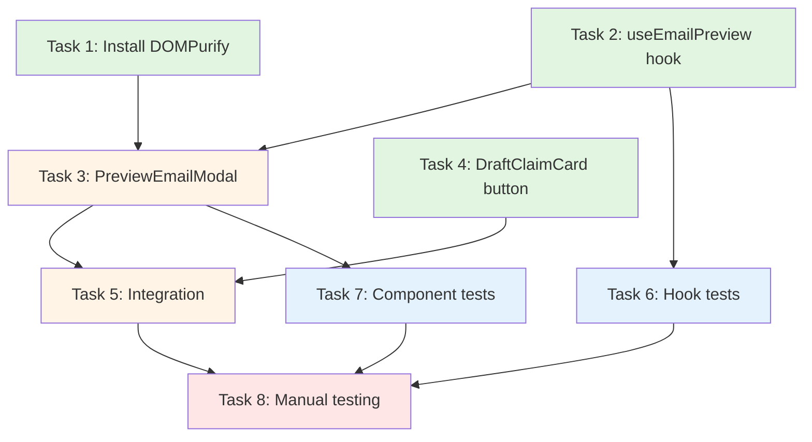

# Tasks Document: Email Preview Frontend UI

## Implementation Tasks

- [x] 1. Install DOMPurify dependency
  - Files:
    - `frontend/package.json` (MODIFY)
  - Run `pnpm add dompurify` and `pnpm add -D @types/dompurify` in frontend workspace
  - Purpose: Add HTML sanitization library for secure rendering
  - _Leverage: Existing pnpm workspace setup_
  - _Requirements: Requirement 4 (HTML sanitization)_
  - _Prompt: Implement the task for spec preview-email-frontend, first run spec-workflow-guide to get the workflow guide then implement the task. Role: Frontend Developer. Task: Install DOMPurify and @types/dompurify in frontend workspace using pnpm. Restrictions: Must install in frontend workspace only, not root. Success: pnpm list dompurify shows package installed, TypeScript can import DOMPurify. After completion, mark task 1 in-progress before starting, log implementation, then mark complete._

- [x] 2. Create useEmailPreview hook
  - Files:
    - `frontend/src/hooks/email/useEmailPreview.ts` (NEW)
  - Implement React Query hook to fetch preview from GET /claims/:id/preview
  - Use useQuery with enabled: claimId !== null
  - Configure staleTime: 0 and gcTime: 0 (no caching)
  - Return standard React Query result (data, isLoading, isError, error, refetch)
  - Purpose: Encapsulate preview API fetching logic
  - _Leverage: frontend/src/hooks/email/useEmailSending.ts, frontend/src/lib/api-client.ts, @project/types IPreviewEmailResponse_
  - _Requirements: Requirement 5 (Loading State), Requirement 6 (Error Handling)_
  - _Prompt: Implement the task for spec preview-email-frontend, first run spec-workflow-guide to get the workflow guide then implement the task. Role: Frontend Developer with React Query expertise. Task: Create useEmailPreview hook using useQuery from @tanstack/react-query, calling apiClient.get. Restrictions: Use existing apiClient not raw axios, disable caching, disable auto-retry, only fetch when claimId not null, import IPreviewEmailResponse from @project/types. Success: Hook compiles, returns data/isLoading/isError/error/refetch, does not fetch when claimId is null. After completion, mark task 2 in-progress before starting, log implementation with artifacts, then mark complete._

- [x] 3. Create PreviewEmailModal component
  - Files:
    - `frontend/src/components/email/PreviewEmailModal.tsx` (NEW)
  - Implement modal using existing Dialog components
  - Props: claimId: string or null, onClose: () => void
  - States: Loading (Skeleton), Error (with retry), Success (preview content)
  - Collapsible recipient header (collapsed by default) with useState
  - HTML sanitization with DOMPurify before rendering with dangerouslySetInnerHTML
  - Mobile responsive: full-screen on mobile via CSS classes
  - Purpose: Display email preview in accessible modal
  - _Leverage: frontend/src/components/ui/dialog.tsx, frontend/src/components/ui/button.tsx, frontend/src/components/ui/skeleton.tsx, useEmailPreview hook_
  - _Requirements: Requirement 2 (Modal), Requirement 3 (Recipients), Requirement 4 (HTML), Requirement 5 (Loading), Requirement 6 (Error), Requirement 7 (Mobile), Requirement 8 (Accessibility)_
  - _Prompt: Implement the task for spec preview-email-frontend, first run spec-workflow-guide to get the workflow guide then implement the task. Role: Frontend Developer with React and accessibility expertise. Task: Create PreviewEmailModal using Dialog components, implementing loading/error/success states. Restrictions: Use existing Dialog/Button/Skeleton from ui folder, sanitize HTML with DOMPurify, make recipients collapsible, apply max-w-4xl class, handle mobile full-screen, include role=alert on errors, use client directive. Success: Component renders all states, recipients toggle, HTML sanitized, modal closes correctly, accessible with ARIA. After completion, mark task 3 in-progress before starting, log implementation with artifacts, then mark complete._

- [x] 4. Add Preview button to DraftClaimCard
  - Files:
    - `frontend/src/components/claims/draft-claim-card.tsx` (MODIFY)
  - Add onPreview: (claim: IClaimMetadata) => void to DraftClaimCardProps
  - Add Preview button after Expand/Collapse button, before Edit button
  - Use Eye icon from lucide-react
  - Follow existing button pattern: variant=ghost size=sm with mobile-responsive classes
  - Purpose: Provide preview trigger in draft claim card
  - _Leverage: Existing Edit/Delete button pattern in same file, Eye icon from lucide-react_
  - _Requirements: Requirement 1 (Preview Button in Draft Claim Card)_
  - _Prompt: Implement the task for spec preview-email-frontend, first run spec-workflow-guide to get the workflow guide then implement the task. Role: Frontend Developer. Task: Modify DraftClaimCard to add onPreview callback prop and Preview button following existing Edit/Delete pattern. Restrictions: Add onPreview to props interface, use Eye icon, follow same Button styling, place between Expand and Edit, include aria-label, disable when isDeleting. Success: Preview button appears correctly, calls onPreview when clicked, follows responsive pattern. After completion, mark task 4 in-progress before starting, log implementation with artifacts, then mark complete._

- [x] 5. Integrate PreviewEmailModal in parent component
  - Files:
    - Find and modify parent component that renders DraftClaimCard
  - Add state: const [previewClaimId, setPreviewClaimId] = useState<string or null>(null)
  - Pass onPreview callback to DraftClaimCard
  - Render PreviewEmailModal with claimId and onClose props
  - Purpose: Wire up preview button to modal
  - _Leverage: Existing modal integration patterns in codebase_
  - _Requirements: Requirement 1 (Button triggers modal), Requirement 2 (Modal opens/closes)_
  - _Prompt: Implement the task for spec preview-email-frontend, first run spec-workflow-guide to get the workflow guide then implement the task. Role: Frontend Developer. Task: Find parent component rendering DraftClaimCard and integrate PreviewEmailModal with state management. Restrictions: Search codebase first, use useState for previewClaimId, pass onPreview callback, render PreviewEmailModal with correct props. Success: Clicking Preview opens modal, closing resets state, no console errors. After completion, mark task 5 in-progress before starting, log implementation with artifacts, then mark complete._

- [-] 6. Write unit tests for useEmailPreview hook
  - Files:
    - `frontend/src/hooks/email/__tests__/useEmailPreview.test.ts` (NEW)
  - Test cases: loading state, successful fetch, error handling, null claimId, correct endpoint
  - Mock apiClient using vi.mock
  - Purpose: Ensure hook reliability
  - _Leverage: frontend/src/hooks/email/__tests__/useEmailSending.test.ts, Vitest_
  - _Requirements: Testing Strategy from design.md_
  - _Prompt: Implement the task for spec preview-email-frontend, first run spec-workflow-guide to get the workflow guide then implement the task. Role: QA Engineer with React Testing expertise. Task: Create unit tests for useEmailPreview hook covering all states. Restrictions: Mock apiClient with vi.mock, use renderHook from testing-library, wrap in QueryClientProvider, verify endpoint called. Success: All 5 test cases pass, mocks configured correctly. After completion, mark task 6 in-progress before starting, log implementation with artifacts, then mark complete._

- [ ] 7. Write unit tests for PreviewEmailModal component
  - Files:
    - `frontend/src/components/email/__tests__/PreviewEmailModal.test.tsx` (NEW)
  - Test cases: loading skeleton, error message, preview content, close button, recipient toggle, null claimId
  - Mock useEmailPreview hook
  - Purpose: Ensure component reliability
  - _Leverage: Existing component test patterns, @testing-library/react, Vitest_
  - _Requirements: Testing Strategy from design.md_
  - _Prompt: Implement the task for spec preview-email-frontend, first run spec-workflow-guide to get the workflow guide then implement the task. Role: QA Engineer with React Testing expertise. Task: Create unit tests for PreviewEmailModal covering all states and interactions. Restrictions: Mock useEmailPreview with vi.mock, use testing-library for rendering and events, test all UI states. Success: All test cases pass, behavior verified for all states. After completion, mark task 7 in-progress before starting, log implementation with artifacts, then mark complete._

- [ ] 8. Manual testing and validation
  - Manual testing tasks:
    - Start frontend and backend services
    - Create/ensure draft claim exists with attachments
    - Click Preview button on draft claim card
    - Verify modal opens with loading spinner
    - Verify preview shows subject, recipients (collapsed), and email body
    - Click recipient header to expand/collapse
    - Verify HTML renders correctly (attachment sections visible)
    - Test error scenarios (network off, invalid claim)
    - Test mobile view (resize browser or use dev tools)
    - Verify close behavior (X button, Escape key, click outside)
  - Purpose: Validate end-to-end user experience
  - _Leverage: Running backend and frontend services_
  - _Requirements: All Requirements 1-8, Success Criteria from requirements.md_
  - _Prompt: Implement the task for spec preview-email-frontend, first run spec-workflow-guide to get the workflow guide then implement the task. Role: QA Engineer. Task: Perform comprehensive manual testing covering all requirements. Restrictions: Test against locally running services, verify all UI states, test mobile responsiveness, test accessibility. Success: All features work correctly, no console errors. After completion, mark task 8 in-progress before starting, log test results, then mark complete._

## Task Dependencies

**Execution Order**:
1. Task 1 (DOMPurify) + Task 2 (Hook) + Task 4 (Button) - Can run in parallel
2. Task 3 (Modal) - Depends on Task 1 and Task 2
3. Task 5 (Integration) - Depends on Task 3 and Task 4
4. Task 6 (Hook tests) + Task 7 (Component tests) - Can run in parallel after their dependencies
5. Task 8 (Manual) - Final validation after all implementation and tests

## Implementation Notes

**Linus-Style Simplicity Checklist**:
- 8 tasks total - minimal, atomic, each does one thing
- No unnecessary abstraction tasks (no separate "create interfaces" or "design patterns")
- Each task touches 1-2 files maximum
- Clear dependencies - no circular or complex chains
- Parallel execution possible for independent tasks

**Critical Implementation Rules**:
- Task 1-4 can start immediately (no dependencies between them except 3 needs 1+2)
- Use existing patterns - copy from similar files
- No new abstractions - inline everything small
- Tests are separate tasks but important - don't skip

**What We're NOT Doing**:
- Creating separate interface files (inline in component)
- Creating utility wrapper files (inline DOMPurify call)
- Writing integration tests (manual testing covers E2E)
- Creating Storybook stories (not in scope)

## Post-Implementation Checklist

After completing all tasks, verify:
1. All 8 tasks marked as completed
2. pnpm run build succeeds in frontend workspace
3. pnpm run lint passes in frontend workspace
4. All unit tests pass (pnpm run test in frontend)
5. Manual testing validates all requirements
6. No TypeScript errors
7. No console errors in browser
8. Implementation logged with detailed artifacts using log-implementation tool
