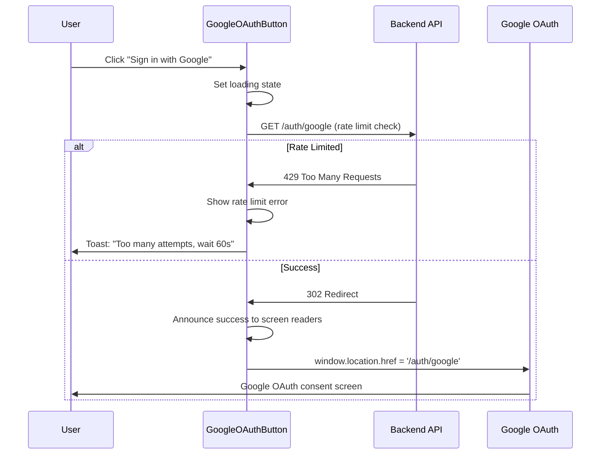
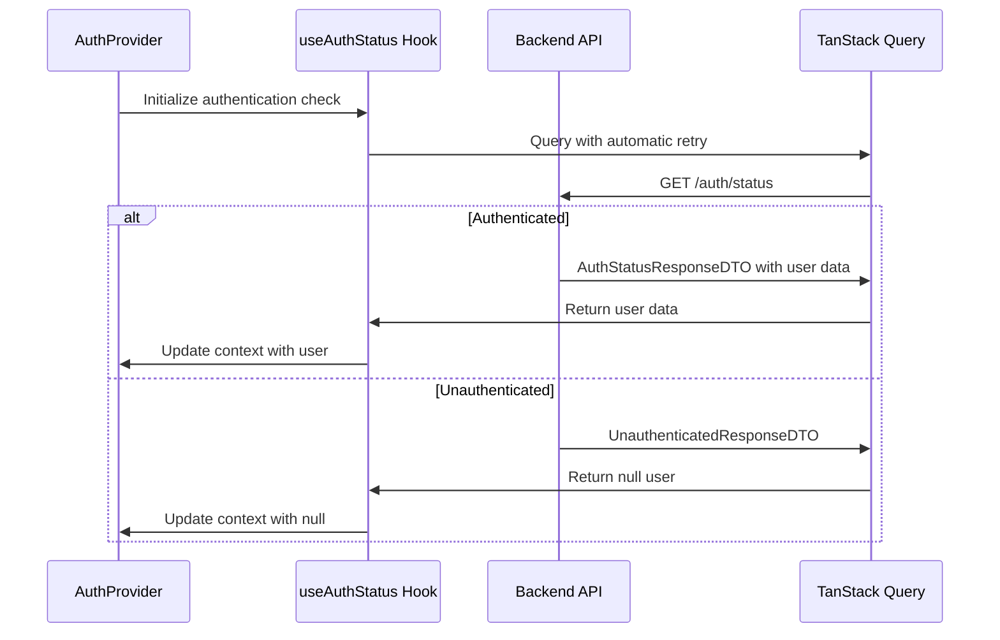
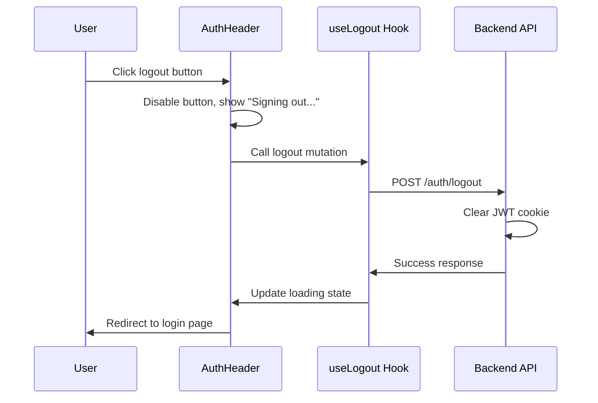

# Authentication Components

## Overview

The Authentication Components module provides a complete Google OAuth 2.0 authentication interface for the Mavericks Claim Submission System. It integrates seamlessly with existing backend OAuth endpoints to enable secure authentication for @mavericks-consulting.com employees with dark theme, mobile-responsive design, and comprehensive accessibility features.

## Architecture

The authentication system implements a provider pattern with React Context for global state management, integrated with TanStack Query for server state synchronization and automatic retry logic. All components follow single responsibility principle with clear separation of concerns.

### Component Hierarchy

```
AuthProvider (Context)
├── AuthHeader (Navigation component)
│   ├── User Avatar/Dropdown
│   ├── Profile Link
│   └── Logout Button
├── GoogleOAuthButton (Login initiation)
└── Login Page (Authentication entry point)
```

## Components

### AuthProvider

Global authentication context provider that manages authentication state and provides it to the entire application.

**Key Features:**

- React Context integration with TanStack Query
- Automatic authentication status polling
- Global logout functionality
- Error state management
- Loading state handling

**Integration:**

```typescript
// App-level integration
import { AuthProvider } from '@/components/auth';

export default function RootLayout({ children }) {
  return (
    <AuthProvider>
      {children}
    </AuthProvider>
  );
}

// Component-level usage
import { useAuth } from '@/components/auth';

const MyComponent = () => {
  const { user, isAuthenticated, logout } = useAuth();
  // Component logic
};
```

### AuthHeader

Navigation header component that displays user authentication status and provides access to user profile and logout functionality.

**Key Features:**

- User avatar with fallback initials
- Dropdown menu with profile link and logout option
- Loading state with skeleton loader
- Sign-in button for unauthenticated users
- Performance optimization with React.memo
- Full accessibility support with ARIA labels

**Props:**

```typescript
interface AuthHeaderProps {
  className?: string;
}
```

**Usage:**

```typescript
import { AuthHeader } from '@/components/auth';

// Basic usage
<AuthHeader />

// With custom styling
<AuthHeader className="border-b" />
```

**States:**

- **Loading**: Displays skeleton loader while authentication status is being checked
- **Unauthenticated**: Shows "Sign In" button linking to login page
- **Authenticated**: Shows user avatar with dropdown menu containing profile link and logout button

### GoogleOAuthButton

OAuth initiation button that handles Google authentication flow with comprehensive error handling and accessibility features.

**Key Features:**

- Google OAuth 2.0 integration with rate limiting support
- Mobile-optimized performance with touch responsiveness
- Comprehensive error handling with user-friendly messages
- Full accessibility support with screen reader announcements
- Performance monitoring for mobile optimization
- Loading states with spinner animation
- Keyboard navigation support (Enter, Space, Escape)

**Props:**

```typescript
interface GoogleOAuthButtonProps
  extends
    React.ComponentProps<'button'>,
    Pick<VariantProps<typeof buttonVariants>, 'size'> {
  className?: string;
  disabled?: boolean;
  onOAuthError?: (error: Error) => void;
  accessibleDescription?: string;
  liveRegionId?: string;
}
```

**Usage:**

```typescript
import { GoogleOAuthButton } from '@/components/auth';

// Basic usage
<GoogleOAuthButton />

// With error handling
<GoogleOAuthButton
  onOAuthError={(error) => console.error('OAuth failed:', error)}
/>

// With custom accessibility
<GoogleOAuthButton
  accessibleDescription="Custom sign-in description"
  liveRegionId="my-status-region"
/>
```

## Authentication Flow

### OAuth Initiation Flow



### Authentication Status Flow



### Logout Flow



## Error Handling

The authentication components implement comprehensive error handling with specific strategies for different types of failures.

### Error Categories

#### 1. Rate Limiting Errors (429 Too Many Requests)

**Common Causes:**

- Too many OAuth initiation requests (5 per minute limit)
- Multiple rapid login attempts

**Handling Strategy:**

- Automatic detection via `isRateLimitError()` function
- User-friendly toast message with wait time
- Screen reader announcement for accessibility
- Button remains disabled during rate limit period

**Example Response:**

```typescript
{
  toast: "Too many login attempts. Please wait 60 seconds and try again.",
  screenReader: "Too many login attempts. Please wait and try again."
}
```

#### 2. Network/Connection Errors

**Common Causes:**

- Network connectivity issues
- Server unavailability
- Request timeouts (5 second limit)

**Handling Strategy:**

- AbortController with 5-second timeout for mobile optimization
- Generic error message for network failures
- Automatic retry via TanStack Query for status checks
- Loading state management to prevent double-clicks

**Example Response:**

```typescript
{
  toast: "Sign in failed. Please try again.",
  screenReader: "Authentication failed. Please try again."
}
```

#### 3. OAuth Flow Errors

**Common Causes:**

- User denies Google OAuth consent
- Invalid domain (non-@mavericks-consulting.com)
- OAuth provider errors

**Handling Strategy:**

- Error detection via callback URL parameters
- Redirect to login page with error message
- Clear error state on successful retry
- Proper error logging for debugging

### Error Monitoring and Accessibility

#### Screen Reader Support

All error states include proper ARIA live regions for screen reader announcements:

```typescript
// Live region for status announcements
<div
  aria-live="assertive"
  aria-atomic="true"
  role="status"
>
  {statusMessage}
</div>
```

#### Performance Monitoring

Mobile performance monitoring with development warnings for slow operations:

```typescript
// Monitor render performance (target: <200ms)
const monitorRenderPerformance = (startTime: number, operation: string) => {
  const duration = performance.now() - startTime;
  if (duration > 200) {
    console.warn(`GoogleOAuthButton ${operation} took ${duration}ms`);
  }
};
```

## Accessibility Features

### Screen Reader Support

- **ARIA Labels**: Descriptive labels for all interactive elements
- **Live Regions**: Status announcements for authentication state changes
- **Role Attributes**: Proper semantic roles for buttons and navigation elements
- **Screen Reader Only Content**: Hidden descriptive text for additional context

### Keyboard Navigation

- **Tab Order**: Logical tab sequence through authentication interface
- **Keyboard Shortcuts**: Enter and Space key support for button activation
- **Focus Management**: Proper focus retention and movement
- **Escape Key**: Cancel loading operations when pressed

### Mobile Accessibility

- **Touch Targets**: Minimum 44px touch targets for mobile devices
- **Touch Optimization**: Disabled text selection and tap highlights for better UX
- **Gesture Support**: Proper touch event handling with preventDefault
- **Screen Reader Mobile**: Optimized announcements for mobile screen readers

## Performance Optimization

### Component Optimization

- **React.memo**: Prevents unnecessary re-renders with custom comparison functions
- **Memoized Callbacks**: Stable callback references with useCallback
- **Memoized Values**: Computed values cached with useMemo
- **Lazy Loading**: Components split by route for optimal loading

### Mobile Performance

- **Touch Responsiveness**: Event handling optimized for mobile devices
- **Network Optimization**: Request caching and AbortController for timeouts
- **Rendering Performance**: Sub-200ms render targets for mobile devices
- **Memory Efficiency**: Proper cleanup of event listeners and timers

### Query Optimization

- **TanStack Query**: Efficient server state management with automatic background updates
- **Cache Management**: Proper cache invalidation on authentication state changes
- **Retry Logic**: Intelligent retry patterns for network failures
- **Batch Operations**: Grouped API calls where possible

## Testing

### Test Coverage

The authentication components include comprehensive test suites covering:

- **Unit Tests**: Individual component behavior and prop handling
- **Integration Tests**: Component interaction and state management
- **Accessibility Tests**: ARIA attributes and keyboard navigation
- **Error Handling**: All error scenarios and edge cases
- **Performance Tests**: Render timing and memory usage

### Test Files

- `auth-header.test.tsx`: AuthHeader component functionality and states
- `google-oauth-button.test.tsx`: OAuth button behavior and error handling
- `auth-provider.test.tsx`: Context provider and hook integration
- `useAuthStatus.test.ts`: Authentication status hook testing
- `useLogout.test.ts`: Logout functionality testing

### Testing Patterns

```typescript
// Example test structure
describe('AuthHeader', () => {
  describe('Loading State', () => {
    it('should display loading spinner when isLoading is true', () => {
      // Test loading state
    });
  });

  describe('Authenticated State', () => {
    it('should display user avatar with correct initials', () => {
      // Test authenticated state
    });
  });

  describe('Error Handling', () => {
    it('should handle auth hook errors gracefully', () => {
      // Test error scenarios
    });
  });
});
```

## Usage Examples

### Basic Authentication Setup

```typescript
// 1. Wrap your app with AuthProvider
import { AuthProvider } from '@/components/auth';

export default function RootLayout({ children }) {
  return (
    <AuthProvider>
      {children}
    </AuthProvider>
  );
}

// 2. Add AuthHeader to your navigation
import { AuthHeader } from '@/components/auth';

export default function Navbar() {
  return (
    <nav className="border-b">
      <div className="flex justify-between items-center">
        <Logo />
        <AuthHeader />
      </div>
    </nav>
  );
}

// 3. Create login page with OAuth button
import { GoogleOAuthButton } from '@/components/auth';

export default function LoginPage() {
  return (
    <div className="min-h-screen flex items-center justify-center">
      <div className="space-y-6">
        <h1>Sign In</h1>
        <GoogleOAuthButton />
      </div>
    </div>
  );
}
```

### Advanced Usage with Error Handling

```typescript
import { GoogleOAuthButton, useAuth } from '@/components/auth';
import { toast } from 'sonner';

export default function LoginPage() {
  const { error } = useAuth();

  const handleOAuthError = (error: Error) => {
    // Custom error handling
    console.error('OAuth Error:', error);
    toast.error('Authentication failed. Please contact support if this persists.');
  };

  return (
    <div className="min-h-screen flex items-center justify-center">
      <div className="space-y-6">
        <h1>Sign In to Mavericks Claims</h1>

        {error && (
          <div className="bg-red-50 dark:bg-red-900/10 p-4 rounded-md">
            <p className="text-red-700 dark:text-red-400">
              Authentication error. Please try again.
            </p>
          </div>
        )}

        <GoogleOAuthButton
          size="lg"
          onOAuthError={handleOAuthError}
          accessibleDescription="Sign in with your @mavericks-consulting.com Google account to access the expense claims system"
        />
      </div>
    </div>
  );
}
```

### Protected Route Implementation

```typescript
import { useAuth } from '@/components/auth';
import { redirect } from 'next/navigation';

export default function ProtectedPage() {
  const { isAuthenticated, isLoading, user } = useAuth();

  if (isLoading) {
    return <div>Loading...</div>;
  }

  if (!isAuthenticated) {
    redirect('/auth/login');
  }

  return (
    <div>
      <h1>Welcome, {user?.name}!</h1>
      <p>Your email: {user?.email}</p>
    </div>
  );
}
```

## Integration Points

### Backend API Integration

- **AuthService**: OAuth token management and user data retrieval
- **JWT Cookies**: Secure cookie-based session management with httpOnly flags
- **Rate Limiting**: Integration with backend OAuth rate limiting decorators
- **Domain Validation**: @mavericks-consulting.com domain restriction enforcement

### Frontend Integration

- **TanStack Query**: Server state management for authentication status
- **Next.js Routing**: App Router integration with authentication guards
- **Toast System**: Sonner integration for user feedback and error messages
- **UI Components**: Reuse of existing Button, Avatar, and Dropdown components

### Type System Integration

- **Shared Types**: Uses `@project/types` for consistent typing across frontend and backend
- **DTO Integration**: Direct usage of backend DTOs for API responses
- **Type Safety**: Full TypeScript strict mode compliance with proper inference

## Configuration

### Environment Variables

Authentication components work with existing backend OAuth configuration:

```bash
# Backend OAuth Configuration
GOOGLE_CLIENT_ID=your_oauth_client_id
GOOGLE_CLIENT_SECRET=your_oauth_client_secret
GOOGLE_REDIRECT_URI=http://localhost:3000/api/auth/google/callback

# Frontend Configuration (auto-detected)
NEXT_PUBLIC_API_URL=http://localhost:3001
```

### Customization Options

```typescript
// Custom OAuth button styling
<GoogleOAuthButton
  className="w-full bg-blue-600 hover:bg-blue-700"
  size="lg"
/>

// Custom auth header placement
<AuthHeader className="ml-auto" />

// Custom error handling
<GoogleOAuthButton
  onOAuthError={(error) => {
    // Custom error tracking
    analytics.track('oauth_error', { error: error.message });
  }}
/>
```

## Best Practices

1. **Always use AuthProvider** - Wrap your app at the root level for global state access
2. **Handle loading states** - Always check `isLoading` before rendering authentication-dependent content
3. **Implement error boundaries** - Add React error boundaries around authentication components
4. **Test accessibility** - Run screen reader tests and keyboard navigation validation
5. **Monitor performance** - Use development performance warnings to optimize mobile experience
6. **Secure routing** - Implement proper route guards for protected pages
7. **Error logging** - Log authentication errors for monitoring and debugging
8. **Cache management** - Properly invalidate authentication cache on logout

## Common Issues and Solutions

### Issue 1: Authentication State Not Updating

**Symptoms:** User authentication status doesn't update after successful login
**Solution:** Ensure AuthProvider wraps the entire app and TanStack Query client is properly configured

### Issue 2: OAuth Button Not Responding

**Symptoms:** Button clicks don't initiate OAuth flow
**Solution:** Check network connectivity and verify backend OAuth endpoints are accessible

### Issue 3: Rate Limiting Errors

**Symptoms:** Repeated "too many requests" errors
**Solution:** Implement proper rate limiting respect and user feedback for wait periods

### Issue 4: Mobile Touch Issues

**Symptoms:** Button taps don't register consistently on mobile
**Solution:** Ensure proper touch event handling and disable text selection on buttons

### Issue 5: Screen Reader Accessibility

**Symptoms:** Authentication status changes not announced
**Solution:** Verify ARIA live regions are properly implemented and not being overridden

## Dependencies

### Required Dependencies

- **React 18+**: Context and hooks support
- **Next.js 14+**: App Router and server components
- **TanStack Query v5**: Server state management
- **TypeScript 5+**: Type safety and inference
- **Tailwind CSS**: Styling system
- **Lucide React**: Icon system
- **Sonner**: Toast notifications

### Optional Dependencies

- **@testing-library/react**: Component testing
- **Vitest**: Test runner
- **@testing-library/user-event**: User interaction testing
- **@testing-library/jest-dom**: DOM testing utilities

This documentation provides comprehensive coverage of the authentication components, their usage patterns, and integration guidelines for the Mavericks Claim Submission System.
